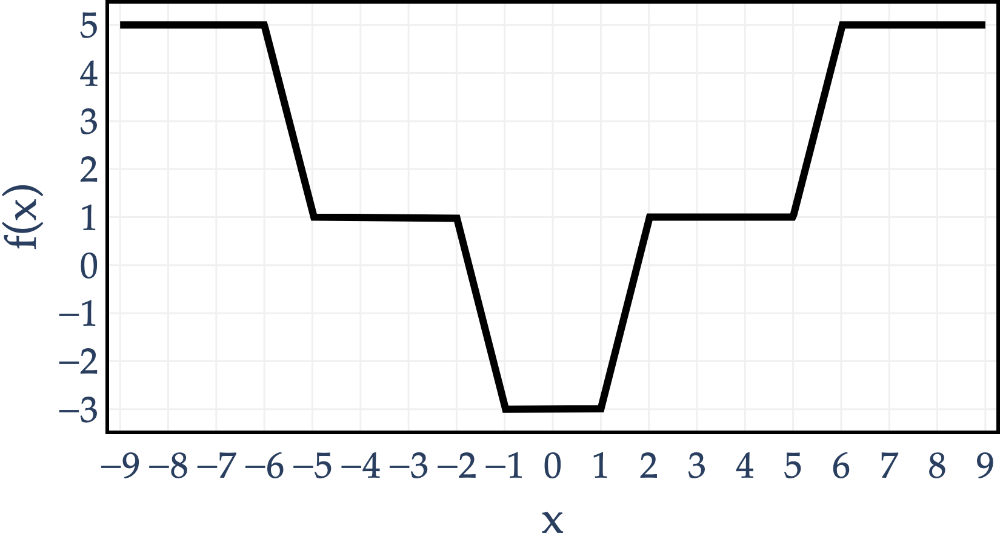

Consider the function \\(f: \mathbb{R} \to \mathbb{R}\\) graphed below.

Note that \\(f\\) is a piecewise linear function, with slopes of \\(0\\), \\(4\\), and \\(-4\\). The slope changes at the following values of \\(x\\): \\(-6, -5, -2, -1, 1, 2, 5, 6\\).

Suppose we want to minimize \\(f(x)\\) using gradient descent. There are several values of \\(x\\) such that \\(f\\) is not differentiable at \\(x\\); if any of our guesses \\(x^{(0)}, x^{(1)}, x^{(2)}, \ldots\\) ever evaluate to one of these values, we say that gradient descent **crashes**.

a)

2 pts True or False: \\(f(x)\\) is convex on the domain \\(x \in [-9, 9]\\).

 True False

Solution

 True False

This is false. In order for a function to be convex, it must be the case that we can draw a line segment between any two points on the function and the line segment never passes below the function, but this is not the case for this \\(f\\). For example, connect \\((-3, 1)\\) to \\((-1, -3)\\); the line segment is entirely beneath the function.

b)

4 pts Suppose we choose a learning rate/step size of \\(\alpha = 0.1\\).

Among the options below, which value of \\(x^{(0)}\\) will allow gradient descent to **converge to the global minimum** of \\(f(x)\\) **without crashing**?

If multiple values of \\(x^{(0)}\\) are possible, **select the value that converges the quickest** (i.e. in the fewest number of iterations).

 \\(1.4\\) \\(1.6\\) \\(1.8\\) \\(1.9\\) \\(2.0\\)

Solution

 \\(1.4\\) \\(1.6\\) \\(1.8\\) \\(1.9\\) \\(2.0\\)

When \\(x\\) is between \\(1\\) and \\(2\\), the slope is 4, so with learning rate \\(\alpha = 0.1\\), gradient descent updates by 

$$
x^{(t+1)} = x^{(t)} - 0.1(4) = x^{(t)} - 0.4
$$

 Now, let's check the options:

-   \\(1.4 \to 1.0\\), so gradient descent crashes at the nondifferentiable point \\(x=1\\).

-   \\(1.6 \to 1.2 \to 0.8\\), so it reaches the flat global-minimum region without crashing.

-   \\(1.8 \to 1.4 \to 1.0\\), so it crashes.

-   \\(1.9 \to 1.5 \to 1.1 \to 0.7\\), so it also works, but it takes more iterations than starting at 1.6.

-   Starting at \\(2.0\\) crashes immediately, because \\(f\\) is not differentiable there.

Therefore, the correct choice is \\(\boxed{1.6}\\).

