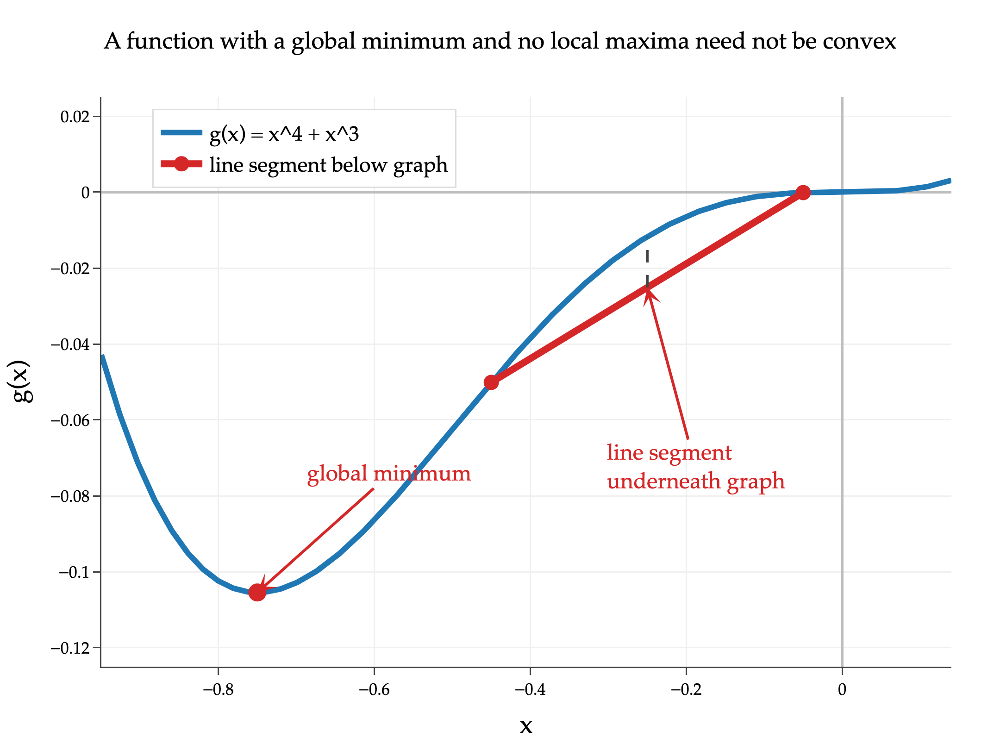

Let \\(\vec a \in \mathbb{R}^2\\) and let

$$
f(\vec x) = \log(\vec a \cdot \vec x)
$$

 for all vectors \\(\vec x\\) such that \\(\vec a \cdot \vec x &gt; 0\\); if \\(\vec a \cdot \vec x \leq 0\\), then \\(f(\vec x)\\) is undefined. Suppose that

$$
\nabla f\left(\begin{bmatrix}2\\\\1\end{bmatrix}\right)
=
\begin{bmatrix}1/5\\\\3/5\end{bmatrix}
$$

a)

3 pts Which of the following could be \\(\vec a\\)? **Select all** that apply.

 \\(\begin{bmatrix}3\\\\1\end{bmatrix}\\) \\(\begin{bmatrix}1\\\\3\end{bmatrix}\\) \\(\begin{bmatrix}-1\\\\-3\end{bmatrix}\\) \\(\begin{bmatrix}1\\\\2\end{bmatrix}\\) \\(\begin{bmatrix}5\\\\3\end{bmatrix}\\) \\(\begin{bmatrix}2\\\\6\end{bmatrix}\\)

Solution

 \\(\begin{bmatrix}2\\\\6\end{bmatrix}\\)

Let

$$
g(\vec{x})=\vec{a}\cdot\vec{x}=a_1x_1+a_2x_2
\qquad\text{and}\qquad
h(u)=\log(u)
$$

 Then \\(f(\vec{x})=h(g(\vec{x}))\\). Using the chain rule from [Chapter 8.2](https://notes.eecs245.org/gradients/gradients-matrix-vector-operations/#chain-rule-for-vector-to-scalar-functions),

$$
\nabla f(\vec{x})
=
h'(g(\vec{x}))\nabla g(\vec{x})
$$

 Now,

$$
h'(u)=\frac{1}{u}
\qquad\text{and}\qquad
\nabla g(\vec{x})=
\begin{bmatrix}a_1\\\\a_2\end{bmatrix}
=\vec{a}
$$

 so

$$
\nabla f(\vec{x})
=
h'(\vec a \cdot \vec x) \nabla g(\vec{x}) =
\frac{\vec{a}}{\vec{a}\cdot\vec{x}}
$$

 At \\(\vec{x}=\begin{bmatrix}2\\\\1\end{bmatrix}\\), this becomes

$$
\frac{\vec{a}}{2a_1+a_2}
=
\begin{bmatrix}1/5\\\\3/5\end{bmatrix}
$$

 Since \\(f\\) is defined at \\(\begin{bmatrix}2\\\\1\end{bmatrix}\\), this must mean that \\(\vec a \cdot \vec x\\), which is equal to \\(2a&#95;1 + a&#95;2\\), is positive. Multiplying both sides by this positive denominator gives

$$
\vec{a}
=
(2a_1+a_2)
\begin{bmatrix}1/5\\\\3/5\end{bmatrix}
=
\frac{2a_1+a_2}{5}
\begin{bmatrix}1\\\\3\end{bmatrix}
$$

 This says \\(\vec{a}\\) must be a positive scalar multiple of \\(\begin{bmatrix}1\\\\3\end{bmatrix}\\). Among the answer choices, the vectors with that form are \\(\begin{bmatrix}1\\\\3\end{bmatrix}\\) and \\(\begin{bmatrix}2\\\\6\end{bmatrix}\\).

Another way to approach this would be to take the equation

$$
\frac{\vec a}{2a_1+a_2} = \begin{bmatrix}1/5\\\\3/5\end{bmatrix}
$$

from above, and realize the expression on the right is also equal to \\(\frac{1}{2a&#95;1+a&#95;2} \begin{bmatrix}a&#95;1\\\\a&#95;2\end{bmatrix}\\), which allows us to set up a system of equations directly for \\(a&#95;1\\) and \\(a&#95;2\\):

$$
\begin{align*}
\frac{a_1}{2a_1+a_2} &= 1/5 \\\\
\frac{a_2}{2a_1+a_2} &= 3/5
\end{align*}
$$

Both equations say the same thing: \\(a&#95;2 = 3a&#95;1\\), i.e. that \\(a&#95;2\\) must be triple \\(a&#95;1\\), so \\(\vec a\\) is a scalar multiple of \\(\begin{bmatrix}1\\\\3\end{bmatrix}\\). But, don't forget the added constraint that \\(2a&#95;1 + a&#95;2\\) must be positive.

b)

4 pts Suppose we use gradient descent to minimize \\(f(\vec x)\\) using an initial guess of \\(\vec x^{(0)} = \begin{bmatrix} 2 \\\\ 1 \end{bmatrix}\\) and a learning rate of \\(\alpha = 1/2\\). Find \\(\vec x^{(1)}\\). Show your work, and write your answer in the box provided. Your answer should be a vector with no variables.

$$
\vec x^{(1)} = \_\_\_\_\_\_
$$

Solution

The gradient descent update from [Chapter 8.3](https://notes.eecs245.org/gradients/gradient-descent/) is

$$
\vec{x}^{(1)}
=
\vec{x}^{(0)}-\alpha\nabla f(\vec{x}^{(0)})
$$

 Here, \\(\vec{x}^{(0)}=\begin{bmatrix}2\\\\1\end{bmatrix}\\), \\(\alpha=1/2\\), and \\(\nabla f(\vec{x}^{(0)})=\begin{bmatrix}1/5\\\\3/5\end{bmatrix}\\). So,

$$
\vec{x}^{(1)}
=
\begin{bmatrix}2\\\\1\end{bmatrix}
-
\frac{1}{2}\begin{bmatrix}1/5\\\\3/5\end{bmatrix}
=
\begin{bmatrix}2\\\\1\end{bmatrix}
-
\begin{bmatrix}1/10\\\\3/10\end{bmatrix}
=
\begin{bmatrix}19/10\\\\7/10\end{bmatrix}
$$

c)

2 pts This part is unrelated to the previous parts.

Suppose \\(g: \mathbb{R} \to \mathbb{R}\\). True or false: if \\(g\\) has a global minimum and no local maxima, it must be convex.

 True False

Solution

 True False

This is false. For instance, consider

$$
g(x)=x^4+x^3
$$

 This function has a global minimum, since \\(g(x)\to\infty\\) as \\(x\to\infty\\) and as \\(x\to-\infty\\). Also,

$$
g'(x)=4x^3+3x^2=x^2(4x+3)
$$

 The derivative only changes sign at \\(x=-3/4\\), where it changes from negative to positive, so \\(g\\) has a local minimum and no local maxima. But,

$$
g''(x)=12x^2+6x
$$

 which is negative for some \\(x\\) values, for instance \\(x=-1/4\\). So \\(g\\) is not convex. See [Chapter 8.5](https://notes.eecs245.org/gradients/convexity/) for the convexity condition.

