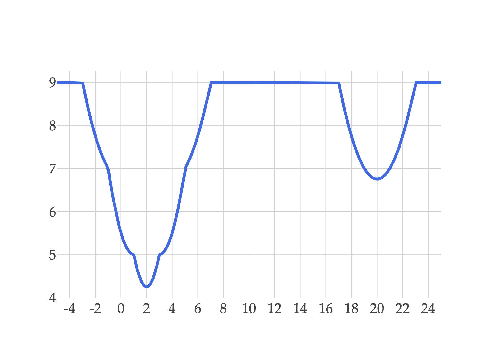

Suppose we'd like to find the optimal parameter, \\(w^{\ast}\\), for the constant model \\(h(x&#95;i)=w\\), using the following dataset of \\(n = 4\\) values, \\(y&#95;1, y&#95;2, y&#95;3, y&#95;4\\):

$$
0, \quad 2, \quad 4, \quad 20
$$

a)

3 pts First, suppose we find the optimal parameter by minimizing mean squared error, \\(R&#95;\text{sq}(w)\\). Which value of \\(w\\) minimizes \\(R&#95;\text{sq}(w)\\)? Give your answer as a number with no variables.

\\(\text{minimizer of } R&#95;\text{sq}(w) = \&#95;\&#95;\&#95;\&#95;\&#95;\&#95;\\)

Solution

For the constant model, average squared loss is minimized at the mean of the \\(y&#95;i\\)'s. Here,

$$
\frac{0+2+4+20}{4}=\frac{26}{4}=\boxed{\frac{13}{2}}
$$

Now, consider the **clipped** loss function, defined below.

$$
\displaystyle L_\text{clip}(y_i,h(x_i))=\min\{(y_i-h(x_i))^2,9\}
$$

 For example, \\(L&#95;\text{clip}(10, 5) = 9\\) and \\(L&#95;\text{clip}(5, 3) = 4\\).

Let \\(R&#95;\text{clip}(w)\\) be the average clipped loss for the constant model and this dataset.

b)

3 pts State one value of \\(w\\) where the derivative of \\(R&#95;\text{clip}(w)\\) is not defined.

\\(\text{one value of } w \text{ where the derivative of } R&#95;\text{clip}(w) \text{ is not defined} =\\) \_\_\_\_\_\_

Solution

The clipped loss changes formulas whenever

$$
(y_i-w)^2=9
$$

 Equivalently, this happens when \\(w=y&#95;i\pm 3\\). Since \\(20-3=17\\), one valid answer is \\(\boxed{17}\\).

For context, here's what average clipped loss looks like for this dataset:

c)

3 pts Suppose we restrict \\(w\\) to the interval \\(1 \leq w \leq 3\\). Among all values of \\(w\\) in this interval, which value minimizes \\(R&#95;\text{clip}(w)\\)? Give your answer as a number with no variables.

\\(\text{minimizer of } R&#95;\text{clip}(w) \text{ within the interval } [1, 3] = \&#95;\&#95;\&#95;\&#95;\&#95;\&#95;\\)

Solution

Once \\(w\\) is more than 3 units away from any particular \\(y&#95;i\\) value, the value \\((y&#95;i - w)^2\\) is replaced by the constant \\(9\\) when computing average loss.

What do we know about constants when they are added to functions? **They don't affect the minimizer!** That is, the minimizer of \\(f(x)\\) and of \\(f(x) + c\\) are the same.

What this is saying is that if \\(w\\) is restricted to the interval \\(1 \leq w \leq 3\\), we can ignore \\(y&#95;4 = 20\\) when computing the minimizer, and this just reduces to minimizing average squared loss (mean squared error) across the data points that are within 3 units of \\(w\\). As long as \\(1 \leq w \leq 3\\), we are within 3 units of \\(y&#95;1 = 0\\), \\(y&#95;2 = 2\\), and \\(y&#95;3 = 4\\).

What constant minimizes average squared loss, for the dataset \\(0, 2, 4\\)? That's the mean of \\(0, 2, 4\\), which is \\(2\\). So the minimizer of \\(R&#95;\text{clip}(w)\\) within the interval \\(1 \leq w \leq 3\\) is \\(\boxed{2}\\).

If you'd like to see this a little more formally, then when \\(1 \leq w \leq 3\\),

$$
R_\text{clip}(w)=\frac14\left(w^2+(2-w)^2+(4-w)^2+9\right)
$$

 Taking the derivative,

$$
\frac{\text{d}}{\text{d}w}R_\text{clip}(w)=\frac14(2w+2(w-2)+2(w-4))=\frac{6w-12}{4}
$$

 Setting this equal to \\(0\\) gives \\(w = 2\\), as we intuited earlier.

d)

3 pts Now suppose there are no restrictions on \\(w\\). Among all possible values of \\(w\\), which value minimizes \\(R&#95;\text{clip}(w)\\)? Give your answer as a number with no variables.

\\(\text{minimizer of } R&#95;\text{clip}(w) = \&#95;\&#95;\&#95;\&#95;\&#95;\&#95;\\)

Solution

The best \\(w\\) is still \\(w = 2\\). As a refresher, let's look at the graph of \\(R&#95;\text{clip}(w)\\) again:

First, note that \\(w = 20\\) is a local minimizer of \\(R&#95;\text{clip}(w)\\): if we zoom in to the graph of \\(R&#95;\text{clip}(w)\\) around \\(w = 20\\), it looks like a parabola that opens up, centered at \\(w = 20\\). But, when we zoom out, we see that the graph falls even lower near \\(w = 2\\) than it does near \\(w = 20\\).

Why is this? It's because there are many more \\(y&#95;i\\) values within 3 units of \\(w = 2\\) than there are within 3 units of \\(w = 20\\). Remembering that we have \\(y&#95;1 = 0, y&#95;2 = 2, y&#95;3 = 4, y&#95;4 = 20\\):

$$
R_\text{clip}(20) = \frac{1}{4} \sum_{i=1}^4 \min\{(20-y_i)^2, 9\} = \frac{1}{4} \left( 9 + 9 + 9 + 0 \right) = \frac{27}{4}
$$

$$
R_\text{clip}(2) = \frac{1}{4} \sum_{i=1}^4 \min\{(2-y_i)^2, 9\} = \frac{1}{4} \left( 4 + 0 + 4 + 9 \right) = \frac{17}{4}
$$

So, \\(R&#95;\text{clip}(20) = \frac{27}{4} &gt; \frac{13}{4} = R&#95;\text{clip}(2)\\).

The question, then, is whether \\(w=2\\) is the global minimizer, or just that it's better than \\(w=20\\). Crucially, you wouldn't have had the graph of \\(R&#95;\text{clip}(w)\\) during the exam, so you would have needed to reason about this without it. One way to see how \\(w = 2\\) is the global minimizer is to realize that as \\(w\\) increases from \\(2\\), the average loss only increases, until it reaches 9, where it "coasts" until it we reach \\(w = 17\\), where it decreases once again.

e)

4 pts State one pro and one con of using clipped loss instead of squared loss to find optimal model parameters.

Solution

One pro is that clipped loss is less sensitive to outliers, since very large errors all receive the same loss of \\(9\\). One con is that it stops distinguishing between bad and very bad predictions once the error is large enough; it also introduces points where the derivative is not defined, when the two cases of the min function switch.

