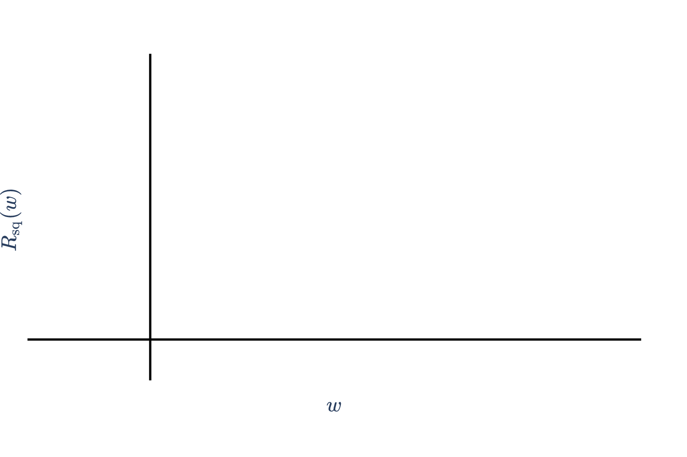
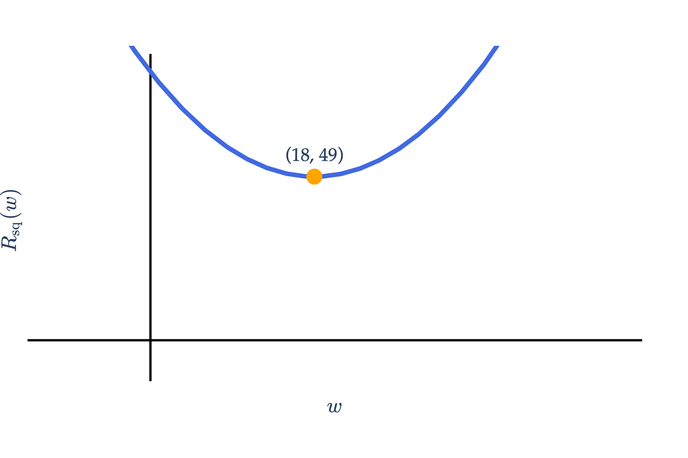
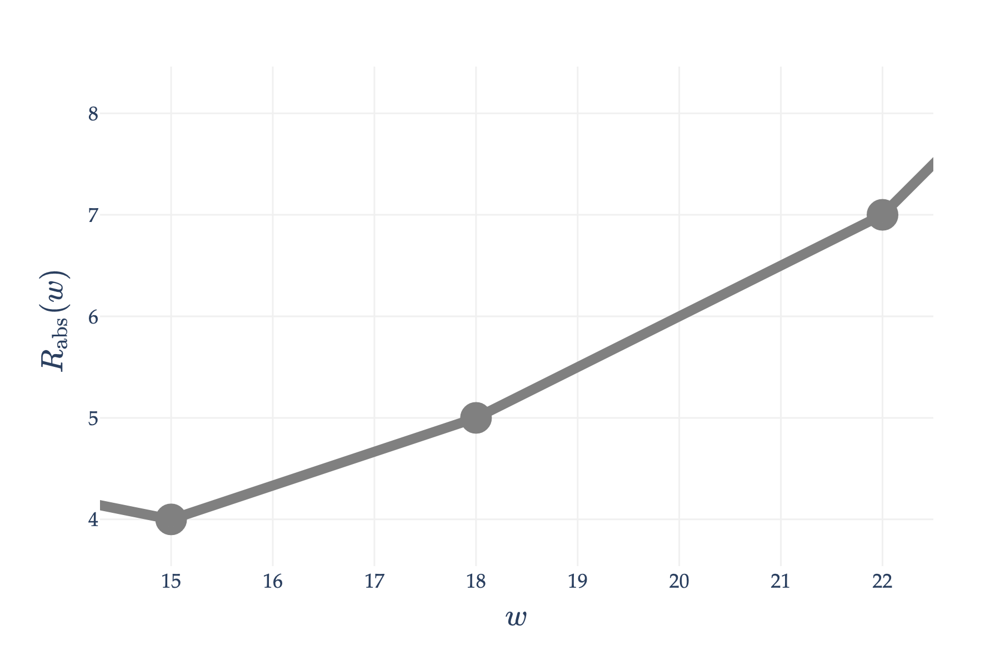

Consider a dataset of \\(n\\) values, \\(y&#95;1, y&#95;2, \ldots, y&#95;n\\), with:

-   a mean of \\(\bar{y} = 18\\)

-   a median of 15

-   a standard deviation of \\(\sigma&#95;y = 7\\)

a)

4 pts In the space provided, sketch the graph of \\(R&#95;\text{sq}(w)\\), the mean squared error of a constant prediction \\(w\\) on the dataset. For full credit:

-   The shape of the graph must be correct.

-   You must clearly label the coordinates of the **minimum point** on the graph.

Solution

Recall that

$$
R_\text{sq}(w) = \frac{1}{n} \sum_{i=1}^n (y_i - w)^2
$$

is a parabola, minimized at \\(w = \bar y\\). When \\(w = \bar y\\),

$$
R_\text{sq}(w) = \frac{1}{n} \sum_{i=1}^n (y_i - \bar y)^2 = \sigma_y^2
$$

 is the variance of the dataset. Here, the mean is 18 and the variance is 49, so the minimum point is at \\((18, 49)\\).

b)

6 pts Which of the following quantities is **guaranteed** to be equal to 0? Select all that apply.

 \\(\displaystyle \frac{1}{n} \sum&#95;{i=1}^n (y&#95;i - 15)\\)

 \\(\displaystyle \frac{1}{n} \sum&#95;{i=1}^n (y&#95;i - 18)\\)

 \\(\displaystyle \frac{1}{n}\sum&#95;{i=1}^n (y&#95;i - 15)^2\\)

 \\(\displaystyle \frac{1}{n}\sum&#95;{i=1}^n (y&#95;i - 18)^2\\)

 \\(\displaystyle \frac{1}{n}\sum&#95;{i=1}^n (y&#95;i - 15)^2 - 7^2\\)

 \\(\displaystyle \frac{1}{n}\sum&#95;{i=1}^n (y&#95;i - 18)^2 - 7^2\\)

Solution

 \\(\displaystyle \frac{1}{n}\sum&#95;{i=1}^n (y&#95;i - 18)^2 - 7^2\\)

There are two key ideas at play here:

-   The mean is the unique point in the dataset such that the sum of deviations from the mean is 0. In other words,

$$
\sum_{i=1}^n (y_i - \bar y) = \sum_{i=1}^n y_i - n \bar y = n \bar y - n \bar y = 0
$$

-   The variance of a dataset is the average of the squared deviations from the mean. In other words,

$$
\sigma_y^2 = \frac{1}{n} \sum_{i=1}^n (y_i - \bar y)^2
$$

 Equivalently, this is the value of \\(R&#95;\text{sq}(w)\\) when \\(w = \bar y\\).

With this in mind, let's look at the options:

**(i)** (**False**) \\(\displaystyle \frac{1}{n} \sum&#95;{i=1}^n (y&#95;i - 15)\\): This is the average of the deviations from the median, which is not 0. This is only true for the mean.

**(ii)** (**True**) \\(\displaystyle \frac{1}{n} \sum&#95;{i=1}^n (y&#95;i - 18)\\): This is the average of the deviations from the mean, which is 0. This is only true for the mean.

**(iii)** (**False**) \\(\displaystyle \frac{1}{n}\sum&#95;{i=1}^n (y&#95;i - 15)^2\\): This is the function \\(R&#95;\text{sq}(w)\\) when \\(w = 15\\). As we see in the solution to part **a)**, this is not 0.

**(iv)** (**False**) \\(\displaystyle \frac{1}{n}\sum&#95;{i=1}^n (y&#95;i - 18)^2\\): This is the function \\(R&#95;\text{sq}(w)\\) when \\(w = 18\\), i.e. it is the variance of the dataset. As we see in the solution to part **a)**, this is also not zero --- here, it is \\(\sigma&#95;y^2 = 7^2 = 49\\). One point of confusion may be that \\(w = \bar{y}\\) is the point at which \\(R&#95;\text{sq}(w)\\) is minimized and \\(R&#95;\text{sq}(w)\\) has a **derivative** of 0, but \\(R&#95;\text{sq}(\bar y) \neq 0\\) in general.

**(v)** (**False**) \\(\displaystyle \frac{1}{n}\sum&#95;{i=1}^n (y&#95;i - 15)^2 - 7^2\\): This would be true if the 15 were replaced with the mean, 18, but it is not.

**(vi)** (**True**) \\(\displaystyle \frac{1}{n}\sum&#95;{i=1}^n (y&#95;i - 18)^2 - 7^2\\): This is the variance of the dataset minus the variance of the dataset, which indeed is 0.

c)

6 pts Recall that \\(R&#95;\text{abs}(w)\\) is the mean absolute error of a constant prediction \\(w\\) on the dataset. A snippet of the graph of \\(R&#95;\text{abs}(w)\\) is shown below.

For clarity, the circles at \\((15, 4)\\), \\((18, 5)\\), and \\((22, 7)\\) indicate the points at which the slope of \\(R&#95;\text{abs}(w)\\) changes.

Given that there are \\(n = 72\\) values in the dataset, how many values in the dataset are equal to **18**? Show your work and \\(\boxed{\text{circle}}\\) your final answer, which should be an integer with no variables.

Solution

The number of values in the dataset that are equal to 18 is 6.

Recall, the slope of \\(R&#95;\text{abs}(w)\\) at any \\(w\\) that is not a data point is:

$$
\frac{\text{d}}{\text{d}w} R_\text{abs}(w) = \frac{\# \text{ left of } w - \# \text{ right of } w}{n}
$$

There are two line segments of interest here: the one between \\(w=15\\) and \\(w=18\\), and the one between \\(w=18\\) and \\(w=22\\). We have two ways of computing the slope of each one: by using \\(\text{slope} = \frac{\text{change in } y}{\text{change in } x}\\) and by using the formula above. We'll use both formulas on each line segment.

-   **Between \\(w=15\\) and \\(w=18\\):**

-   Method 1: Using \\(\text{slope} = \frac{\text{change in } y}{\text{change in } x}\\), the graph rises from \\((15, 4)\\) to \\((18, 5)\\), which gives a slope of

$$
s_1 = \frac{5 - 4}{18 - 15} = \frac{1}{3}
$$

-   Method 2: Using the formula for the slope of \\(R&#95;\text{abs}(w)\\), let \\(l\\) be the number of values in the dataset less than or equal to 15. Then, the slope in this interval is

$$
s_1 = \frac{l - (72 - l)}{72} = \frac{2l - 72}{72}
$$

   At this point, we have enough information to solve for \\(l\\):

$$
\frac{2l - 72}{72} = \frac{1}{3} \implies l = 48
$$

-   **Between \\(w=18\\) and \\(w=22\\):**

-   Method 1:

$$
s_2 = \frac{7 - 5}{22 - 18} = \frac{2}{4} = \frac{1}{2}
$$

-   Method 2: Let \\(k\\) be the number of values in the dataset **equal to** 18. Ultimately, this is what we're trying to find. Then, the number of values in the dataset less than or equal to 18 is \\(l + k\\). In this interval, the slope is

$$
s_2 = \frac{(l + k) - (72 - (l + k))}{72} = \frac{2(l + k) - 72}{72}
$$

   So, we need to solve for \\(k\\) in

$$
\frac{2(l + k) - 72}{72}
$$

   But, we know that \\(l = 48\\), so

$$
\frac{2(48 + k) - 72}{72} = \frac{1}{2} \implies 96 + 2k - 72 = 36 \implies 2k = 12 \implies \boxed{k = 6}
$$

Therefore, there are 6 values in the dataset that are equal to 18.

