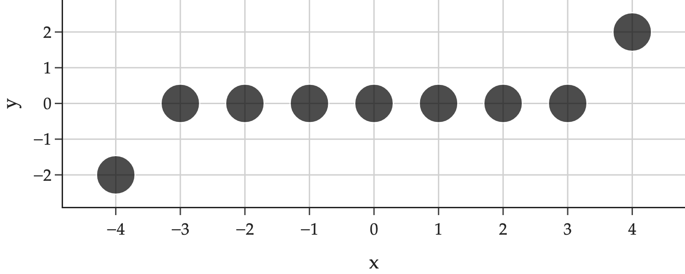
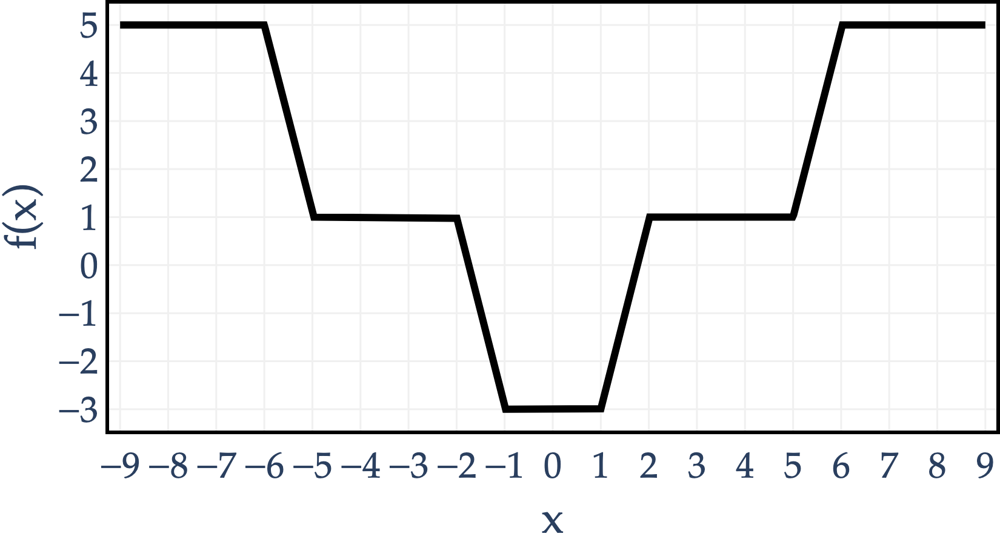



# Fall 2025 Final Exam

**administered**

<a class="btn btn-info assignment-pdf-button" href="/resources/exams/fa25-final.pdf" target="_blank">View as PDF ✏️</a>
<a class="btn btn-info assignment-pdf-button" href="/resources/exams/fa25-final-solutions.pdf" target="_blank">Solutions PDF ✅</a>

{: .yellow }

**Instructions**

-   This exam consists of 13 problems, worth a total of 130 points, spread across 14 pages (7 sheets of paper). **All problems count towards your Final Exam score; certain problems also count towards your Midterm 1 or Midterm 2 redemption scores.**

-   You have 120 minutes to complete this exam, unless you have extended-time accommodations through SSD.

-   Write your uniqname in the top right corner of every page in the space provided.

-   For free response problems, you must show all of your work (unless otherwise specified), and \\(\boxed{\text{circle}}\\) your final answer. We will not grade work that appears elsewhere, and you may lose points if your work is not shown.

-   For multiple choice problems, completely fill in bubbles and square boxes; if we cannot tell which option(s) you selected, you may lose points.

-   You may refer to **3** two-sided handwritten notes sheet. Other than that, you may not refer to any other resources or technology during the exam (no phones, watches, or calculators).

---

## Problems

- [Problem 1: (10 pts) $\boxed{\text{Counts towards Midterm 1 redemption score}}$](#problem-1-10-pts-boxedtextcounts-towards-midterm-1-redemption-score)
- [Problem 2: (10 pts) $\boxed{\text{Counts towards Midterm 1 redemption score}}$](#problem-2-10-pts-boxedtextcounts-towards-midterm-1-redemption-score)
- [Problem 3: (16 pts) $\boxed{\text{Counts towards Midterm 1 redemption score}}$](#problem-3-16-pts-boxedtextcounts-towards-midterm-1-redemption-score)
- [Problem 4: (8 pts) $\boxed{\text{Counts towards Midterm 2 redemption score}}$](#problem-4-8-pts-boxedtextcounts-towards-midterm-2-redemption-score)
- [Problem 5: (12 pts) $\boxed{\text{Counts towards Midterm 2 redemption score}}$](#problem-5-12-pts-boxedtextcounts-towards-midterm-2-redemption-score)
- [Problem 6: (4 pts) $\boxed{\text{Counts towards Midterm 2 redemption score}}$](#problem-6-4-pts-boxedtextcounts-towards-midterm-2-redemption-score)
- [Problem 7: (6 pts) $\boxed{\text{Counts towards Midterm 2 redemption score}}$](#problem-7-6-pts-boxedtextcounts-towards-midterm-2-redemption-score)
- [Problem 8: (6 pts) $\boxed{\text{Counts towards Midterm 2 redemption score}}$](#problem-8-6-pts-boxedtextcounts-towards-midterm-2-redemption-score)
- [Problem 9](#problem-9-18-pts)
- [Problem 10](#problem-10-12-pts)
- [Problem 11](#problem-11-12-pts)
- [Problem 12](#problem-12-12-pts)
- [Problem 13](#problem-13-4-pts)

---

## Problem 1: (10 pts) \\(\boxed{\text{Counts towards Midterm 1 redemption score}}\\)

a)

6 pts Suppose we'd like to find the optimal constant prediction, \\(w^{\ast}\\), for the constant model \\(h(x&#95;i) = w\\), given a dataset of \\(n\\) values \\(y&#95;1, y&#95;2, \ldots, y&#95;n\\). To do so, we minimize mean Bursley error, defined as

$$
R_{\text{B}}(w) = \frac{1}{n} \sum_{i=1}^n | 2y_i - w |^2
$$

Suppose the mean of \\(y&#95;1, y&#95;2, \ldots, y&#95;n\\) is 20 and the median of \\(y&#95;1, y&#95;2, \ldots, y&#95;n\\) is 30.

Which value of \\(w^{\ast}\\) minimizes \\(R&#95;{\text{B}}(w)\\) for this dataset? Select one of the answers below, then justify your answer in the box provided.

Hint: Look very closely at the definition of \\(R&#95;{\text{B}}(w)\\). You do not need to re-prove any results from class; you can fully find and explain your answer without using calculus.

1.  Answer:

 \\(10\\) \\(15\\) \\(20\\) \\(30\\) \\(40\\) \\(60\\)

2.  Justify your answer in the box below.

Solution

 \\(10\\) \\(15\\) \\(20\\) \\(30\\) \\(40\\) \\(60\\)

First, notice that the use of absolute values is a distraction: since \\(|x|^2 = x^2\\), we can rewrite \\(R&#95;{\text{B}}(w)\\) as

$$
R_{\text{B}}(w) = \frac{1}{n} \sum_{i=1}^n (2y_i - w)^2
$$

While it's possible to solve this problem by taking the derivative of \\(R&#95;{\text{B}}(w)\\) with respect to \\(w\\) and setting it equal to 0, it's quicker to leverage what we already know. We know that if there wasn't a coefficient of \\(2\\) in front of \\(y&#95;i\\), the minimizer would be the mean of the dataset.

One way to reason about the effect of the coefficient of \\(2\\) is to consider a substitution. Let \\(z&#95;i = 2y&#95;i\\). Then, \\(R&#95;{\text{B}}(w)\\) becomes

$$
R_{\text{B}}(w) = \frac{1}{n} \sum_{i=1}^n (z_i - w)^2
$$

 which is the same as the mean squared error of the dataset \\(z&#95;1, z&#95;2, \ldots, z&#95;n\\), and so \\(w^{\ast} = \bar{z}\\). But \\(\bar{z} = 2 \bar{y}\\), and so

$$
w^* = 2 \bar{y} = 2 \cdot 20 = \boxed{40}
$$

b)

4 pts This part does not use any of the numbers from part **a)**.

Recall that the mean absolute error, \\(R&#95;{\text{abs}}(w)\\), of a constant prediction \\(w\\) on a dataset of \\(n\\) values \\(y&#95;1, y&#95;2, \ldots, y&#95;n\\) is given by

$$
R_{\text{abs}}(w) = \frac{1}{n} \sum_{i=1}^n |y_i - w|
$$

Consider the dataset of 4 values, \\(1, 3, 5, 9\\). Among all integers **not in this dataset**, which **integer** minimizes \\(R&#95;{\text{abs}}(w)\\) for this dataset?

\\(\text{minimizer} = \minibox{3cm}{4}[1cm]\\)

Solution

The minimizer of mean absolute error is the median of the dataset. When the number of data points is even, any value between the middle two values, inclusive, minimizes mean absolute error. Here, any value between 3 and 5 inclusive minimizes mean absolute error; the value \\(\boxed{4}\\) is the only integer in this range that isn't in the dataset itself, so it is the minimizer we're looking for.

---

## Problem 2: (10 pts) \\(\boxed{\text{Counts towards Midterm 1 redemption score}}\\)

Let \\(k\\) be a positive integer and let \\(\alpha\\) be a positive real number. Consider the dataset of \\(n = 2k+1\\) points, \\(\underbrace{(-k, -\alpha), (-k+1, 0), (-k+2, 0), \ldots, (-1, 0)}&#95;{k \text{ points}}, (0, 0), \underbrace{(1, 0), \ldots, (k-2, 0), (k-1, 0), (k, \alpha)}&#95;{k \text{ points}}\\).

Note that the \\(x\\)-values are equally spaced, starting from \\(-k\\) and ending at \\(k\\). The \\(y\\)-values are all 0, except for the first and last points, which have \\(y\\)-value \\(-\alpha\\) and \\(\alpha\\), respectively. For example, if \\(k = 4\\) and \\(\alpha = 2\\), the dataset looks like

a)

4 pts Find \\(\bar{x}\\) and \\(\bar{y}\\), the means of the \\(x\\)- and \\(y\\)-values, respectively. Give your answers as expressions involving \\(k\\), \\(\alpha\\), and/or other constants.

\\(\bar{x} = \minibox{3cm}{0}[1cm], \qquad \bar{y} = \minibox{3cm}{0}[1cm]\\)

Solution

Both sets of values average to 0: \\(\bar{x} = 0\\) and \\(\bar{y} = 0\\).

-   The \\(x\\)-values are evenly spaced and centered around 0. If you were to add them up, the \\(-k\\) would cancel out with the \\(k\\), the \\(k-1\\) would cancel out with the \\(-k+1\\), and so on, making the sum 0, and hence the average 0.

-   The \\(y\\)-values are all 0, except for the first and last points, which have \\(y\\)-value \\(-\alpha\\) and \\(\alpha\\), respectively. The average of the \\(y\\)-values is therefore \\(\frac{-\alpha + \alpha}{2k+1} = 0\\).

b)

6 pts Suppose we fit a simple linear regression model to the dataset by minimizing mean squared error. \\(w&#95;1^{\ast}\\), the slope of the regression line, is of the form

$$
w_1^* = \frac{A}{\sum_{i=1}^n (x_i - \bar{x})^2}
$$

What is the value of \\(A\\)? Select one of the answers below, then justify your answer in the box provided.

1.  Answer:

 \\(0\\) \\(\displaystyle \alpha\\) \\(\displaystyle 2 \alpha\\) \\(\displaystyle 2 k \alpha\\) \\(\displaystyle 2 k^2 \alpha\\) \\(\displaystyle \frac{2 \alpha}{k}\\)

2.  Justify your answer in the box below.

Solution

 \\(0\\) \\(\displaystyle \alpha\\) \\(\displaystyle 2 \alpha\\) \\(\displaystyle 2 k \alpha\\) \\(\displaystyle 2 k^2 \alpha\\) \\(\displaystyle \frac{2 \alpha}{k}\\)

There are several equivalent formulas for the slope of the regression line, \\(w&#95;1^{\ast}\\), and any of them would allow us to answer the question quickly. Let's start with

$$
w_1^* = \frac{\sum_{i=1}^n (x_i - \bar{x})(y_i - \bar{y})}{\sum_{i=1}^n (x_i - \bar{x})^2}
$$

The denominator of this formula is the same as the one given to us, so let's focus on the numerator, which is \\(v\\) in the formula provided.

$$
v = \sum_{i=1}^n (x_i - \bar{x})(y_i - \bar{y})
$$

From the previous part, we know that \\(\bar{x} = 0\\) and \\(\bar{y} = 0\\), so we can simplify the expression to

$$
v = \sum_{i=1}^n (x_i - 0)(y_i - 0) = \sum_{i=1}^n x_i y_i
$$

But, we know that for all data points other than \\(i=1\\) (the point \\((-k, -\alpha)\\)) and \\(i=n\\) (the point \\((k, \alpha)\\)), \\(x&#95;i = 0\\). Therefore,

$$
v = \sum_{i = 1}^n x_iy_i = -k(-\alpha) + \underbrace{\sum_{i = 2}^{n-1} x_i (0)}_{0} + k(\alpha) = 2k\alpha
$$

Therefore, \\(v = \boxed{2k\alpha}\\).

---

## Problem 3: (16 pts) \\(\boxed{\text{Counts towards Midterm 1 redemption score}}\\)

Consider the vectors \\(\vec u = \begin{bmatrix} 3 \\\\ 3 \\\\ 6 \end{bmatrix}\\) and \\(\vec v = \begin{bmatrix} 1 \\\\ 0 \\\\ c \end{bmatrix}\\), where \\(c \in \mathbb{R}\\) is some constant.

In parts **a)** and **b)**, if there are multiple possible values of \\(c\\), give just one.

a)

3 pts Suppose \\(\vec u\\) and \\(\vec v\\) are orthogonal. Find \\(c\\). Give your answer as a number with no variables.

$c = \minibox{3cm}{

$$
-1/2
$$

}$

Solution

Since \\(\vec u\\) and \\(\vec v\\) are orthogonal, their dot product is 0.

$$
\begin{bmatrix} 3 \\\\ 3 \\\\ 6 \end{bmatrix} \cdot \begin{bmatrix} 1 \\\\ 0 \\\\ c \end{bmatrix} = 0
$$

$$
3 + 0 + 6c = 0
$$

$$
6c = -3
$$

$$
c = -1/2
$$

b)

3 pts Suppose \\(\lVert \vec v \rVert = 4\\). Find \\(c\\). Give your answer as a number with no variables.

$c = \minibox{3cm}{

$$
\sqrt{15}
$$

}$

Solution

Since \\(\lVert \vec v \rVert = 4\\), we have

$$
\sqrt{1^2 + 0^2 + c^2} = 4
$$

$$
1 + c^2 = 16
$$

$$
c^2 = 15
$$

$$
c = \sqrt{15}
$$

c)

6 pts Suppose the projection of \\(\vec v\\) onto \\(\vec u\\) is \\(\begin{bmatrix} 1.5 \\\\ 1.5 \\\\ 3 \end{bmatrix}\\). What is the value of \\(c\\)? Select one of the answers below, then justify your answer in the box provided.

1.  Answer:

 \\(1/2\\) \\(3/2\\) \\(2\\) \\(4\\) \\(6\\) \\(6 + \sqrt{41}\\) \\(27\\)

2.  Justify your answer in the box below.

Solution

 \\(1/2\\) \\(3/2\\) \\(2\\) \\(4\\) \\(6\\) \\(6 + \sqrt{41}\\) \\(27\\)

The projection of \\(\vec v\\) onto \\(\vec u\\) is given by

$$
\vec p = \frac{\vec v \cdot \vec u}{\vec u \cdot \vec u} \vec u
$$

Since we're told that \\(\vec p = \begin{bmatrix} 1.5 \\\\ 1.5 \\\\ 3 \end{bmatrix}\\), this means that \\(p = \frac{1}{2} \begin{bmatrix} 3 \\\\ 3 \\\\ 6 \end{bmatrix} = \frac{1}{2} \vec u\\). So,

$$
\frac{\vec v \cdot \vec u}{\vec u \cdot \vec u} = \frac{1}{2}
$$

Substituting in \\(\vec v = \begin{bmatrix} 1 \\\\ 0 \\\\ c \end{bmatrix}\\) and \\(\vec u = \begin{bmatrix} 3 \\\\ 3 \\\\ 6 \end{bmatrix}\\) gives us

$$
\frac{1 \cdot 3 + 0 \cdot 3 + c \cdot 6}{3^2 + 3^2 + 6^2} = \frac{1}{2} \implies \frac{3 + 6c}{54} = \frac{1}{2} \implies 3 + 6c = 27 \implies \boxed{c = 4}
$$

Recall from the previous page that \\(\vec u = \begin{bmatrix} 3 \\\\ 3 \\\\ 6 \end{bmatrix}\\) and \\(\vec v = \begin{bmatrix} 1 \\\\ 0 \\\\ c \end{bmatrix}\\), where \\(c \in \mathbb{R}\\) is some constant.

d)

4 pts Suppose \\(\text{span}(\lbrace\vec u, \vec v\rbrace)\\) is the plane \\(2x + 4y - 3z = 0\\). Find \\(c\\). Show your work, and \\(\boxed{\text{circle}}\\) your final answer, which should be a number with no variables. <em>Hint: While you could compute the cross product, there is no need to --- there is a much quicker solution.</em>

Solution

One way to find the equation of the plane \\(ax + by + cz = 0\\) spanned by \\(\vec u\\) and \\(\vec v\\) in \\(\mathbb{R}^3\\) is to take the cross product of the two vectors, and setting \\(a\\) to the first component of the cross product, \\(b\\) to the second component, and \\(c\\) to the third component. We could compute the cross product in terms of \\(c\\), and solve for where it is equal to \\(\begin{bmatrix} 2 \\\\ 4 \\\\ -3 \end{bmatrix}\\).

But this is overly complicated, and there's an easier solution: if this plane is spanned by \\(\vec u\\) and \\(\vec v\\), then \\(\vec v\\) needs to satisfy the equation of the plane, which is \\(2x + 4y - 3z = 0\\).

Substituting in \\(\vec v = \begin{bmatrix} 1 \\\\ 0 \\\\ c \end{bmatrix}\\) gives us

$$
2 \cdot 1 + 4 \cdot 0 - 3 \cdot c = 0 \implies 2 - 3c = 0 \implies \boxed{c = 2/3}
$$

---

## Problem 4: (8 pts) \\(\boxed{\text{Counts towards Midterm 2 redemption score}}\\)

Let \\(\vec u\\) and \\(\vec v\\) be as in the previous problem.

a)

4 pts Suppose that for some value of \\(c\\), \\(P\\) is the matrix that projects vectors in \\(\mathbb{R}^3\\) onto \\(\text{span}(\lbrace\vec u, \vec v\rbrace)\\). **Select all** true statements below.

 \\(P^2 = P\\) \\(P\\) is invertible \\(P\\) is orthogonal \\(P\\) is symmetric

Solution

 \\(P^2 = P\\) \\(P\\) is invertible \\(P\\) is orthogonal \\(P\\) is symmetric

If we let \\(X = \begin{bmatrix} | &amp; | \\\\ \vec u &amp; \vec v \\\\ | &amp; | \end{bmatrix}\\), then no matter what \\(c\\) is, \\(\text{rank}(X) = 2\\), meaning the \\(2 \times 2\\) matrix \\(X^TX\\) is invertible. Then,

$$
P = X (X^TX)^{-1}X^T
$$

With this in mind:

-   \\(P^2 = P\\) is **true**. This is the defining property of a projection matrix: once a vector has been projected onto the plane, projecting it again does nothing.

-   Conceptually, \\(P\\) is **not** invertible, because multiple different vectors \\(\vec y\\) can be projected onto the same vector \\(\vec p\\). The act of multiplying by \\(P\\) is not one-to-one, so \\(P\\) is not invertible.

-   \\(P\\) is **not** an orthogonal matrix. Orthogonal matrices preserve lengths, but projection usually shortens vectors unless they already lie in the plane. Also, orthogonal matrices are invertible, but \\(P\\) is not.

-   \\(P\\) is **symmetric**. This is a standard property of orthogonal projection matrices, and you can also verify it directly from \\(P = X(X^TX)^{-1}X^T\\) by taking the transpose.

b)

4 pts Now, suppose \\(\vec y \in \mathbb{R}^3\\). Let \\(\vec p \\) be the projection of \\(\vec y\\) onto \\(\text{span}(\lbrace\vec u, \vec v\rbrace)\\), and let \\(\vec e = \vec y - \vec p\\).

There is no value of \\(c\\) that guarantees that the components of \\(\vec e\\) sum to 0, for every \\(\vec y \in \mathbb{R}^3\\). That is, it is **not** guaranteed that \\(e&#95;1 + e&#95;2 + e&#95;3 = 0\\) for every \\(\vec y \in \mathbb{R}^3\\).

Give a 1-2 sentence English explanation for why it is **not** guaranteed that \\(e&#95;1 + e&#95;2 + e&#95;3 = 0\\) for every \\(\vec y \in \mathbb{R}^3\\). <em>Hint: What <strong>would</strong> have to be true about \\(\vec u\\) and \\(\vec v\\) to make this guarantee for every \\(\vec y\\)?</em>

Solution

For \\(e&#95;1 + e&#95;2 + e&#95;3\\) to always equal 0, every error vector \\(\vec e\\) would have to be orthogonal to \\(\begin{bmatrix} 1 \\\\ 1 \\\\ 1 \end{bmatrix}\\). Since every error vector is orthogonal to \\(\text{span}(\lbrace\vec u, \vec v\rbrace)\\), this would require \\(\begin{bmatrix} 1 \\\\ 1 \\\\ 1 \end{bmatrix}\\) to lie in \\(\text{span}(\lbrace\vec u, \vec v\rbrace)\\), but no value of \\(c\\) makes that happen.

---

## Problem 5: (12 pts) \\(\boxed{\text{Counts towards Midterm 2 redemption score}}\\)

Consider the \\(n \times 5\\) matrix \\(A\\), along with a CR decomposition of it, given below.

$$
A =
\begin{bmatrix}
2 & 2 & 2 & 2 & 2 \\\\
3 & 4 & 5 & 6 & 7 \\\\
4 & 6 & 8 & 10 & 12 \\\\
5 & 8 & 11 & 14 & 17 \\\\
6 & 10 & 14 & 18 & 22 \\\\
\vdots & \vdots & \vdots & \vdots & \vdots \\\\
n+1 & 2n & 3n - 1 & 4n - 2 & 5n - 3 \\\\
\end{bmatrix} = \underbrace{\begin{bmatrix} 2 & ? \\\\ 3 & ? \\\\ 4 & ? \\\\ 5 & ? \\\\ 6 & ? \\\\ \vdots & \vdots \\\\ n + 1 & ? \end{bmatrix}}_{C} \underbrace{\begin{bmatrix} 1 & \boxed{a} & 0 & c & -1 \\\\ 0 & \boxed{b} & 1 & d & 2\end{bmatrix}}_{R}
$$

a)

2 pts Find \\(\text{rank}(A)\\). Give your answer as an integer with no variables.

\\(\text{rank}(A) = \minibox{3cm}{2}[1cm]\\)

Solution

The CR decomposition writes \\(A = CR\\), where \\(C\\) contains linearly independent columns of \\(A\\). Since \\(C\\) has 2 columns, \\(A\\) has 2 linearly independent columns, so

$$
\text{rank}(A) = \boxed{2}
$$

b)

4 pts Find \\(a\\) and \\(b\\). Give your answers as numbers with no variables.

\\(a = \minibox{3cm}{1/2}[1cm], \qquad b = \minibox{3cm}{1/2}[1cm]\\)

Solution

Because columns 1 and 3 of \\(R\\) are the basis of \\(\text{colsp}(A)\\) that we're using to construct all 5 columns of \\(A\\), column 2 of \\(A\\) must be

$$
\text{col}_2(A) = a\,\text{col}_1(A) + b\,\text{col}_3(A)
$$

The "quick" way to spot what \\(a\\) and \\(b\\) must be is that column 2 is the average of columns 1 and 3: 2 is the average of 2 and 2, 4 is the average of 3 and 5, 6 is the average of 4 and 8, and so on. This alone tells you that \\(a = b = \frac{1}{2}\\).

Another way to find \\(a\\) and \\(b\\) more systematically is to set up a system of equations. We have two unknowns --- \\(a\\) and \\(b\\) --- so we must need two equations, which we can get from looking at the first two rows of \\(A\\).

$$
\begin{align*}
2 &= 2a + 2b \\\\
4 &= 3a + 5b
\end{align*}
$$

The first equation says \\(a+b=1\\), so \\(a=1-b\\). Substitute into the second:

$$
4 = 3(1-b) + 5b = 3 + 2b \implies b = \frac{1}{2}
$$

 Then \\(a = \frac{1}{2}\\) as well. Therefore,

$$
\boxed{a = \frac{1}{2}, \qquad b = \frac{1}{2}}
$$

c)

3 pts State **one** vector in \\(\text{nullsp}(A)\\). Give your answer as a vector with no variables. <em>Hint: It is possible to find a vector in \\(\text{nullsp}(A)\\) without using your answer from part <strong>b)</strong>. Try not to rely heavily on your answer from part <strong>b)</strong> in case it's incorrect.</em>

\\(\text{One vector in } \text{nullsp}(A) \text{ is:   } \minibox{3cm}{\\)\begin{bmatrix} 1 \\ -2 \\ 1 \\ 0 \\ 0 \end{bmatrix}\\(}[4cm]\\)

Solution

To find a vector in \\(\text{nullsp}(A)\\), we need to find a linear combination of \\(A\\)'s columns that equals \\(\vec 0\\). One such linear combination can be found from rearranging the linear dependence relationship from the last part:

$$
\begin{align*}
\text{col}_2(A) &= \frac{1}{2}\,\text{col}_1(A) + \frac{1}{2}\,\text{col}_3(A) \\\\
\vec 0 &= \frac{1}{2}\,\text{col}_1(A) - \text{col}_2(A) + \frac{1}{2}\,\text{col}_3(A)
\end{align*}
$$

The coefficients on columns 1 through 3 are \\(\frac{1}{2}\\), \\(-1\\), and \\(\frac{1}{2}\\); this linear combination doesn't use columns 4 and 5. So, this tells us that \\(\begin{bmatrix} 1/2 \\\\ -1 \\\\ 1/2 \\\\ 0 \\\\ 0 \end{bmatrix}\\) is in \\(\text{nullsp}(A)\\). If we'd like to get rid of the fraction, then we could also say \\(\begin{bmatrix} 1 \\\\ -2 \\\\ 1 \\\\ 0 \\\\ 0 \end{bmatrix}\\) is in \\(\text{nullsp}(A)\\) too.

There are plenty of other answers. For instance, the fact that

$$
\text{col}_3(A) = \frac{1}{2}\,\text{col}_1(A) + \frac{1}{2}\,\text{col}_5(A)
$$

tells us that \\(\begin{bmatrix} 1/2 \\\\ 0 \\\\ -1 \\\\ 0 \\\\ 1/2 \end{bmatrix}\\) and \\(\begin{bmatrix} 1 \\\\ 0 \\\\ -2 \\\\ 0 \\\\ 1 \end{bmatrix}\\) are also in \\(\text{nullsp}(A)\\).

d)

3 pts Fill in the blanks: \\(\text{nullsp}(A^T)\\) is a \_\_(i)\_\_-dimensional subspace of \_\_(ii)\_\_.

| \\(i\\) |  \\(2\\) |  \\(3\\) |  \\(4\\) |  \\(5\\) |  \\(n-2\\) |  \\(n-1\\) |  \\(n\\) |  |
|:---|:---|:---|:---|:---|:---|:---|:---|:---|
|  |  |  |  |  |  |  |  |  |
| \\(ii\\) |  \\(\mathbb{R}^2\\) |  \\(\mathbb{R}^3\\) |  \\(\mathbb{R}^4\\) |  \\(\mathbb{R}^5\\) |  \\(\mathbb{R}^{n-2}\\) |  \\(\mathbb{R}^{n-1}\\) |  \\(\mathbb{R}^n\\) |  |

Solution

 \\(\mathbb{R}^2\\) \\(\mathbb{R}^3\\) \\(\mathbb{R}^4\\) \\(\mathbb{R}^5\\) \\(\mathbb{R}^{n-2}\\) \\(\mathbb{R}^{n-1}\\) \\(\mathbb{R}^n\\)

Since \\(\text{rank}(A)=2\\) and \\(\text{rank}(A) = \text{rank}(A^T)\\), we also have \\(\text{rank}(A^T)=2\\). The matrix \\(A^T\\) has \\(n\\) columns, so rank-nullity gives

$$
\dim(\text{nullsp}(A^T)) = \text{\# columns in A^T} - \text{rank}(A^T) = n - 2
$$

 Also, \\(\text{nullsp}(A^T)\\) is a subspace of \\(\mathbb{R}^n\\), because vectors in \\(\text{nullsp}(A^T)\\) must have one entry for each column of \\(A^T\\) (row of \\(A\\)).

---

## Problem 6: (4 pts) \\(\boxed{\text{Counts towards Midterm 2 redemption score}}\\)

Suppose \\(A\\) and \\(B\\) are both (not necessarily symmetric!) \\(n \times n\\) matrices. Which of the following is \\(\nabla f(\vec x)\\), the gradient of

$$
f(\vec x) = (A \vec x)^T (B \vec x)
$$

 \\(2AB \vec x\\) \\(A^TB \vec x\\) \\(2A^TB \vec x\\) \\(2B^TA \vec x\\) \\((A^TB + B^TA) \vec x\\) \\((A^TB - B^TA) \vec x\\)

Solution

 \\(2AB \vec x\\) \\(A^TB \vec x\\) \\(2A^TB \vec x\\) \\(2B^TA \vec x\\) \\((A^TB + B^TA) \vec x\\) \\((A^TB - B^TA) \vec x\\)

We can rewrite the function as

$$
f(\vec x) = (A\vec x)^T(B\vec x) = \vec x^T A^T B \vec x
$$

 If \\(M\\) is any matrix, then

$$
\nabla(\vec x^T M \vec x) = (M + M^T)\vec x
$$

 Here, \\(M = A^TB\\), so

$$
\nabla f(\vec x) = \left(A^TB + (A^TB)^T\right)\vec x = \boxed{(A^TB + B^TA)\vec x}
$$

---

## Problem 7: (6 pts) \\(\boxed{\text{Counts towards Midterm 2 redemption score}}\\)

Consider the function \\(f: \mathbb{R} \to \mathbb{R}\\) graphed below.

Note that \\(f\\) is a piecewise linear function, with slopes of \\(0\\), \\(4\\), and \\(-4\\). The slope changes at the following values of \\(x\\): \\(-6, -5, -2, -1, 1, 2, 5, 6\\).

Suppose we want to minimize \\(f(x)\\) using gradient descent. There are several values of \\(x\\) such that \\(f\\) is not differentiable at \\(x\\); if any of our guesses \\(x^{(0)}, x^{(1)}, x^{(2)}, \ldots\\) ever evaluate to one of these values, we say that gradient descent **crashes**.

a)

2 pts True or False: \\(f(x)\\) is convex on the domain \\(x \in [-9, 9]\\).

 True False

Solution

 True False

This is false. In order for a function to be convex, it must be the case that we can draw a line segment between any two points on the function and the line segment never passes below the function, but this is not the case for this \\(f\\). For example, connect \\((-3, 1)\\) to \\((-1, -3)\\); the line segment is entirely beneath the function.

b)

4 pts Suppose we choose a learning rate/step size of \\(\alpha = 0.1\\).

Among the options below, which value of \\(x^{(0)}\\) will allow gradient descent to **converge to the global minimum** of \\(f(x)\\) **without crashing**?

If multiple values of \\(x^{(0)}\\) are possible, **select the value that converges the quickest** (i.e. in the fewest number of iterations).

 \\(1.4\\) \\(1.6\\) \\(1.8\\) \\(1.9\\) \\(2.0\\)

Solution

 \\(1.4\\) \\(1.6\\) \\(1.8\\) \\(1.9\\) \\(2.0\\)

When \\(x\\) is between \\(1\\) and \\(2\\), the slope is 4, so with learning rate \\(\alpha = 0.1\\), gradient descent updates by

$$
x^{(t+1)} = x^{(t)} - 0.1(4) = x^{(t)} - 0.4
$$

 Now, let's check the options:

-   \\(1.4 \to 1.0\\), so gradient descent crashes at the nondifferentiable point \\(x=1\\).

-   \\(1.6 \to 1.2 \to 0.8\\), so it reaches the flat global-minimum region without crashing.

-   \\(1.8 \to 1.4 \to 1.0\\), so it crashes.

-   \\(1.9 \to 1.5 \to 1.1 \to 0.7\\), so it also works, but it takes more iterations than starting at 1.6.

-   Starting at \\(2.0\\) crashes immediately, because \\(f\\) is not differentiable there.

Therefore, the correct choice is \\(\boxed{1.6}\\).

---

## Problem 8: (6 pts) \\(\boxed{\text{Counts towards Midterm 2 redemption score}}\\)

Suppose we fit a multiple linear regression model **with** an intercept term that predicts the `height` of a wolverine given its `weight` and `color`. The model is fit by minimizing mean squared error.

a)

2 pts If we one hot encode the color feature **without** dropping any categories, the design matrix \\(X\\) has 6 columns.

How many unique `color`s are there? Give your answer as an integer with no variables.

There are \\(\minibox{3cm}{4}[1cm]\\) unique `color`s.

Solution

The 6 columns are:

-   1 intercept column

-   1 `weight` column

-   1 column for each color after one hot encoding without dropping any categories

So the number of unique colors is

$$
6 - 2 = \boxed{4}
$$

b)

4 pts Assume that not all wolverines in the dataset have the same `weight`, and that there is at least one wolverine with each color.

What impact would dropping one of the color categories' columns from the design matrix \\(X\\) have? **Select all that apply.**

 It would decrease the rank of \\(X\\).

 It would guarantee that \\(X\\) invertible.

 It would guarantee that \\(X^TX\\) invertible.

 It would guarantee the existence of a unique optimal parameter vector \\(\vec w^{\ast}\\).

 It would change \\(\text{nullsp}(X)\\).

 It would change \\(\text{colsp}(X)\\).

Solution

 It would change \\(\text{colsp}(X)\\).

By dropping one of the color categories' columns from the design matrix \\(X\\), we guarantee that the columns of \\(X\\) are linearly independent. As discussed in the course notes, when one hot encoding, the sum of all 4 color columns is equal to the intercept column (of all ones); by dropping one of the 4 color columns, we don't lose any information but remove the linear dependence. (The other assumptions in the problem help guarantee this, too --- for instance, if all of the wolverines in the dataset have the same `weight`, then the `weight` column is a scalar multiple of the intercept column.)

With that in mind, let's look at the options:

-   It would decrease the rank of \\(X\\). **False**: \\(\text{colsp}(X)\\) doesn't change, so \\(\text{rank}(X)\\) doesn't change.

-   It would guarantee that \\(X\\) is invertible. **False**: \\(X\\) is not necessarily square!

-   It would guarantee that \\(X^TX\\) is invertible. **True**: If \\(X\\)'s columns are linearly independent, then \\(X^TX\\) is invertible, since \\(\text{rank}(X) = \text{rank}(X^TX) = \text{\# columns in } X^TX\\).

-   It would gaurantee the existence of a unique optimal parameter vector \\(\vec w^{\ast}\\). **True**: If \\(X\\)'s columns are linearly independent, there is a unique \\(\vec w^{\ast}\\).

-   It would change \\(\text{nullsp}(X)\\): **True**. With the redundant column, \\(X\\) has a non-trivial null space, but without it, \\(X\\)'s null space is \\(\lbrace \vec 0 \rbrace\\).

-   It would change \\(\text{colsp}(X)\\): **False**, as discussed above.

---

## Problem 9 18 pts

Consider the matrix \\(A = \begin{bmatrix} 2 &amp; 1 \\\\ c &amp; 6 \end{bmatrix}\\), where \\(c \in \mathbb{R}\\) is some constant.

Each part asks you to find the values of \\(c\\), \\(\lambda&#95;1\\) (\\(A\\)'s **larger eigenvalue**) and \\(\lambda&#95;2\\) (\\(A\\)'s **smaller eigenvalue**) given the information provided. Your answers should be **numbers with no variables**.

If \\(A\\) only has one unique eigenvalue, put the same number for both \\(\lambda&#95;1\\) and \\(\lambda&#95;2\\).

<em>Hint: Remember the relationship between the eigenvalues of a matrix and its determinant and trace.</em>

a)

6 pts
\\(A\\) is **not** invertible.

\\(c = \minibox{3cm}{12}, \qquad \lambda&#95;1 = \minibox{3cm}{8}, \qquad \lambda&#95;2 = \minibox{3cm}{0}\\)

Solution

If \\(A\\) is not invertible, then \\(\det(A)=0\\). Here,

$$
\det(A) = (2)(6) - (1)(c) = 12 - c
$$

 so

$$
12 - c = 0 \implies \boxed{c = 12}
$$

The trace is

$$
\text{tr}(A)=2+6=8
$$

 so the eigenvalues must add to 8. Since the determinant is 0, the eigenvalues must multiply to 0, so one eigenvalue is 0 and the other is 8. Therefore,

$$
\boxed{\lambda_1 = 8, \qquad \lambda_2 = 0}
$$

b)

6 pts
\\(A\\)'s characteristic polynomial is \\(p(\lambda) = \lambda^2 - 8\lambda + 7\\).

\\(c = \minibox{3cm}{5}, \qquad \lambda&#95;1 = \minibox{3cm}{7}, \qquad \lambda&#95;2 = \minibox{3cm}{1}\\)

Solution

For a \\(2 \times 2\\) matrix,

$$
p(\lambda) = \lambda^2 - (\text{trace})\lambda + \det(A)
$$

 Here, the trace is 8, as both \\(A\\) and the characteristic polynomial tell us. This must mean

$$
\det(A) = 7
$$

 Since \\(\det(A)=12-c\\), we get

$$
12 - c = 7 \implies \boxed{c = 5}
$$

 Now, let's factor the characteristic polynomial:

$$
\lambda^2 - 8\lambda + 7 = (\lambda-7)(\lambda-1)
$$

 so the eigenvalues are 7 and 1. Thus,

$$
\boxed{\lambda_1 = 7, \qquad \lambda_2 = 1}
$$

c)

6 pts
\\(A\\) is **not** diagonalizable.

\\(c = \minibox{3cm}{-4}, \qquad \lambda&#95;1 = \minibox{3cm}{4}, \qquad \lambda&#95;2 = \minibox{3cm}{4}\\)

Solution

A \\(2 \times 2\\) matrix is not diagonalizable only if it has an eigenvalue \\(\lambda\\) with algebraic multiplicity 2 but geometric multiplicity 1, i.e. a repeated eigenvalue but only one linearly independent eigenvector. Since the two eigenvalues must add to 8, they must both be

$$
\lambda = \frac{8}{2} = 4
$$

$$
\boxed{\lambda_1 = 4, \qquad \lambda_2 = 4}
$$

 That means the determinant must be

$$
4 \cdot 4 = 16
$$

 So,

$$
12 - c = 16 \implies \boxed{c = -4}
$$

---

{: .yellow }
> **Make sure to place the larger eigenvalue in \\(\lambda&#95;1\\) and the smaller eigenvalue in \\(\lambda&#95;2\\)!**

## Problem 10 12 pts

Consider the adjacency matrix \\(A = \begin{bmatrix} 0.4 &amp; 0 &amp; 0.5 \\\\ 0.4 &amp; 0 &amp; 0.5 \\\\ a &amp; b &amp; c \end{bmatrix}\\) for a Markov chain with three states, where \\(a, b, c \in \mathbb{R}\\) are some constants.

a)

6 pts Find \\(a\\), \\(b\\), and \\(c\\) such that \\(A\\) is a valid adjacency matrix. Give your answers as numbers with no variables.

\\(a = \minibox{3cm}{0.2}[1cm], \qquad b = \minibox{3cm}{1}[1cm], \qquad c = \minibox{3cm}{0}[1cm]\\)

Solution

For a valid adjacency matrix, each column must sum to 1, since the columns describe the transition probabilities **out of** a given state. So,

$$
\begin{align*}
0.4 + 0.4 + a &= 1 \implies a = 0.2 \\\\
0 + 0 + b &= 1 \implies b = 1 \\\\
0.5 + 0.5 + c &= 1 \implies c = 0
\end{align*}
$$

Therefore,

$$
\boxed{a = 0.2, \qquad b = 1, \qquad c = 0}
$$

b)

6 pts Suppose \\(\vec x^{\ast} \in \mathbb{R}^3\\) is a vector containing the long-run fraction of time spent in each state. Which of the following vectors is \\(\vec x^{\ast}\\) and why?

1.  \\(\vec x^{\ast}\\) is

 \\(\displaystyle \begin{bmatrix} 1/3 \\\\ 1/3 \\\\ 1/3 \end{bmatrix}\\) \\(\displaystyle \begin{bmatrix} 4/9 \\\\ 0 \\\\ 5/9 \end{bmatrix}\\) \\(\displaystyle \begin{bmatrix} 5/16 \\\\ 5/16 \\\\ 6/16 \end{bmatrix}\\) \\(\displaystyle \begin{bmatrix} 5/16 \\\\ 6/16 \\\\ 5/16 \end{bmatrix}\\) \\(\displaystyle \begin{bmatrix} 3/16 \\\\ 3/16 \\\\ 10/16 \end{bmatrix}\\)

2.  because \\(\vec x^{\ast}\\) is the eigenvector of \\(A\\) corresponding to the eigenvalue

 \\(-1\\) \\(0\\) \\(0.4\\) \\(1\\) \\(1.8\\)

Solution

 \\(-1\\) \\(0\\) \\(0.4\\) \\(1\\) \\(1.8\\)

The long-run fraction of time spent in each state is the stationary distribution, so it must satisfy

$$
A\vec x^* = \vec x^*
$$

 That means \\(\vec x^{\ast}\\) is an eigenvector corresponding to eigenvalue 1.

Using the matrix from part **a)**,

$$
A = \begin{bmatrix} 0.4 & 0 & 0.5 \\\\ 0.4 & 0 & 0.5 \\\\ 0.2 & 1 & 0 \end{bmatrix}
$$

 we can check that

$$
A\begin{bmatrix} 5/16 \\\\ 5/16 \\\\ 6/16 \end{bmatrix}
=
\begin{bmatrix} 5/16 \\\\ 5/16 \\\\ 6/16 \end{bmatrix}
$$

 So the correct choices are

$$
\boxed{\begin{bmatrix} 5/16 \\\\ 5/16 \\\\ 6/16 \end{bmatrix}}
\qquad \text{and} \qquad
\boxed{1}
$$

---

## Problem 11 12 pts

Let \\(A\\) be a \\(4 \times 4\\) **symmetric** matrix with eigenvalue decomposition \\(A = V \Lambda V^{-1}\\). Suppose the columns of \\(V\\) are \\(\vec v&#95;1\\), \\(\vec v&#95;2\\), \\(\vec v&#95;3\\), and \\(\vec v&#95;4\\), in that order, and that the columns of \\(V\\) are unit vectors.

a)

2 pts Suppose \\(\Lambda = \begin{bmatrix} 4 &amp; 0 &amp; 0 &amp; 0 \\\\ 0 &amp; 3 &amp; 0 &amp; 0 \\\\ 0 &amp; 0 &amp; 2 &amp; 0 \\\\ 0 &amp; 0 &amp; 0 &amp; 1 \end{bmatrix}\\).

True or False: \\(V\\) is guaranteed to be an orthogonal matrix.

 True False

Solution

 True False

This is true. Since \\(A\\) is symmetric, the spectral theorem states that eigenvectors corresponding to different eigenvalues are automatically orthogonal. Additionally, \\(A\\) has four unique eigenvalues. This means that the columns of \\(V\\) are guaranteed to be orthogonal. Since we're told that the columns of \\(V\\) are unit vectors, they are orthonormal, so \\(V\\) is orthogonal.

b)

2 pts Suppose \\(\Lambda = \begin{bmatrix} 4 &amp; 0 &amp; 0 &amp; 0 \\\\ 0 &amp; 2 &amp; 0 &amp; 0 \\\\ 0 &amp; 0 &amp; 2 &amp; 0 \\\\ 0 &amp; 0 &amp; 0 &amp; 1 \end{bmatrix}\\).

True or False: \\(V\\) is guaranteed to be an orthogonal matrix.

 True False

Solution

 True False

This is false. A symmetric matrix always has an orthonormal eigenbasis, but when an eigenvalue is repeated, the problem does not guarantee that the particular unit eigenvectors in \\(V\\) were chosen to be orthogonal within that eigenspace. The two eigenvectors corresponding to \\(\lambda = 2\\) are guaranteed to be orthogonal to the eigenvectors for \\(\lambda = 1\\) and \\(\lambda = 4\\), but not necessarily orthogonal to each other.

The rest of this problem does not use any of the information from parts **a)** and **b)**. Suppose \\(k\\) is some positive integer greater than 1, and that

$$
\vec x = 5 \vec v_1 - 3 \vec v_2 - 5 \vec v_3 + \vec v_4
$$

 and

$$
A^k \vec x = 40 \vec v_1 - 81 \vec v_2 + 64 \vec v_4
$$

c)

6 pts What is the value of \\(k\\)? Select one of the answers below, then justify your answer in the box provided. <em>Hint: If \\(A = V \Lambda V^{-1}\\), what is \\(A^k\\)?</em>

1.  Answer:

 \\(2\\) \\(3\\) \\(4\\) \\(5\\)

2.  Justify your answer in the box below.

Solution

 \\(2\\) \\(3\\) \\(4\\) \\(5\\)

If \\(A = V\Lambda V^{-1}\\), then

$$
A^k \vec x = 5\lambda_1^k \vec v_1 - 3\lambda_2^k \vec v_2 - 5\lambda_3^k \vec v_3 + \lambda_4^k \vec v_4.
$$

 Matching this with

$$
A^k \vec x = 40 \vec v_1 - 81 \vec v_2 + 64 \vec v_4
$$

 gives

$$
\lambda_1^k = 8 \qquad \lambda_2^k = 27 \qquad \lambda_4^k = 64
$$

 Among the answer choices, the only value of \\(k\\) for which all three numbers are perfect \\(k\\)th powers is \\(k=3\\):

$$
8 = 2^3 \qquad 27 = 3^3 \qquad 64 = 4^3
$$

 Therefore, \\(\boxed{k = 3}\\).

d)

2 pts Fill in the blank: as \\(k \to \infty\\), the direction of \\(A^k \vec x\\) approaches the direction of\...

 \\(\vec v&#95;1\\) \\(\vec v&#95;2\\) \\(\vec v&#95;3\\) \\(\vec v&#95;4\\)

Solution

 \\(\vec v&#95;1\\) \\(\vec v&#95;2\\) \\(\vec v&#95;3\\) \\(\vec v&#95;4\\)

From part **c)**, the relevant eigenvalues have magnitudes 2, 3, 0, and 4. As \\(k \to \infty\\), the component corresponding to the largest eigenvalue magnitude dominates, so the direction of \\(A^k \vec x\\) approaches the direction of \\(\boxed{\vec v&#95;4}\\).

---

## Problem 12 12 pts

Suppose \\(\tilde X\\) is a \\(24 \times 3\\) matrix whose columns are mean-centered (i.e. have a mean of 0). Let \\(\tilde X = U \Sigma V^T\\) be the singular value decomposition of \\(\tilde X\\), where

$$
\tilde X = U \underbrace{\begin{bmatrix} 12 & 0 & 0 \\\\ 0 & 2 & 0 \\\\ 0 & 0 & 0 \\\\\vdots & \vdots & \vdots \end{bmatrix}}_{\Sigma} \underbrace{\begin{bmatrix} 1/\sqrt{10} & 3/\sqrt{10} & 0 \\\\ \cdots & \vec v_2^T & \cdots \\\\ 0 & 0 & 1 \end{bmatrix}}_{V^T}
$$

a)

2 pts Find \\(\text{rank}(\tilde X)\\). Give your answer as an integer with no variables.

\\(\text{rank}(\tilde X) = \minibox{3cm}{2}\\)

Solution

The rank of a matrix is equal to its number of non-zero singular values. Here, the singular values are 12, 2, and 0, so

$$
\text{rank}(\tilde X) = \boxed{2}.
$$

b)

3 pts It is possible to find \\(\vec v&#95;2^T\\), the second row of \\(V^T\\), solely using the information provided (without knowing any of the values in \\(\tilde X\\)). In one English sentence, **explain how** to find it.

Solution

Since \\(V\\) is orthogonal, the rows of \\(V^T\\) must be orthonormal, so \\(\vec v&#95;2^T\\) is the unit vector orthogonal to both \\(\begin{bmatrix} 1/\sqrt{10} \\\\ 3/\sqrt{10} \\\\ 0 \end{bmatrix}\\) and \\(\begin{bmatrix} 0 \\\\ 0 \\\\ 1 \end{bmatrix}\\).

c)

2 pts True or False: There exists some vector \\(\vec z \in \mathbb{R}^{24}\\) such that \\(\tilde X \tilde X^T \vec z = 2 \vec z\\).

 True False Impossible to tell

Solution

 True False Impossible to tell

This is **False**. The eigenvalues of \\(\tilde X \tilde X^T\\) are the squares of the singular values of \\(\tilde X\\), so they are \\(144\\), \\(4\\), and \\(0\\). Since 2 is not an eigenvalue of \\(\tilde X \tilde X^T\\), no such vector \\(\vec z\\) exists.

d)

5 pts What is the largest possible variance of the components of \\(\tilde X \vec w\\), where \\(\vec w \in \mathbb{R}^3\\) is a unit vector? Select one of the answers below, then justify your answer in the box provided.

1.  Answer:

 \\(1\\) \\(2\\) \\(6\\) \\(12\\) \\(24\\) \\(144\\)

2.  Justify your answer in the box below.

Solution

 \\(1\\) \\(2\\) \\(6\\) \\(12\\) \\(24\\) \\(144\\)

Because the columns of \\(\tilde X\\) are mean-centered, the variance of the components of \\(\tilde X\vec w\\) is

$$
\frac{1}{n}\|\tilde X\vec w\|^2 = \frac{1}{24}\|\tilde X\vec w\|^2
$$

 This is maximized when \\(\vec w\\) is the first right singular vector (\\(\vec v&#95;1\\)), and the maximum value is

$$
\frac{\sigma_1^2}{24} = \frac{12^2}{24} = \frac{144}{24} = 6
$$

 So the largest possible variance is \\(\boxed{6}\\).

---

## Problem 13 4 pts

What is one topic you studied a lot for that wasn't on the Final Exam? **Blank answers will receive no credit!**

Solution

Congrats on completing the Final Exam for EECS 245! We'll really miss you; please stay in touch.

Feel free to draw us a picture about EECS 245 in the box below.


