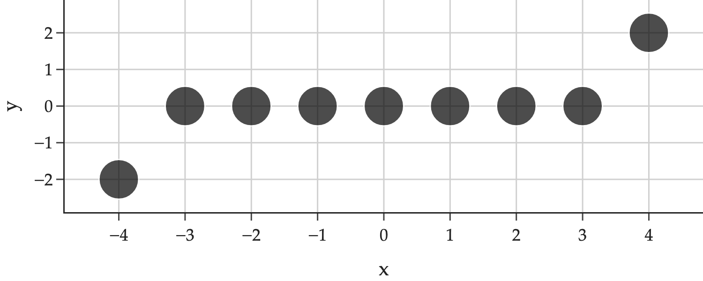

Let \\(k\\) be a positive integer and let \\(\alpha\\) be a positive real number. Consider the dataset of \\(n = 2k+1\\) points, \\(\underbrace{(-k, -\alpha), (-k+1, 0), (-k+2, 0), \ldots, (-1, 0)}&#95;{k \text{ points}}, (0, 0), \underbrace{(1, 0), \ldots, (k-2, 0), (k-1, 0), (k, \alpha)}&#95;{k \text{ points}}\\).

Note that the \\(x\\)-values are equally spaced, starting from \\(-k\\) and ending at \\(k\\). The \\(y\\)-values are all 0, except for the first and last points, which have \\(y\\)-value \\(-\alpha\\) and \\(\alpha\\), respectively. For example, if \\(k = 4\\) and \\(\alpha = 2\\), the dataset looks like

a)

4 pts Find \\(\bar{x}\\) and \\(\bar{y}\\), the means of the \\(x\\)- and \\(y\\)-values, respectively. Give your answers as expressions involving \\(k\\), \\(\alpha\\), and/or other constants.

\\(\bar{x} = \&#95;\&#95;\&#95;\&#95;\&#95;\&#95;, \qquad \bar{y} = \&#95;\&#95;\&#95;\&#95;\&#95;\&#95;\\)

Solution

Both sets of values average to 0: \\(\bar{x} = 0\\) and \\(\bar{y} = 0\\).

-   The \\(x\\)-values are evenly spaced and centered around 0. If you were to add them up, the \\(-k\\) would cancel out with the \\(k\\), the \\(k-1\\) would cancel out with the \\(-k+1\\), and so on, making the sum 0, and hence the average 0.

-   The \\(y\\)-values are all 0, except for the first and last points, which have \\(y\\)-value \\(-\alpha\\) and \\(\alpha\\), respectively. The average of the \\(y\\)-values is therefore \\(\frac{-\alpha + \alpha}{2k+1} = 0\\).

b)

6 pts Suppose we fit a simple linear regression model to the dataset by minimizing mean squared error. \\(w&#95;1^{\ast}\\), the slope of the regression line, is of the form

$$
w_1^* = \frac{A}{\sum_{i=1}^n (x_i - \bar{x})^2}
$$

What is the value of \\(A\\)? Select one of the answers below, then justify your answer in the box provided.

1.  Answer:

 \\(0\\) \\(\displaystyle \alpha\\) \\(\displaystyle 2 \alpha\\) \\(\displaystyle 2 k \alpha\\) \\(\displaystyle 2 k^2 \alpha\\) \\(\displaystyle \frac{2 \alpha}{k}\\)

{: start="2"}
2.  Justify your answer in the box below.

Solution

 \\(0\\) \\(\displaystyle \alpha\\) \\(\displaystyle 2 \alpha\\) \\(\displaystyle 2 k \alpha\\) \\(\displaystyle 2 k^2 \alpha\\) \\(\displaystyle \frac{2 \alpha}{k}\\)

There are several equivalent formulas for the slope of the regression line, \\(w&#95;1^{\ast}\\), and any of them would allow us to answer the question quickly. Let's start with

$$
w_1^* = \frac{\sum_{i=1}^n (x_i - \bar{x})(y_i - \bar{y})}{\sum_{i=1}^n (x_i - \bar{x})^2}
$$

The denominator of this formula is the same as the one given to us, so let's focus on the numerator, which is \\(v\\) in the formula provided.

$$
v = \sum_{i=1}^n (x_i - \bar{x})(y_i - \bar{y})
$$

From the previous part, we know that \\(\bar{x} = 0\\) and \\(\bar{y} = 0\\), so we can simplify the expression to

$$
v = \sum_{i=1}^n (x_i - 0)(y_i - 0) = \sum_{i=1}^n x_i y_i
$$

But, we know that for all data points other than \\(i=1\\) (the point \\((-k, -\alpha)\\)) and \\(i=n\\) (the point \\((k, \alpha)\\)), \\(x&#95;i = 0\\). Therefore,

$$
v = \sum_{i = 1}^n x_iy_i = -k(-\alpha) + \underbrace{\sum_{i = 2}^{n-1} x_i (0)}_{0} + k(\alpha) = 2k\alpha
$$

Therefore, \\(v = \boxed{2k\alpha}\\).

