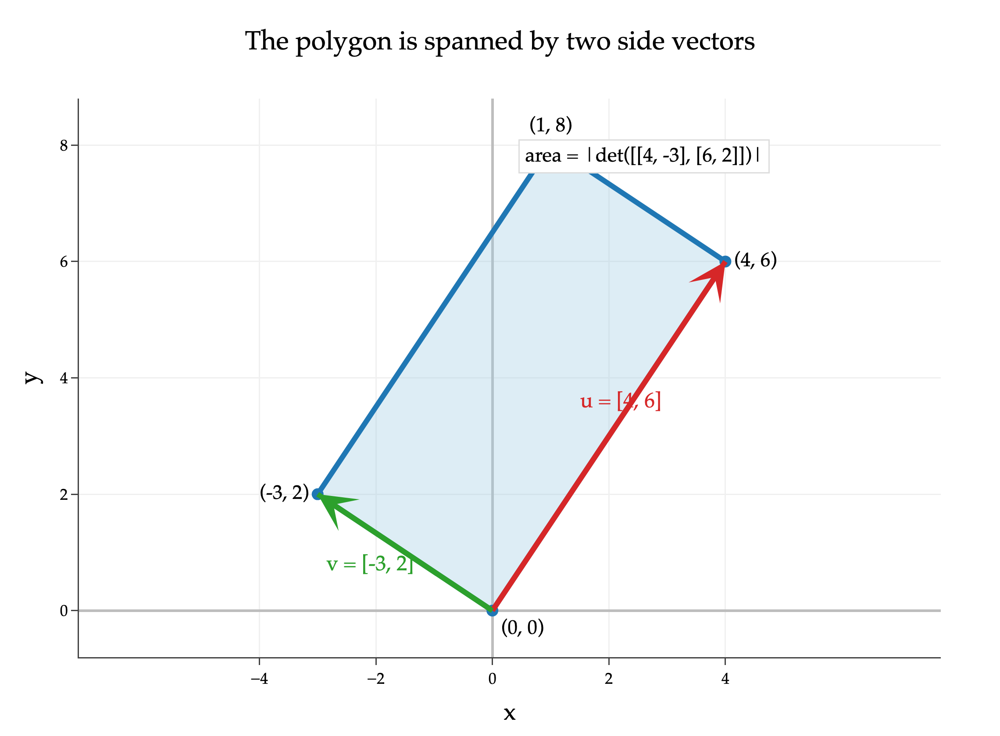
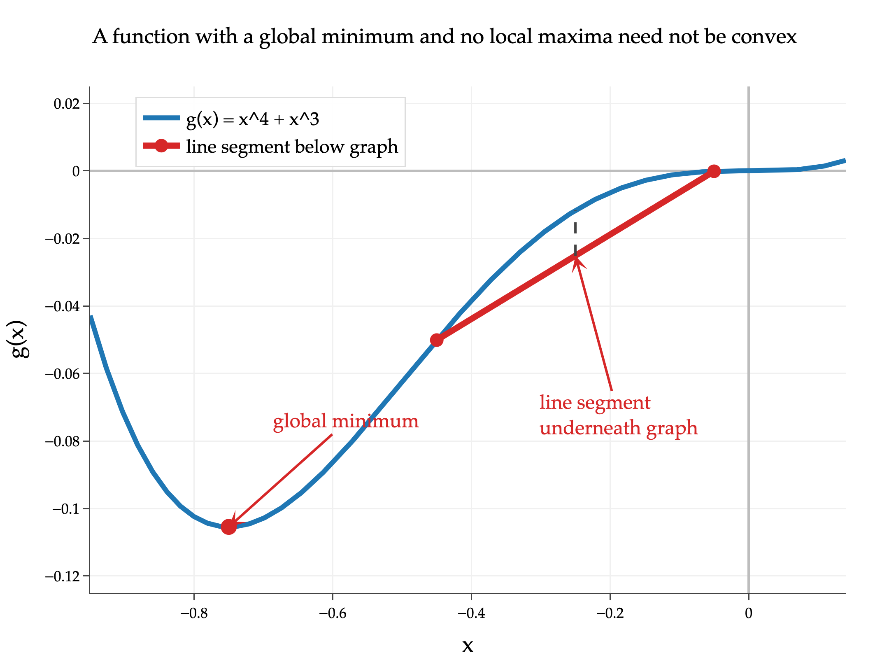



# Spring 2026 Final Exam

<a class="btn btn-info assignment-pdf-button" href="/resources/exams/sp26-final.pdf" target="_blank">View as PDF ✏️</a>
<a class="btn btn-info assignment-pdf-button" href="/resources/exams/sp26-final-solutions.pdf" target="_blank">Solutions PDF ✅</a>

{: .yellow }

**Instructions**

-   This exam consists of 14 problems, worth a total of 130 points, spread across 14 pages (7 sheets of paper). **All problems count towards your Final Exam score; certain problems also count towards your Midterm 1 or Midterm 2 redemption scores.**

-   You have 120 minutes to complete this exam, unless you have extended-time accommodations through SSD.

-   Write your uniqname in the top right corner of every page in the space provided.

-   For free response problems, show your work unless otherwise specified, and write your final answer in the box provided.

-   For multiple choice problems, completely fill in bubbles and square boxes; if we cannot tell which option(s) you selected, you may lose points.

-   You may refer to **3** two-sided handwritten notes sheets. No other resources or technology are allowed.

---

## Problems

- [Problem 1: (14 pts) $\boxed{\text{Counts towards Midterm 1 redemption score}}$](#problem-1-14-pts-boxedtextcounts-towards-midterm-1-redemption-score)
- [Problem 2: (9 pts) $\boxed{\text{Counts towards Midterm 1 redemption score}}$](#problem-2-9-pts-boxedtextcounts-towards-midterm-1-redemption-score)
- [Problem 3: (10 pts) $\boxed{\text{Counts towards Midterm 1 redemption score}}$](#problem-3-10-pts-boxedtextcounts-towards-midterm-1-redemption-score)
- [Problem 4: (5 pts) $\boxed{\text{Counts towards Midterm 1 redemption score}}$](#problem-4-5-pts-boxedtextcounts-towards-midterm-1-redemption-score)
- [Problem 5: (4 pts) $\boxed{\text{Counts towards Midterm 2 redemption score}}$](#problem-5-4-pts-boxedtextcounts-towards-midterm-2-redemption-score)
- [Problem 6: (6 pts) $\boxed{\text{Counts towards Midterm 2 redemption score}}$](#problem-6-6-pts-boxedtextcounts-towards-midterm-2-redemption-score)
- [Problem 7: (12 pts) $\boxed{\text{Counts towards Midterm 2 redemption score}}$](#problem-7-12-pts-boxedtextcounts-towards-midterm-2-redemption-score)
- [Problem 8: (12 pts) $\boxed{\text{Counts towards Midterm 2 redemption score}}$](#problem-8-12-pts-boxedtextcounts-towards-midterm-2-redemption-score)
- [Problem 9: (9 pts) $\boxed{\text{Counts towards Midterm 2 redemption score}}$](#problem-9-9-pts-boxedtextcounts-towards-midterm-2-redemption-score)
- [Problem 10](#problem-10-12-pts)
- [Problem 11](#problem-11-10-pts)
- [Problem 12](#problem-12-11-pts)
- [Problem 13](#problem-13-12-pts)
- [Problem 14](#problem-14-4-pts)

---

## Problem 1: (14 pts) \\(\boxed{\text{Counts towards Midterm 1 redemption score}}\\)

Suppose we'd like to find the optimal constant parameter, \\(w^{\ast}\\), for the constant model \\(h(x&#95;i)=w\\), using the following dataset of \\(n=5\\) values:

$$
1,\quad 1,\quad 4,\quad 9,\quad 25
$$

 In each part, find the value of \\(w^{\ast}\\) that minimizes the given \\(R(w)\\). Show your work in the space provided, and write your final answer in the bottom-right corner of the box. Your answers should be numbers with no variables. *Note: There is no need to use calculus here.*

a)

4 pts
\\(\displaystyle R(w) = \frac{1}{5} \sum&#95;{i=1}^5 (y&#95;i - w)^2\\)

$$
w^* = \boxed{\textbf{8}}
$$

Solution

The minimizer of mean squared error for a constant model is the mean, as discussed in [Chapter 1.2](https://notes.eecs245.org/introduction-to-supervised-learning/squared-loss-constant-model/). So,

$$
w^* = \frac{1+1+4+9+25}{5} = \frac{40}{5} = 8
$$

b)

4 pts
\\(\displaystyle R(w) = \frac{1}{5} \sum&#95;{i=1}^5 (\sqrt{y&#95;i} - w)^2\\)

$$
w^* = \boxed{\textbf{12/5}}
$$

Solution

This is asking for the best constant prediction for the transformed values \\(\sqrt{y&#95;i}\\). The transformed data are

$$
1,\quad 1,\quad 2,\quad 3,\quad 5
$$

 so

$$
w^* = \frac{1+1+2+3+5}{5} = \frac{12}{5}
$$

c)

4 pts
\\(\displaystyle R(w) = \frac{1}{5} \sum&#95;{i=1}^5 (y&#95;i - \sqrt{w})^2\\)

$$
w^* = \boxed{\textbf{64}}
$$

Solution

Let \\(u=\sqrt{w}\\). The loss becomes

$$
R(u) = \frac{1}{5}\sum_{i=1}^5 (y_i-u)^2
$$

 which is minimized at the mean of the original \\(y&#95;i\\) values:

$$
u^* = \frac{1+1+4+9+25}{5} = 8
$$

 Since \\(u=\sqrt{w}\\), we have

$$
w^* = 8^2 = 64
$$

d)

2 pts Which answer from above is also the minimizer of \\(\displaystyle R(w) = \sqrt{\frac{1}{5} \sum&#95;{i=1}^5 (y&#95;i - w)^2}\\)?

 Answer from part (a) Answer from part (b) Answer from part (c) None

Solution

 Answer from part (a) Answer from part (b) Answer from part (c) None

The square root function is strictly increasing, so minimizing

$$
\sqrt{\frac{1}{5} \sum_{i=1}^5 (y_i-w)^2}
$$

 is equivalent to minimizing

$$
\frac{1}{5} \sum_{i=1}^5 (y_i-w)^2
$$

That is exactly the objective from part **a)**, so the answer is the answer from part **a)**.

---

## Problem 2: (9 pts) \\(\boxed{\text{Counts towards Midterm 1 redemption score}}\\)

Suppose we fit a simple linear regression model to a dataset of \\(n\\) points, \\((x&#95;1,y&#95;1),(x&#95;2,y&#95;2),\ldots,(x&#95;n,y&#95;n)\\), by minimizing mean squared error. Let \\(\bar x\\) and \\(\bar y\\) be the means of the \\(x\\)-values and \\(y\\)-values, respectively, and suppose the standard deviations \\(\sigma&#95;x\\) and \\(\sigma&#95;y\\) are both positive. Let

$$
h(x_i)=w_0^*+w_1^*x_i
$$

 be the best simple linear regression line for the original dataset.

Now, we create a new dataset of \\(n+1\\) points by starting with the original dataset and adding one new point,

$$
(x_{n+1},y_{n+1})=(\bar x,c)
$$

 where \\(c\\) is a constant. Let

$$
h_{\text{new}}(x_i)=w_0'+w_1'x_i
$$

 be the best simple linear regression line for the new dataset.

a)

6 pts Prove that \\(w&#95;1' = w&#95;1^{\ast}\\), i.e. that the new slope is the same as the old slope, no matter what \\(c\\) is. <em>Hint: Start with any of the formulas for the optimal slope that involve summations in the numerator and denominator, and separate the sums.</em>

Solution

The optimal slope for simple linear regression can be written as

$$
w_1^*
=
\frac{\sum_{i=1}^n (x_i-\bar{x})y_i}{\sum_{i=1}^n (x_i-\bar{x}) x_i}
$$

 as derived in [Chapter 2.3](https://notes.eecs245.org/simple-linear-regression/finding-optimal-parameters/). There are several other equivalent formulas, e.g. with \\(\sum&#95;{i=1}^n (x&#95;i-\bar{x})(y&#95;i-\bar{y})\\) on the numerator, but this one keeps the algebra simplest, as it doesn't require us to think about the new value of \\(\bar y\\).

For the new dataset, the mean of the \\(x\\)-values is still \\(\bar{x}\\), since

$$
\bar{x}'=\frac{n\bar{x}+\bar{x}}{n+1}=\bar{x}
$$

 The denominator of the new slope is therefore

$$
\sum_{i=1}^{n+1}(x_i-\bar{x}')x_i
=
\sum_{i=1}^n(x_i-\bar{x})x_i + (\bar{x}-\bar{x})\bar{x}
=
\sum_{i=1}^n(x_i-\bar{x})x_i
$$

 The numerator of the new slope is

$$
\begin{align*}
\sum_{i=1}^{n+1}(x_i-\bar{x}')y_i
&=
\sum_{i=1}^{n}(x_i-\bar{x})y_i
+(\bar{x}-\bar{x})c \\\\
&=
\sum_{i=1}^{n}(x_i-\bar{x})y_i
\end{align*}
$$

So the numerator and denominator in this formula are both unchanged, meaning \\(w&#95;1'=w&#95;1^{\ast}\\).

b)

3 pts Which of the following expressions is equal to \\(w&#95;0' - w&#95;0^{\ast}\\), the difference between the new intercept and the old intercept?

 None of these

Solution

 None of these

The intercept of the optimal simple linear regression line is

$$
w_0^* = \bar{y}-w_1^*\bar{x}
$$

 The new \\(x\\)-mean is still \\(\bar{x}\\), and part **a)** showed that the new slope is still \\(w&#95;1^{\ast}\\). The new \\(y\\)-mean is

$$
\bar{y}'=\frac{n\bar{y}+c}{n+1}
$$

 So,

$$
\begin{align*}
w_0'-w_0^*
&=
(\bar{y}'-w_1^*\bar{x})-(\bar{y}-w_1^*\bar{x}) \\\\
&= \bar{y}'-\bar{y} \\\\
&= \frac{n\bar{y}+c}{n+1}-\bar{y} \\\\
&= \frac{c-\bar{y}}{n+1}
\end{align*}
$$

---

## Problem 3: (10 pts) \\(\boxed{\text{Counts towards Midterm 1 redemption score}}\\)

Let \\(\vec x = \begin{bmatrix} 2 \\\\ 1 \\\\ 1 \end{bmatrix}\\) and \\(\vec z = \begin{bmatrix} 3 \\\\ 9 \\\\ 3 \end{bmatrix}\\), and suppose \\(\vec y \in \mathbb{R}^3\\) is such that

the projection of \\(\vec x\\) onto \\(\vec y\\) is \\(\vec 0\\) and that \\(\vec y \cdot \vec y = \vec y \cdot \vec z = 45\\).

a)

4 pts Find the projection of \\(\vec z\\) onto \\(\vec x\\). Show your work, and write your final answer in the box provided. Give your answer as a vector with no variables.

$$
\text{projection of \vec z onto \vec x} = \boxed{\textbf{\begin{bmatrix}6\\\\3\\\\3\end{bmatrix}}}
$$

Solution

Using the projection formula from [Chapter 3.4](https://notes.eecs245.org/vectors/projecting-onto-a-single-vector/),

$$
\vec p =
\frac{\vec{z}\cdot\vec{x}}{\vec{x}\cdot\vec{x}}\vec{x}
$$

 Here,

$$
\vec{z}\cdot\vec{x}=3(2)+9(1)+3(1)=18,
\qquad
\vec{x}\cdot\vec{x}=2^2+1^2+1^2=6
$$

 so

$$
\vec p
=
\frac{18}{6}\vec{x}
=
3\begin{bmatrix}2\\\\1\\\\1\end{bmatrix}
=
\begin{bmatrix}6\\\\3\\\\3\end{bmatrix}
$$

b)

6 pts Write \\(\vec z\\) as a linear combination of \\(\vec x\\) and \\(\vec y\\). Show your work, and fill in each box with a number with no variables. <em>Hint: What is the relationship between \\(\vec x\\) and \\(\vec y\\)?</em>

Solution

Since the projection of \\(\vec{x}\\) onto \\(\vec{y}\\) is \\(\vec{0}\\) and \\(\vec{y}\cdot\vec{y}=45\\), \\(\vec{y}\\) is nonzero and \\(\vec{x}\cdot\vec{y}=0\\). In other words, \\(\vec{x}\\) and \\(\vec{y}\\) are orthogonal.

Suppose

$$
\vec{z}=a\vec{x}+b\vec{y}
$$

 Taking dot products with \\(\vec{x}\\) gives

$$
\vec{z}\cdot\vec{x}=a(\vec{x}\cdot\vec{x})+b(\vec{y}\cdot\vec{x})
$$

 Using the work from part **a)**, \\(\vec{z}\cdot\vec{x}=18\\) and \\(\vec{x}\cdot\vec{x}=6\\). Since \\(\vec{y}\cdot\vec{x}=0\\),

$$
18 = 6a
$$

 so \\(a=3\\).

Now take dot products with \\(\vec{y}\\):

$$
\vec{z}\cdot\vec{y}=a(\vec{x}\cdot\vec{y})+b(\vec{y}\cdot\vec{y})
$$

 The problem tells us that \\(\vec{z}\cdot\vec{y}=\vec{y}\cdot\vec{y}=45\\), and \\(\vec{x}\cdot\vec{y}=0\\), so

$$
45=45b
$$

 and therefore \\(b=1\\). So,

$$
\vec{z}=3\vec{x}+\vec{y}
$$

---

## Problem 4: (5 pts) \\(\boxed{\text{Counts towards Midterm 1 redemption score}}\\)

Suppose \\(S = \left\lbrace \begin{bmatrix} x&#95;1 \\\\ x&#95;2 \\\\ x&#95;3 \\\\ x&#95;4 \end{bmatrix} : x&#95;1 + x&#95;2 + 2x&#95;3 = 0 \text{ and } x&#95;3 = x&#95;4 \right\rbrace\\). State one basis for \\(S\\). Your answer should be a list of vectors with no variables.

\\(\text{one basis for } S =\\)

Solution

The condition \\(x&#95;3=x&#95;4\\) means we can write \\(x&#95;3=x&#95;4=b\\). The other condition gives

$$
x_1+x_2+2b=0
$$

 so \\(x&#95;1=-x&#95;2-2b\\). Let \\(x&#95;2=a\\). Then every vector in \\(S\\) can be written as

$$
\begin{bmatrix}
x_1\\\\x_2\\\\x_3\\\\x_4
\end{bmatrix}
=
\begin{bmatrix}
-a-2b\\\\a\\\\b\\\\b
\end{bmatrix}
=
a\begin{bmatrix}-1\\\\1\\\\0\\\\0\end{bmatrix}
+b\begin{bmatrix}-2\\\\0\\\\1\\\\1\end{bmatrix}
$$

 So, one basis for \\(S\\) is

$$
\left\{
\begin{bmatrix}-1\\\\1\\\\0\\\\0\end{bmatrix},
\begin{bmatrix}-2\\\\0\\\\1\\\\1\end{bmatrix}
\right\}
$$

Another way to think about this: since \\(\dim(S)=2\\) (the subspace has two "degrees of freedom", or free variables), any two linearly independent vectors in \\(S\\) span all of \\(S\\) (see [Chapter 4.3](https://notes.eecs245.org/linear-independence/vector-spaces-basis-dimension/)). So, we could just play with the numbers until we end up with two vectors that are not scalar multiples of each other that both satisfy the conditions of inclusion in \\(S\\). For instance,

$$
\left\{\begin{bmatrix}-1\\\\1\\\\0\\\\0\end{bmatrix},\begin{bmatrix}-3 \\\\ 1 \\\\ 1 \\\\ 1\end{bmatrix}\right\}
$$

 is also a valid basis.

---

## Problem 5: (4 pts) \\(\boxed{\text{Counts towards Midterm 2 redemption score}}\\)

Suppose \\(A\\) is a \\(7 \times 12\\) matrix. Fill in each blank with an integer with no variables.

1.  (2 pts) What is the minimum possible value of \\(\text{dim}(\text{nullsp}(A))\\)?

2.  (2 pts) What is the maximum possible value of \\(\text{dim}(\text{nullsp}(A))\\)?

Solution

By the rank-nullity theorem from [Chapter 5.4](https://notes.eecs245.org/matrices/null-space-rank-nullity/),

$$
\text{rank}(A)+\text{dim}(\text{nullsp}(A))=12
$$

 The rank of a \\(7\times 12\\) matrix is at least \\(0\\) and at most \\(7\\). So the dimension of the null space is

$$
\text{dim}(\text{nullsp}(A))=12-\text{rank}(A)
$$

 This is as small as possible when \\(\text{rank}(A)=7\\), giving minimum \\(\text{dim}(\text{nullsp}(A)) = 5\\), and as large as possible when \\(\text{rank}(A)=0\\), giving maximum \\(\text{dim}(\text{nullsp}(A)) = 12\\).

---

## Problem 6: (6 pts) \\(\boxed{\text{Counts towards Midterm 2 redemption score}}\\)

Find the area enclosed by the polygon with vertices \\((0, 0)\\), \\((4, 6)\\), \\((1, 8)\\), and \\((-3, 2)\\). Show your work, and write your answer in the box provided.

$$
\text{area} = \boxed{\textbf{26}}
$$

Solution

Let

$$
\vec{u}=\begin{bmatrix}4\\\\6\end{bmatrix}
\qquad\text{and}\qquad
\vec{v}=\begin{bmatrix}-3\\\\2\end{bmatrix}
$$

 Then

$$
\vec{u}+\vec{v}
=
\begin{bmatrix}1\\\\8\end{bmatrix}
$$

 so the four vertices are the coordinates of \\(\vec{0}\\), \\(\vec{u}\\), \\(\vec{u}+\vec{v}\\), and \\(\vec{v}\\). This means the polygon is a parallelogram. The area of the parallelogram is the absolute value of the determinant of the matrix whose columns are the two side vectors, as in [Chapter 6.1](https://notes.eecs245.org/linear-transformations-and-projections/linear-transformations/#the-determinant). We picked \\(\vec{u}\\) and \\(\vec{v}\\) because they are the side vectors from the origin, but using any two of the three nonzero vertices as the columns would give the same answer after taking the absolute value: adding one column to another does not change the determinant.

So,

$$
\text{area}
=
\left|
\det\left(
\begin{bmatrix}
4 & -3\\\\
6 & 2
\end{bmatrix}
\right)
\right|
=
\left|4(2)-(-3)(6)\right|
=26
$$

---

## Problem 7: (12 pts) \\(\boxed{\text{Counts towards Midterm 2 redemption score}}\\)

Suppose \\(X\\) is an \\(n \times d\\) matrix with linearly independent columns, \\(d&lt;n\\), and \\(\vec y \in \mathbb{R}^n\\).

Furthermore, suppose \\(P\\) is the matrix that projects vectors in \\(\mathbb{R}^n\\) onto \\(\text{colsp}(X)\\), and \\(\vec p = P \vec y\\) is the projection of \\(\vec y\\) onto \\(\text{colsp}(X)\\).

Finally, let \\(Q\\) be an \\(n \times n\\) orthogonal matrix.

a)

4 pts
1.  (2 pts) What is \\(\text{det}(P)\\)?

 \\(-1\\) \\(0\\) \\(1\\) \\(-1\\) or \\(1\\) None of these

2.  (2 pts) What is \\(\text{det}(Q)\\)?

 \\(-1\\) \\(0\\) \\(1\\) \\(-1\\) or \\(1\\) None of these

Solution

 \\(-1\\) \\(0\\) \\(1\\) \\(-1\\) or \\(1\\) None of these

**(i)** Since \\(P\\) projects onto \\(\text{colsp}(X)\\) and \\(d&lt;n\\), multiple vectors in \\(\mathbb{R}^n\\) will have the same projection onto \\(\text{colsp}(X)\\). So \\(P\\) is not invertible, and therefore \\(\det(P)=0\\).

**(ii)** Since \\(Q\\) is orthogonal, \\(Q^TQ=I\\). Taking determinants gives

$$
\det(Q^TQ)=\det(I)
$$

 so, since \\(\det(I)=1\\), \\(\text{det}(Q^T) = \det(Q)\\), and in general \\(\text{det}(AB) = \det(A)\det(B)\\) for square \\(A\\) and \\(B\\), we have

$$
\det(Q)^2=1
$$

 and therefore \\(\det(Q)\\) is either \\(-1\\) or \\(1\\).

b)

2 pts Which of the following vectors is orthogonal to \\(\text{colsp}(X)\\)?

 \\(\vec y\\) \\(P \vec y\\) \\(Q \vec y\\) \\((I - P) \vec y\\) \\((I - Q) \vec y\\) None of these

Solution

 \\(\vec y\\) \\(P \vec y\\) \\(Q \vec y\\) \\((I - P) \vec y\\) \\((I - Q) \vec y\\) None of these

The vector \\(P\vec{y}\\) is the projection of \\(\vec{y}\\) onto \\(\text{colsp}(X)\\), so the error vector

$$
\vec y - \vec p = \vec{y}-P\vec{y}=(I-P)\vec{y}
$$

 is orthogonal to \\(\text{colsp}(X)\\). This is the same projection geometry used in [Chapter 6.3](https://notes.eecs245.org/linear-transformations-and-projections/projecting-onto-column-space/); the novel thing here was the representation of the error vector as a linear combination of the columns of \\(I-P\\).

c)

6 pts Prove that the projection of \\(Q \vec y\\) onto \\(\text{colsp}(QX)\\) is \\(Q \vec p\\). <em>Hint: Start by showing that the matrix that projects vectors in \\(\mathbb{R}^n\\) onto \\(\text{colsp}(QX)\\) is \\(Q P Q^T\\).</em>

Solution

Since \\(X\\) has linearly independent columns, the matrix that projects onto \\(\text{colsp}(X)\\) is

$$
P=X(X^TX)^{-1}X^T
$$

 Now, the matrix that projects onto \\(\text{colsp}(QX)\\) is

$$
\begin{align*}
QX((QX)^T(QX))^{-1}(QX)^T
&=
QX(X^TQ^TQX)^{-1}X^TQ^T \\\\
&=
QX(X^TX)^{-1}X^TQ^T \\\\
&=
QPQ^T
\end{align*}
$$

using the fact that \\(Q^TQ=I\\). Therefore, the projection of \\(Q\vec{y}\\) onto \\(\text{colsp}(QX)\\) is

$$
(QPQ^T)(Q\vec{y})
=
QP(Q^TQ)\vec{y}
=
QP\vec{y}
=
Q\vec{p}
$$

Why does this happen? Think of \\(Q\\) as a rotation matrix. This is saying that if we:

**(i)** Rotate \\(\vec y\\) and rotate \\(\text{colsp}(X)\\), and project the rotated \\(\vec y\\) onto the rotated \\(\text{colsp}(X)\\), OR

**(ii)** Project the original \\(\vec y\\) onto the original \\(\text{colsp}(X)\\), and then rotate the projected vector,

we end up with the same vector in either case.

---

## Problem 8: (12 pts) \\(\boxed{\text{Counts towards Midterm 2 redemption score}}\\)

Suppose we'd like to fit a multiple linear regression model to predict \\(\texttt{cost}&#95;i\\), the cost in dollars of parking in an Ann Arbor parking garage, using \\(\texttt{hours}&#95;i\\), the number of hours parked.

For each row \\(i\\), the corresponding augmented feature vector is \\(\text{Aug}(\vec x&#95;i) = \begin{bmatrix} 1 &amp; \texttt{hours}&#95;i &amp; \max(0,\texttt{hours}&#95;i-2) \end{bmatrix}^T\\) so the model is of the form

$$
h(\vec x_i)
=
w_0 + w_1 \texttt{hours}_i + w_2 \max(0, \texttt{hours}_i - 2)
$$

 The model is fit by minimizing mean squared error.

a)

4 pts Suppose the dataset has four rows, and the number of hours parked in those rows is

\\(3\\), \\(0\\), \\(5\\), and \\(1\\), respectively. Write the first four rows of the design matrix \\(X\\). Your answer should be a matrix with four rows and no variables.

\\(X =\\)

Solution

Each row is the transpose of the augmented feature vector

$$
\begin{bmatrix}
1\\\\
\texttt{hours}_i\\\\
\max(0,\texttt{hours}_i-2)
\end{bmatrix}
$$

 For \\(\texttt{hours}&#95;i=3,0,5,1\\), the values of \\(\max(0,\texttt{hours}&#95;i-2)\\) are \\(1,0,3,0\\), respectively. So,

$$
X=
\begin{bmatrix}
1&3&1\\\\
1&0&0\\\\
1&5&3\\\\
1&1&0
\end{bmatrix}
$$

b)

2 pts Give a one-sentence English explanation of the meaning of \\(w&#95;2\\).

Solution

The coefficient \\(w&#95;2\\) is the change in the hourly slope after 2 hours; after the first 2 hours, each additional hour changes the predicted cost by \\(w&#95;1+w&#95;2\\) dollars instead of \\(w&#95;1\\) dollars.

c)

6 pts Once again, suppose the dataset has four rows. In each of the following subparts, we provide the number of hours parked in the dataset. Find the rank of the design matrix \\(X\\) in each case. Fill in each blank with an integer with no variables.

1.  (2 pts) \\(3\\), \\(0\\), \\(5\\), and \\(1\\) \\(\text{rank}(X) = \boxed{\textbf{3}}\\)

2.  (2 pts) \\(2\\), \\(0\\), \\(2\\), and \\(1\\) \\(\text{rank}(X) = \boxed{\textbf{2}}\\)

3.  (2 pts) \\(3\\), \\(4\\), \\(5\\), and \\(6\\) \\(\text{rank}(X) = \boxed{\textbf{2}}\\)

Solution

This feature engineering setup is an example of the multiple linear regression design matrices from [Chapter 7.2](https://notes.eecs245.org/regression-using-linear-algebra/multiple-linear-regression/).

**(i)** The design matrix is

$$
\begin{bmatrix}
    1&3&1\\\\
    1&0&0\\\\
    1&5&3\\\\
    1&1&0
    \end{bmatrix}
$$

 The three columns are linearly independent, so \\(\text{rank}(X)=3\\).

**(ii)** The design matrix is

$$
\begin{bmatrix}
    1&2&0\\\\
    1&0&0\\\\
    1&2&0\\\\
    1&1&0
    \end{bmatrix}
$$

 The third column is all zero, while the first two columns are linearly independent. So \\(\text{rank}(X)=2\\).

**(iii)** If all hour values are greater than \\(2\\), then

$$
\max(0,\texttt{hours}_i-2)=\texttt{hours}_i-2
$$

 This means column 2 is equal to \\(2\\) times column 1 plus column 3:

$$
\text{column 2}=2(\text{column 1})+\text{column 3}
$$

 So the rank is at most \\(2\\). Since the hour values are not all the same, columns 1 and 3 are linearly independent, and \\(\text{rank}(X)=2\\).

---

## Problem 9: (9 pts) \\(\boxed{\text{Counts towards Midterm 2 redemption score}}\\)

Let \\(\vec a \in \mathbb{R}^2\\) and let

$$
f(\vec x) = \log(\vec a \cdot \vec x)
$$

 for all vectors \\(\vec x\\) such that \\(\vec a \cdot \vec x &gt; 0\\); if \\(\vec a \cdot \vec x \leq 0\\), then \\(f(\vec x)\\) is undefined. Suppose that

$$
\nabla f\left(\begin{bmatrix}2\\\\1\end{bmatrix}\right)
=
\begin{bmatrix}1/5\\\\3/5\end{bmatrix}
$$

a)

3 pts Which of the following could be \\(\vec a\\)? **Select all** that apply.

 \\(\begin{bmatrix}3\\\\1\end{bmatrix}\\) \\(\begin{bmatrix}1\\\\3\end{bmatrix}\\) \\(\begin{bmatrix}-1\\\\-3\end{bmatrix}\\) \\(\begin{bmatrix}1\\\\2\end{bmatrix}\\) \\(\begin{bmatrix}5\\\\3\end{bmatrix}\\) \\(\begin{bmatrix}2\\\\6\end{bmatrix}\\)

Solution

 \\(\begin{bmatrix}2\\\\6\end{bmatrix}\\)

Let

$$
g(\vec{x})=\vec{a}\cdot\vec{x}=a_1x_1+a_2x_2
\qquad\text{and}\qquad
h(u)=\log(u)
$$

 Then \\(f(\vec{x})=h(g(\vec{x}))\\). Using the chain rule from [Chapter 8.2](https://notes.eecs245.org/gradients/gradients-matrix-vector-operations/#chain-rule-for-vector-to-scalar-functions),

$$
\nabla f(\vec{x})
=
h'(g(\vec{x}))\nabla g(\vec{x})
$$

 Now,

$$
h'(u)=\frac{1}{u}
\qquad\text{and}\qquad
\nabla g(\vec{x})=
\begin{bmatrix}a_1\\\\a_2\end{bmatrix}
=\vec{a}
$$

 so

$$
\nabla f(\vec{x})
=
h'(\vec a \cdot \vec x) \nabla g(\vec{x}) =
\frac{\vec{a}}{\vec{a}\cdot\vec{x}}
$$

 At \\(\vec{x}=\begin{bmatrix}2\\\\1\end{bmatrix}\\), this becomes

$$
\frac{\vec{a}}{2a_1+a_2}
=
\begin{bmatrix}1/5\\\\3/5\end{bmatrix}
$$

 Since \\(f\\) is defined at \\(\begin{bmatrix}2\\\\1\end{bmatrix}\\), this must mean that \\(\vec a \cdot \vec x\\), which is equal to \\(2a&#95;1 + a&#95;2\\), is positive. Multiplying both sides by this positive denominator gives

$$
\vec{a}
=
(2a_1+a_2)
\begin{bmatrix}1/5\\\\3/5\end{bmatrix}
=
\frac{2a_1+a_2}{5}
\begin{bmatrix}1\\\\3\end{bmatrix}
$$

 This says \\(\vec{a}\\) must be a positive scalar multiple of \\(\begin{bmatrix}1\\\\3\end{bmatrix}\\). Among the answer choices, the vectors with that form are \\(\begin{bmatrix}1\\\\3\end{bmatrix}\\) and \\(\begin{bmatrix}2\\\\6\end{bmatrix}\\).

Another way to approach this would be to take the equation

$$
\frac{\vec a}{2a_1+a_2} = \begin{bmatrix}1/5\\\\3/5\end{bmatrix}
$$

from above, and realize the expression on the right is also equal to \\(\frac{1}{2a&#95;1+a&#95;2} \begin{bmatrix}a&#95;1\\\\a&#95;2\end{bmatrix}\\), which allows us to set up a system of equations directly for \\(a&#95;1\\) and \\(a&#95;2\\):

$$
\begin{align*}
\frac{a_1}{2a_1+a_2} &= 1/5 \\\\
\frac{a_2}{2a_1+a_2} &= 3/5
\end{align*}
$$

Both equations say the same thing: \\(a&#95;2 = 3a&#95;1\\), i.e. that \\(a&#95;2\\) must be triple \\(a&#95;1\\), so \\(\vec a\\) is a scalar multiple of \\(\begin{bmatrix}1\\\\3\end{bmatrix}\\). But, don't forget the added constraint that \\(2a&#95;1 + a&#95;2\\) must be positive.

b)

4 pts Suppose we use gradient descent to minimize \\(f(\vec x)\\) using an initial guess of \\(\vec x^{(0)} = \begin{bmatrix} 2 \\\\ 1 \end{bmatrix}\\) and a learning rate of \\(\alpha = 1/2\\). Find \\(\vec x^{(1)}\\). Show your work, and write your answer in the box provided. Your answer should be a vector with no variables.

$$
\vec x^{(1)} = \boxed{\textbf{\begin{bmatrix}19/10\\\\7/10\end{bmatrix}}}
$$

Solution

The gradient descent update from [Chapter 8.3](https://notes.eecs245.org/gradients/gradient-descent/) is

$$
\vec{x}^{(1)}
=
\vec{x}^{(0)}-\alpha\nabla f(\vec{x}^{(0)})
$$

 Here, \\(\vec{x}^{(0)}=\begin{bmatrix}2\\\\1\end{bmatrix}\\), \\(\alpha=1/2\\), and \\(\nabla f(\vec{x}^{(0)})=\begin{bmatrix}1/5\\\\3/5\end{bmatrix}\\). So,

$$
\vec{x}^{(1)}
=
\begin{bmatrix}2\\\\1\end{bmatrix}
-
\frac{1}{2}\begin{bmatrix}1/5\\\\3/5\end{bmatrix}
=
\begin{bmatrix}2\\\\1\end{bmatrix}
-
\begin{bmatrix}1/10\\\\3/10\end{bmatrix}
=
\begin{bmatrix}19/10\\\\7/10\end{bmatrix}
$$

c)

2 pts This part is unrelated to the previous parts.

Suppose \\(g: \mathbb{R} \to \mathbb{R}\\). True or false: if \\(g\\) has a global minimum and no local maxima, it must be convex.

 True False

Solution

 True False

This is false. For instance, consider

$$
g(x)=x^4+x^3
$$

 This function has a global minimum, since \\(g(x)\to\infty\\) as \\(x\to\infty\\) and as \\(x\to-\infty\\). Also,

$$
g'(x)=4x^3+3x^2=x^2(4x+3)
$$

 The derivative only changes sign at \\(x=-3/4\\), where it changes from negative to positive, so \\(g\\) has a local minimum and no local maxima. But,

$$
g''(x)=12x^2+6x
$$

 which is negative for some \\(x\\) values, for instance \\(x=-1/4\\). So \\(g\\) is not convex. See [Chapter 8.5](https://notes.eecs245.org/gradients/convexity/) for the convexity condition.

---

## Problem 10 12 pts

Let \\(A=\begin{bmatrix}2&amp;4\\\\4&amp;2\end{bmatrix}\\).

a)

8 pts Find all eigenvalues and eigenvectors of \\(A\\). Show your work, and organize your answers as follows:

-   Put the larger eigenvalue in \\(\lambda&#95;1\\), and a corresponding eigenvector in \\(\vec v&#95;1\\).

-   Put the smaller eigenvalue in \\(\lambda&#95;2\\), and a corresponding eigenvector in \\(\vec v&#95;2\\).

Solution

The characteristic polynomial is

$$
\begin{align*}
\det(A-\lambda I)
&=
\det\left(
\begin{bmatrix}
2-\lambda & 4\\\\
4 & 2-\lambda
\end{bmatrix}
\right) \\\\
&=
(2-\lambda)^2-16 \\\\
&=
\lambda^2-4\lambda-12 \\\\
&=
(\lambda-6)(\lambda+2)
\end{align*}
$$

So the eigenvalues are \\(6\\) and \\(-2\\). Alternatively, using the trace and determinant facts from [Chapter 9.1](https://notes.eecs245.org/eigenvalues-and-eigenvectors/eigenvalues-eigenvectors/), you can arrive at this quickly by seeing that the eigenvalues must add to \\(\text{trace}(A) = 2 + 2 = 4\\) and multiply to \\(\det(A) = 2 \cdot 2 - 4 \cdot 4 = -12\\).

For \\(\lambda=6\\), write an eigenvector as

$$
\vec{v}=\begin{bmatrix}a\\\\b\end{bmatrix}
$$

 Then

$$
A\vec{v}
=
\begin{bmatrix}
2a+4b\\\\
4a+2b
\end{bmatrix}
=
6\begin{bmatrix}a\\\\b\end{bmatrix}
=
\begin{bmatrix}
6a\\\\
6b
\end{bmatrix}
$$

 so

$$
2a+4b=6a
\qquad\text{and}\qquad
4a+2b=6b
$$

 Both equations say \\(a=b\\), so one corresponding eigenvector is \\(\begin{bmatrix}1\\\\1\end{bmatrix}\\).

For \\(\lambda=-2\\), we similarly solve

$$
\begin{bmatrix}
2a+4b\\\\
4a+2b
\end{bmatrix}
=
-2\begin{bmatrix}a\\\\b\end{bmatrix}
=
\begin{bmatrix}
-2a\\\\
-2b
\end{bmatrix}
$$

 so

$$
2a+4b=-2a
\qquad\text{and}\qquad
4a+2b=-2b
$$

 Both equations say \\(a=-b\\), so one corresponding eigenvector is \\(\begin{bmatrix}1\\\\-1\end{bmatrix}\\). Therefore,

$$
\lambda_1=6,\quad \vec{v}_1=\begin{bmatrix}1\\\\1\end{bmatrix},
\qquad
\lambda_2=-2,\quad \vec{v}_2=\begin{bmatrix}1\\\\-1\end{bmatrix}
$$

b)

4 pts True or false: for all integer values of \\(k\\), the matrix \\(B=\begin{bmatrix}2&amp;4&amp;0\\\\4&amp;2&amp;0\\\\0&amp;0&amp;k\end{bmatrix}\\) is diagonalizable.

 True False

Solution

 True False

This is true. Since \\(B\\) is block diagonal (see [Chapter 9.4](https://notes.eecs245.org/eigenvalues-and-eigenvectors/multiplicities-diagonalization/#example-another-diagonalizable-matrix)), we can read off eigenvalues and eigenvectors from its individual blocks.

$$
B=
\left[
\begin{array}{c|c}
\begin{array}{cc}
2 & 4 \\\\
4 & 2
\end{array}
&
\begin{array}{c}
0 \\\\ 0
\end{array}
\\\\
\hline
\begin{array}{cc}
0 & 0
\end{array}
&
\boxed{k}
\end{array}
\right]
$$

 The top-left block has two linearly independent eigenvectors, \\(\begin{bmatrix}1\\\\1\\\\0\end{bmatrix}\\) and \\(\begin{bmatrix}1\\\\-1\\\\0\end{bmatrix}\\), with eigenvalues \\(6\\) and \\(-2\\), and \\(\begin{bmatrix}0\\\\0\\\\1\end{bmatrix}\\) is an eigenvector with eigenvalue \\(k\\). These three eigenvectors are linearly independent no matter what \\(k\\) is. Therefore \\(B\\) is diagonalizable for all integer values of \\(k\\).

Another way to think about this is that for any \\(k\\), the matrix \\(B\\) is symmetric, and hence diagonalizable, as told to us by the spectral theorem.

---

## Problem 11 10 pts

The state diagram below describes a Markov chain with three states. \\(a\\) and \\(b\\) are both constants between 0 and 1.

Suppose that in the long run, \\(\displaystyle\frac{25}{60}\\) of the time is spent in state 1, \\(\displaystyle\frac{21}{60}\\) of the time is spent in state 2, and \\(\displaystyle\frac{14}{60}\\) of the time is spent in state 3.

Find the values of \\(a\\) and \\(b\\). Show your work, and write your final answers in the boxes provided. Your answers should be numbers with no variables.

Solution

As discussed in [Chapter 9.3](https://notes.eecs245.org/eigenvalues-and-eigenvectors/markov-chains-adjacency-matrices/), a steady-state distribution is an eigenvector of the adjacency matrix with eigenvalue \\(1\\), with the additional constraint that its entries sum to \\(1\\). We are given that the steady-state distribution is

$$
\vec x
=
\begin{bmatrix}
25/60\\\\
21/60\\\\
14/60
\end{bmatrix}
$$

 which already sums to \\(1\\). The adjacency matrix for this Markov chain is

$$
A=
\begin{bmatrix}
1-a & 1-b & 0\\\\
a & 0 & 1\\\\
0 & b & 0
\end{bmatrix}
$$

 So we need to choose \\(a\\) and \\(b\\) so that \\(A\vec x=1\vec x=\vec x\\). This gives

$$
\begin{bmatrix}
1-a & 1-b & 0\\\\
a & 0 & 1\\\\
0 & b & 0
\end{bmatrix}
\begin{bmatrix}
25/60\\\\
21/60\\\\
14/60
\end{bmatrix}
=
\begin{bmatrix}
25/60\\\\
21/60\\\\
14/60
\end{bmatrix}
$$

 or equivalently,

$$
\begin{cases}
(1-a)\frac{25}{60}+(1-b)\frac{21}{60}=\frac{25}{60}\\\\
a\frac{25}{60}+\frac{14}{60}=\frac{21}{60}\\\\
b\frac{21}{60}=\frac{14}{60}
\end{cases}
$$

 The second equation gives

$$
a\frac{25}{60}=\frac{7}{60}
\qquad\Rightarrow\qquad
a=\frac{7}{25}
$$

 The third equation gives

$$
b=\frac{14}{21}=\frac{2}{3}
$$

 These values also satisfy the first equation, since

$$
(1-\frac{7}{25})\frac{25}{60}+(1-\frac{2}{3})\frac{21}{60}
=
\frac{18}{60}+\frac{7}{60}
=
\frac{25}{60}
$$

---

## Problem 12 11 pts

Suppose \\(A\\) is a \\(3 \times 3\\) symmetric matrix with rank \\(2\\). The eigenspace corresponding to \\(\lambda=9\\) is the plane

$$
2x-y+2z=0
$$

 Suppose \\(A=Q\Lambda Q^T\\), where \\(Q\\) is an orthogonal matrix and \\(\Lambda\\) is a diagonal matrix with eigenvalues of \\(A\\) on the diagonal, **sorted** from largest to smallest.

a)

3 pts Find \\(\Lambda\\). Your answer should be a matrix with no variables.

$$
\Lambda = \boxed{\textbf{\begin{bmatrix}9&0&0\\\\0&9&0\\\\0&0&0\end{bmatrix}}}
$$

Solution

Since \\(A\\) is symmetric, the spectral theorem from [Chapter 9.5](https://notes.eecs245.org/eigenvalues-and-eigenvectors/symmetric-matrices-spectral-theorem/) tells us that \\(A\\) is diagonalizable with orthogonal eigenspaces. The eigenspace for \\(\lambda=9\\) is a plane, so it is 2-dimensional. Since \\(A\\) has rank \\(2\\), it is not invertible, so it has at least one eigenvalue of \\(0\\). In fact, it has exactly one eigenvalue of \\(0\\), since the other two eigenvalues are both \\(9\\).

Since the eigenvalues are sorted from largest to smallest,

$$
\Lambda=
\begin{bmatrix}
9&0&0\\\\
0&9&0\\\\
0&0&0
\end{bmatrix}
$$

b)

8 pts Consider the vector

$$
\vec v
=
\begin{bmatrix}2 \\\\ 9 \\\\ -2\end{bmatrix}
=
4\begin{bmatrix}1\\\\2\\\\0\end{bmatrix}
-\begin{bmatrix}2\\\\-1\\\\2\end{bmatrix}
$$

 Find \\(A\vec v\\). Show your work, and write your final answer in the box provided. Your answer should be a vector with no variables. <em>Hint: What does the spectral theorem tell us?</em>

$$
A\vec v = \boxed{\textbf{\begin{bmatrix}36\\\\72\\\\0\end{bmatrix}}}
$$

Solution

The vector \\(\begin{bmatrix}1\\\\2\\\\0\end{bmatrix}\\) is in the eigenspace for \\(\lambda=9\\), since it satisfies the equation of the eigenspace, \\(2x-y+2z=0\\):

$$
2(1)-2+2(0)=0
$$

 This means \\(\begin{bmatrix}1\\\\2\\\\0\end{bmatrix}\\) is an eigenvector of \\(A\\) with eigenvalue \\(9\\).

The vector \\(\begin{bmatrix}2\\\\-1\\\\2\end{bmatrix}\\) is **orthogonal** to the plane \\(2x-y+2z=0\\) (conveniently, \\(\begin{bmatrix} 2 \\\\ -1 \\\\ 2 \end{bmatrix}\\) contains the coefficients of the plane equation, and the coefficients of the plane equation define a vector orthogonal to the plane). The spectral theorem tells us that this vector is in the eigenspace corresponding to \\(\lambda=0\\), because **eigenvectors for different eigenvalues are orthogonal for symmetric matrices**. Therefore,

$$
\begin{align*}
A\vec{v}
&=
A\left(4\begin{bmatrix}1\\\\2\\\\0\end{bmatrix}
-\begin{bmatrix}2\\\\-1\\\\2\end{bmatrix}\right) \\\\
&=
4\underbrace{A\begin{bmatrix}1\\\\2\\\\0\end{bmatrix}}_{\substack{\text{eigenvector} \\\\ \lambda = 9}}
- \underbrace{A\begin{bmatrix}2\\\\-1\\\\2\end{bmatrix}}_{\substack{\text{eigenvector} \\\\ \lambda = 0}} \\\\
&=
4\cdot 9\begin{bmatrix}1\\\\2\\\\0\end{bmatrix}
- 0\begin{bmatrix}2\\\\-1\\\\2\end{bmatrix} \\\\
&=
\begin{bmatrix}36\\\\72\\\\0\end{bmatrix}
\end{align*}
$$

---

## Problem 13 12 pts

Let \\(\tilde X\\) be a \\(4 \times 2\\) centered matrix (i.e. in which each column has a mean of 0) with columns \\(\vec a\\) and \\(\vec b\\):

$$
\tilde X = \begin{bmatrix} \mid & \mid \\\\ \vec a & \vec b \\\\ \mid & \mid \end{bmatrix}
$$

 Suppose \\(\tilde X = U \Sigma V^T\\) is the singular value decomposition of \\(\tilde X\\), \\(\vec v&#95;1 = \begin{bmatrix}3/5\\\\4/5\end{bmatrix}\\) is the first column of \\(V\\), and \\(\sigma&#95;1 = 10\\) is the largest singular value.

a)

3 pts How many possible vectors are there for \\(\vec v&#95;2\\), the second column of \\(V\\)?

 1 2 3 4 infinitely many \\(\vec v&#95;2\\)'s are possible

Solution

 1 2 3 4 infinitely many \\(\vec v&#95;2\\)'s are possible

Since \\(V\\) is an orthogonal matrix, its columns must be unit vectors that are orthogonal to each other. In \\(\mathbb{R}^2\\), there are exactly two unit vectors orthogonal to \\(\begin{bmatrix}3/5\\\\4/5\end{bmatrix}\\), namely \\(\begin{bmatrix}-4/5\\\\3/5\end{bmatrix}\\) and \\(\begin{bmatrix}4/5\\\\-3/5\end{bmatrix}\\). So there are two possible vectors for \\(\vec{v}&#95;2\\).

b)

5 pts Write \\(\vec u&#95;1\\), the first column of \\(U\\), as a linear combination of the columns of \\(\tilde X\\). Show your work, and fill in each box with a number with no variables.

Solution

Recall that the key relationship linking the first column of \\(U\\) and the first column of \\(V\\) in \\(\tilde X = U \Sigma V^T\\) is

$$
\tilde{X}\vec{v}_1=\sigma_1\vec{u}_1
$$

 This means

$$
\vec{u}_1=\frac{1}{\sigma_1}\tilde{X}\vec{v}_1
$$

 Since the columns of \\(\tilde{X}\\) are \\(\vec{a}\\) and \\(\vec{b}\\),

$$
\tilde{X}\vec{v}_1
=
\tilde{X}\begin{bmatrix}3/5\\\\4/5\end{bmatrix}
=
\frac{3}{5}\vec{a}+\frac{4}{5}\vec{b}
$$

 and since \\(\sigma&#95;1=10\\),

$$
\vec{u}_1
=
\frac{1}{10}\left(\frac{3}{5}\vec{a}+\frac{4}{5}\vec{b}\right)
=
\frac{3}{50}\vec{a}+\frac{2}{25}\vec{b}
$$

c)

4 pts Given the information above, what is the maximum possible variance of principal component \\(2\\)? Give your answer as a number with no variables.

maximum possible variance of principal component \\(2\\) =

Solution

[Chapter 10.4](https://notes.eecs245.org/singular-value-decomposition/principal-components-analysis/) tells us that the variance of principal component \\(j\\) is

$$
\frac{\sigma_j^2}{n}
$$

We also know that the singular values are sorted from largest to smallest, so \\(\sigma&#95;1 \geq \sigma&#95;2\\). So, the variance of principal component \\(2\\), \\(\frac{\sigma&#95;2^2}{n}\\), is **at most** equal to the variance of principal component \\(1\\), \\(\frac{\sigma&#95;1^2}{n}\\).

Therefore, the maximum possible variance of principal component \\(2\\) is the variance of principal component \\(1\\):

$$
\frac{\sigma_1^2}{n}=\frac{10^2}{4}=25
$$

---

## Problem 14 4 pts

What is one topic you studied a lot for that was not on the Final Exam? **Blank answers will receive no credit!**

Congrats on completing the Final Exam for EECS 245! We'll really miss you; please stay in touch.

Feel free to draw us a picture about EECS 245 in the box below.


