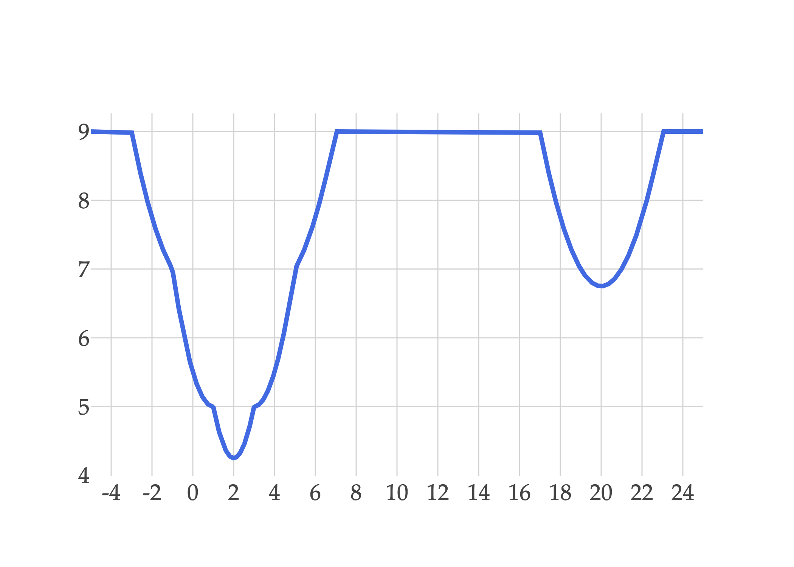



# Spring 2026 Midterm 1

**administered**

<a class="btn btn-info assignment-pdf-button" href="/resources/exams/sp26-mt1.pdf" target="_blank">View as PDF ✏️</a>
<a class="btn btn-info assignment-pdf-button" href="/resources/exams/sp26-mt1-solutions.pdf" target="_blank">Solutions PDF ✅</a>

{: .yellow }

**Instructions**

-   This exam consists of 9 problems, worth 100 points, spread across 12 pages (6 sheets of paper).

-   You have 120 minutes to complete this exam, unless you have extended-time accommodations through SSD.

-   Write your uniqname in the top right corner of each page.

-   For free response problems, **you must show all of your work**, and \\(\boxed{\text{circle}}\\) your final answer. We will not grade work that appears elsewhere, and you may lose points if your work is not shown.

-   For multiple choice problems, completely fill in bubbles and square boxes; if we cannot tell which option(s) you selected, you may lose points.

-   You may refer to **one double-sided 8.5x11" handwritten notes sheet**. Other than that, you may not refer to any other resources or technology during the exam (no phones, watches, or calculators).

---

## Problems

- [Problem 1](#problem-1-16-pts)
- [Problem 2](#problem-2-10-pts)
- [Problem 3](#problem-3-14-pts)
- [Problem 4](#problem-4-8-pts)
- [Problem 5](#problem-5-13-pts)
- [Problem 6](#problem-6-11-pts)
- [Problem 7](#problem-7-10-pts)
- [Problem 8](#problem-8-8-pts)
- [Problem 9](#problem-9-10-pts)

---

## Problem 1 16 pts

Suppose we'd like to find the optimal parameter, \\(w^{\ast}\\), for the constant model \\(h(x&#95;i)=w\\), using the following dataset of \\(n = 4\\) values, \\(y&#95;1, y&#95;2, y&#95;3, y&#95;4\\):

$$
0, \quad 2, \quad 4, \quad 20
$$

a)

3 pts First, suppose we find the optimal parameter by minimizing mean squared error, \\(R&#95;\text{sq}(w)\\). Which value of \\(w\\) minimizes \\(R&#95;\text{sq}(w)\\)? Give your answer as a number with no variables.

\\(\text{minimizer of } R&#95;\text{sq}(w) = \minibox{3cm}{13/2 = 6.5}[1cm]\\)

Solution

For the constant model, average squared loss is minimized at the mean of the \\(y&#95;i\\)'s. Here,

$$
\frac{0+2+4+20}{4}=\frac{26}{4}=\boxed{\frac{13}{2}}
$$

Now, consider the **clipped** loss function, defined below.

$$
\displaystyle L_\text{clip}(y_i,h(x_i))=\min\{(y_i-h(x_i))^2,9\}
$$

 For example, \\(L&#95;\text{clip}(10, 5) = 9\\) and \\(L&#95;\text{clip}(5, 3) = 4\\).

Let \\(R&#95;\text{clip}(w)\\) be the average clipped loss for the constant model and this dataset.

b)

3 pts State one value of \\(w\\) where the derivative of \\(R&#95;\text{clip}(w)\\) is not defined.

\\(\text{one value of } w \text{ where the derivative of } R&#95;\text{clip}(w) \text{ is not defined} =\\)

$$
1cm
$$

Solution

The clipped loss changes formulas whenever

$$
(y_i-w)^2=9
$$

 Equivalently, this happens when \\(w=y&#95;i\pm 3\\). Since \\(20-3=17\\), one valid answer is \\(\boxed{17}\\).

For context, here's what average clipped loss looks like for this dataset:

c)

3 pts Suppose we restrict \\(w\\) to the interval \\(1 \leq w \leq 3\\). Among all values of \\(w\\) in this interval, which value minimizes \\(R&#95;\text{clip}(w)\\)? Give your answer as a number with no variables.

\\(\text{minimizer of } R&#95;\text{clip}(w) \text{ within the interval } [1, 3] = \minibox{3cm}{2}[1cm]\\)

Solution

Once \\(w\\) is more than 3 units away from any particular \\(y&#95;i\\) value, the value \\((y&#95;i - w)^2\\) is replaced by the constant \\(9\\) when computing average loss.

What do we know about constants when they are added to functions? **They don't affect the minimizer!** That is, the minimizer of \\(f(x)\\) and of \\(f(x) + c\\) are the same.

What this is saying is that if \\(w\\) is restricted to the interval \\(1 \leq w \leq 3\\), we can ignore \\(y&#95;4 = 20\\) when computing the minimizer, and this just reduces to minimizing average squared loss (mean squared error) across the data points that are within 3 units of \\(w\\). As long as \\(1 \leq w \leq 3\\), we are within 3 units of \\(y&#95;1 = 0\\), \\(y&#95;2 = 2\\), and \\(y&#95;3 = 4\\).

What constant minimizes average squared loss, for the dataset \\(0, 2, 4\\)? That's the mean of \\(0, 2, 4\\), which is \\(2\\). So the minimizer of \\(R&#95;\text{clip}(w)\\) within the interval \\(1 \leq w \leq 3\\) is \\(\boxed{2}\\).

If you'd like to see this a little more formally, then when \\(1 \leq w \leq 3\\),

$$
R_\text{clip}(w)=\frac14\left(w^2+(2-w)^2+(4-w)^2+9\right)
$$

 Taking the derivative,

$$
\frac{\text{d}}{\text{d}w}R_\text{clip}(w)=\frac14(2w+2(w-2)+2(w-4))=\frac{6w-12}{4}
$$

 Setting this equal to \\(0\\) gives \\(w = 2\\), as we intuited earlier.

d)

3 pts Now suppose there are no restrictions on \\(w\\). Among all possible values of \\(w\\), which value minimizes \\(R&#95;\text{clip}(w)\\)? Give your answer as a number with no variables.

\\(\text{minimizer of } R&#95;\text{clip}(w) = \minibox{3cm}{2}[1cm]\\)

Solution

The best \\(w\\) is still \\(w = 2\\). As a refresher, let's look at the graph of \\(R&#95;\text{clip}(w)\\) again:

First, note that \\(w = 20\\) is a local minimizer of \\(R&#95;\text{clip}(w)\\): if we zoom in to the graph of \\(R&#95;\text{clip}(w)\\) around \\(w = 20\\), it looks like a parabola that opens up, centered at \\(w = 20\\). But, when we zoom out, we see that the graph falls even lower near \\(w = 2\\) than it does near \\(w = 20\\).

Why is this? It's because there are many more \\(y&#95;i\\) values within 3 units of \\(w = 2\\) than there are within 3 units of \\(w = 20\\). Remembering that we have \\(y&#95;1 = 0, y&#95;2 = 2, y&#95;3 = 4, y&#95;4 = 20\\):

$$
R_\text{clip}(20) = \frac{1}{4} \sum_{i=1}^4 \min\{(20-y_i)^2, 9\} = \frac{1}{4} \left( 9 + 9 + 9 + 0 \right) = \frac{27}{4}
$$

$$
R_\text{clip}(2) = \frac{1}{4} \sum_{i=1}^4 \min\{(2-y_i)^2, 9\} = \frac{1}{4} \left( 4 + 0 + 4 + 9 \right) = \frac{17}{4}
$$

So, \\(R&#95;\text{clip}(20) = \frac{27}{4} &gt; \frac{13}{4} = R&#95;\text{clip}(2)\\).

The question, then, is whether \\(w=2\\) is the global minimizer, or just that it's better than \\(w=20\\). Crucially, you wouldn't have had the graph of \\(R&#95;\text{clip}(w)\\) during the exam, so you would have needed to reason about this without it. One way to see how \\(w = 2\\) is the global minimizer is to realize that as \\(w\\) increases from \\(2\\), the average loss only increases, until it reaches 9, where it "coasts" until it we reach \\(w = 17\\), where it decreases once again.

e)

4 pts State one pro and one con of using clipped loss instead of squared loss to find optimal model parameters.

Solution

One pro is that clipped loss is less sensitive to outliers, since very large errors all receive the same loss of \\(9\\). One con is that it stops distinguishing between bad and very bad predictions once the error is large enough; it also introduces points where the derivative is not defined, when the two cases of the min function switch.

---

## Problem 2 10 pts

We will continue to use the constant model, \\(h(x&#95;i)=w\\), and the same dataset of \\(n=4\\) values as in Problem 1:

$$
0,\quad 2,\quad 4,\quad 20
$$

 Instead of the clipped loss function, consider the **weighted absolute** loss function, defined below.

$$
L_\text{WA}(y_i,h(x_i))=
\begin{cases}
\beta(y_i-h(x_i)), & h(x_i)<y_i \\\\
h(x_i)-y_i, & h(x_i)\ge y_i
\end{cases}
$$

 where \\(\beta\\) is a positive integer. Let \\(R&#95;\text{WA}(w)\\) be the average weighted absolute loss for the constant model and this dataset.

The slope of \\(R&#95;\text{WA}(w)\\) at \\(w\\), for any value of \\(w\\) not equal to one of the \\(y&#95;i\\) values, is

$$
\text{slope of } R_\text{WA}(w) \text{ at } w = \frac{\#\text{ left of } w - \beta(\#\text{ right of } w)}{4}
$$

a)

4 pts Suppose \\(\beta = 1\\). Which value of \\(w\\) minimizes \\(R&#95;\text{WA}(w)\\)? Show your work, and write your final answer in the box provided. Your answer should be a number with no variables. If there are multiple possible answers, state just one.

$$
3cm
$$

$$
3cm
$$

$$
1cm
$$

Solution

When \\(\beta = 1\\), \\(R&#95;{\text{WA}}(w)\\) is just mean absolute error, \\(R&#95;\text{abs}(w)\\). We know that the minimizer of mean absolute error is the median of the dataset, or any value between the middle two values if the dataset has an even number of values.

This dataset has an even number of values, so any \\(w\\) in the interval \\(2 \leq w \leq 4\\) minimizes \\(R&#95;\text{WA}(w)\\). One such value is \\(\boxed{3}\\), but \\(2\\), \\(4\\), \\(\pi\\), etc. are all valid answers.

b)

6 pts Now suppose \\(\beta = 2\\). Which value of \\(w\\) minimizes \\(R&#95;\text{WA}(w)\\)? Show your work, and write your final answer in the box provided. Your answer should be a number with no variables. If there are multiple possible answers, state just one.

$$
7cm
$$

$$
3cm
$$

$$
1cm
$$

Solution

When \\(\beta=2\\), the slopes between consecutive data values are

$$
-2,\quad -\frac54,\quad -\frac12,\quad \frac14,\quad 1
$$

 on the intervals \\((-\infty,0)\\), \\((0,2)\\), \\((2,4)\\), \\((4,20)\\), and \\((20,\infty)\\). The slope changes from negative to positive at \\(w=4\\), so the minimizer is \\(\boxed{4}\\).

Conceptually, the fact that the errors in the case where \\(y&#95;i &gt; h(x&#95;i)\\) are multiplied by \\(\beta\\) forces the optimal \\(w^{\ast}\\) to be larger than the median (since we want the \\(y&#95;i &gt; h(x&#95;i)\\) case to not trigger as often when computing the average loss across the entire dataset).

---

## Problem 3 14 pts

Suppose we fit a simple linear regression model **with** an intercept term, \\(h(x&#95;i)=w&#95;0+w&#95;1x&#95;i\\), to a dataset of \\(n\\) points \\((x&#95;1, y&#95;1), (x&#95;2, y&#95;2), \ldots, (x&#95;n, y&#95;n)\\) by minimizing mean squared error. You are given the following information:

-   The fit model satisfies \\(h(-4) = 5\\) and \\(h(8) = 14\\).

-   The mean of \\(y&#95;1, y&#95;2, \ldots, y&#95;n\\) is \\(\bar y = 2\\).

a)

6 pts Find \\(\bar x\\), the mean of \\(x&#95;1, x&#95;2, \ldots, x&#95;n\\). Show your work, and write your final answer in the box provided. Your answer should be a number with no variables. <em>Hint: What property does the line \\(h(x&#95;i)\\) satisfy?</em>

$$
12cm
$$

$$
3cm
$$

$$
1cm
$$

Solution

The line through \\((-4,5)\\) and \\((8,14)\\) has slope

$$
w_1^*=\frac{14-5}{8-(-4)}=\frac{9}{12}=\frac34
$$

 Using \\(h(-4)=5\\),

$$
5=w_0^*+\frac34(-4)=w_0^*-3
$$

 so \\(w&#95;0^{\ast}=8\\), and the fit model is \\(h(x&#95;i) = 8 + \frac{3}{4}x&#95;i\\).

For simple linear regression with an intercept, the fit line passes through \\((\bar x,\bar y)\\). Since \\(\bar y=2\\),

$$
2=8+\frac34\bar x \implies \bar x = -8
$$

 which gives \\(\boxed{\bar x=-8}\\).

b)

4 pts Suppose the correlation coefficient between the \\(x\\)-values and \\(y\\)-values is \\(r = 1/3\\).

The standard deviation of \\(y\\), \\(\sigma&#95;y\\), is \\(c\\) times the standard deviation of \\(x\\), \\(\sigma&#95;x\\). In other words,

$$
\sigma_y = c \sigma_x
$$

 What is the value of \\(c\\)?

 \\(1/4\\) \\(4/9\\) \\(3/4\\) \\(9/4\\) \\(3\\) \\(4\\)

Solution

 \\(1/4\\) \\(4/9\\) \\(3/4\\) \\(9/4\\) \\(3\\) \\(4\\)

For simple linear regression, one (of the many equivalent) formula for the slope \\(w&#95;1^{\ast}\\) is

$$
w_1^*=r\frac{\sigma_y}{\sigma_x}
$$

 From part **a)**, \\(w&#95;1^{\ast}=\frac34\\). Since \\(r=\frac13\\) and \\(\sigma&#95;y=c\sigma&#95;x\\),

$$
\frac34=\frac13c
$$

 so \\(\boxed{c=\frac94}\\).

c)

4 pts Let \\(e&#95;i=y&#95;i-h(x&#95;i)\\) be the fit model's error for the \\(i\\)th point. Note that \\(e&#95;i\\) may either be positive or negative. Which of the following statements are **guaranteed** to be true? **Select all** that apply.

 \\(\displaystyle\sum&#95;{i=1}^n e&#95;i=0\\) \\(\displaystyle\sum&#95;{i=1}^n x&#95;i e&#95;i=0\\) \\(\displaystyle\sum&#95;{i=1}^n y&#95;i e&#95;i=0\\) \\(\displaystyle\sum&#95;{i=1}^n e&#95;i (x&#95;i - \bar x)=0\\)

Solution

 \\(\displaystyle\sum&#95;{i=1}^n e&#95;i=0\\) \\(\displaystyle\sum&#95;{i=1}^n x&#95;i e&#95;i=0\\) \\(\displaystyle\sum&#95;{i=1}^n y&#95;i e&#95;i=0\\) \\(\displaystyle\sum&#95;{i=1}^n e&#95;i (x&#95;i - \bar x)=0\\)

How did we find \\(w&#95;0^{\ast}\\) and \\(w&#95;1^{\ast}\\)? By minimizing mean squared error:

$$
R_\text{sq}(w_0, w_1) = \frac{1}{n} \sum_{i=1}^n (y_i - (w_0 + w_1 x_i))^2
$$

To do so, we took the partial derivatives with respect to \\(w&#95;0\\) and \\(w&#95;1\\) and set them equal to 0:

$$
\frac{\partial R_\text{sq}}{\partial w_0} = \frac{1}{n} \sum_{i=1}^n -2(y_i - (w_0 + w_1 x_i)) = 0
$$

$$
\frac{\partial R_\text{sq}}{\partial w_1} = \frac{1}{n} \sum_{i=1}^n -2x_i(y_i - (w_0 + w_1 x_i)) = 0
$$

Solving these equations gave us \\(w&#95;0^{\ast}\\) and \\(w&#95;1^{\ast}\\). But if we take a closer look, these equations are telling us properties about the errors, \\(e&#95;i = y&#95;i - h(x&#95;i) = y&#95;i - (w&#95;0 + w&#95;1 x&#95;i)\\). Above, I'll substitute in \\(e&#95;i\\) every time I see a \\(y&#95;i - (w&#95;0 + w&#95;1 x&#95;i)\\).

The first equation becomes

$$
\frac{1}{n} \sum_{i=1}^n -2e_i = 0 \implies \sum_{i=1}^n e_i = 0
$$

and the second equation becomes

$$
\frac{1}{n} \sum_{i=1}^n -2x_i e_i = 0 \implies \sum_{i=1}^n x_i e_i = 0
$$

So, hidden in plain sight were these properties about the errors! Recall, the four options in this question are:

-   \\(\displaystyle\sum&#95;{i=1}^n e&#95;i=0\\)

-   \\(\displaystyle\sum&#95;{i=1}^n x&#95;i e&#95;i=0\\)

-   \\(\displaystyle\sum&#95;{i=1}^n y&#95;i e&#95;i=0\\)

-   \\(\displaystyle\sum&#95;{i=1}^n e&#95;i(x&#95;i-\bar x)=0\\)

So, we know the first two are true.

What about the third option, \\(\displaystyle\sum&#95;{i=1}^n y&#95;i e&#95;i=0\\)? The short answer is that there's no reason to believe this is true; if it were, it would have emerged from our analysis above. To be sure that it's not true, let's find a counterexample.

We know that \\(y&#95;i = h(x&#95;i) + e&#95;i\\), so

$$
\sum_{i=1}^n y_i e_i = \sum_{i=1}^n (h(x_i) + e_i) e_i = \sum_{i=1}^n h(x_i) e_i + \sum_{i=1}^n e_i^2
$$

This is only \\(0\\) when the fit line has zero error on every point. So, the third option is not guaranteed to be true.

Finally, let's look at the fourth option, \\(\sum&#95;{i=1}^n e&#95;i(x&#95;i-\bar x)=0\\). This is true, because the first two options are true:

$$
\sum_{i=1}^n e_i(x_i-\bar x)=\sum_{i=1}^n e_i x_i -\sum_{i=1}^n e_i \bar x = 0 - \bar x \sum_{i=1}^n e_i = 0
$$

 The statement \\(\sum&#95;{i=1}^n y&#95;i e&#95;i=0\\) is not guaranteed; in fact, since \\(y&#95;i=h(x&#95;i)+e&#95;i\\),

$$
\sum_{i=1}^n y_i e_i=\sum_{i=1}^n h(x_i)e_i+\sum_{i=1}^n e_i^2=\sum_{i=1}^n e_i^2
$$

 which is only \\(0\\) when the fit line has zero error on every point, i.e. passes through every single point.

**Above, you may be wondering why it's the case that**

$$
\sum_{i = 1}^n h(x_i) e_i = 0
$$

Intentionally, I haven't provided the proof of this! I want you to piece the proof together. Start by using the fact that the first two options in this question are true.

---

## Problem 4 8 pts

Let \\(\vec u,\vec v\in\mathbb R^n\\) be vectors satisfying

$$
\|\vec v\|=5,\qquad \|\vec u+\vec v\|=10,\qquad \|\vec u-\vec v\|=6
$$

Find \\(\lVert \vec u \rVert^2\\) (**not** \\(\lVert \vec u \rVert\\)). Show your work, and write your final answer in the box provided. Your answer should be a number with no variables.

$$
14.5cm
$$

$$
3cm
$$

$$
1cm
$$

Solution

We have

$$
10^2=\|\vec u+\vec v\|^2=\|\vec u\|^2+2\vec u\cdot\vec v+\|\vec v\|^2
$$

 and

$$
6^2=\|\vec u-\vec v\|^2=\|\vec u\|^2-2\vec u\cdot\vec v+\|\vec v\|^2
$$

 Notice that the expressions on the right-hand side are similar, except for the signs of \\(2 \vec u \cdot \vec v\\). So, adding these equations gives

$$
136=2\|\vec u\|^2+2\|\vec v\|^2=2\|\vec u\|^2+50
$$

 so

$$
\lVert \vec u \rVert^2 = \frac{136 - 50}{2} = \boxed{43}
$$

---

## Problem 5 13 pts

Suppose \\(\vec u,\vec v\in\mathbb R^n\\) are non-zero vectors and \\(k\\) is a scalar. Let

$$
f(k) = \lVert \vec u - k \vec v \rVert^2 + C k^2
$$

 where \\(C \geq 0\\) is a non-negative constant.

a)

6 pts In this part only, suppose \\(C=0\\), \\(\vec u = \begin{bmatrix} 1 \\\\ 2 \end{bmatrix}\\), and \\(\vec v = \begin{bmatrix} 3 \\\\ 1 \end{bmatrix}\\). Find the value of \\(k\\) that minimizes \\(f(k)\\). Show your work, and write your final answer in the box provided. Your answer should be a number with no variables.

$$
4cm
$$

$$
3cm
$$

$$
1cm
$$

Solution

There are several ways to think about this problem. What I expected most students to see is that when \\(C = 0\\), this is really asking for the orthogonal projection of \\(\vec u\\) onto \\(\vec v\\); the minimizer of \\(f(k)\\) is the value of \\(k\\) that makes \\(\vec u - k \vec v\\) orthogonal to \\(\vec v\\).

Using that logic, we know from [Chapter 3.4](https://notes.eecs245.org/vectors/orthogonal-projection/) that the orthogonal projection of \\(\vec u\\) onto \\(\vec v\\) is given by

$$
\vec p = k^* \vec v = \left( \frac{\vec u \cdot \vec v}{\vec v \cdot \vec v} \right) \vec v
$$

So,

$$
k^* = \frac{\vec u \cdot \vec v}{\vec v \cdot \vec v} = \frac{1 \cdot 3 + 2 \cdot 1}{3^2 + 1^2} = \frac{5}{10} = \boxed{\frac{1}{2}}
$$

There's another way to approach this problem, which is to simplify \\(f(k)\\) and treat this like a calculus problem.

$$
f(k)=\left\|\begin{bmatrix}1\\\\2\end{bmatrix}-k\begin{bmatrix}3\\\\1\end{bmatrix}\right\|^2=(1-3k)^2+(2-k)^2
$$

 Expanding,

$$
f(k)=10k^2-10k+5
$$

 so

$$
f'(k)=20k-10
$$

 Setting \\(f'(k)=0\\) gives \\(k^{\ast} = \frac{1}{2}\\) as well.

b)

4 pts Note that \\(f(k)\\) *almost* looks like the squared norm of the vector \\(\vec u - k \vec v\\), but with an extra term \\(C k^2\\). Let's try and rewrite \\(f(k)\\) so that it *is* the squared norm of another related vector.

Define two new vectors, \\(\vec U, \vec V \in \mathbb R^{n+1}\\) by appending the scalar \\(a\\) to the end of \\(\vec u\\) and the scalar \\(b\\) to the end of \\(\vec v\\).

$$
\vec U = \begin{bmatrix} u_1 \\\\ u_2 \\\\ \vdots \\\\ u_n \\\\ a\end{bmatrix}, \quad \vec V = \begin{bmatrix} v_1 \\\\ v_2 \\\\ \vdots \\\\ v_n \\\\ b\end{bmatrix}
$$

Select values of \\(a\\) and \\(b\\) so that \\(f(k) = \lVert \vec U - k \vec V \rVert^2\\), for all possible non-negative values of \\(C\\).

1.  What is the value of \\(a\\)?

 0 \\(C\\) \\(C^2\\) \\(\sqrt{C}\\)

2.  What is the value of \\(b\\)?

 0 \\(C\\) \\(C^2\\) \\(\sqrt{C}\\)

Solution

 0 \\(C\\) \\(C^2\\) \\(\sqrt{C}\\)

First, let's try and get a better sense of how \\(\lVert \vec U - k \vec V \rVert^2\\) works.

$$
\begin{align*}
\lVert \vec U - k \vec V \rVert^2 &= \left\lVert \begin{bmatrix} u_1 \\\\ u_2 \\\\ \vdots \\\\ u_n \\\\ a\end{bmatrix} - k \begin{bmatrix} v_1 \\\\ v_2 \\\\ \vdots \\\\ v_n \\\\ b\end{bmatrix} \right\rVert^2 \\\\
&= \left\lVert \begin{bmatrix} u_1 - kv_1 \\\\ u_2 - kv_2 \\\\ \vdots \\\\ u_n - kv_n \\\\ a - kb\end{bmatrix} \right\rVert^2 \\\\
&= \sum_{i=1}^n (u_i - kv_i)^2 + (a - kb)^2 \\\\
&= \lVert \vec u - k \vec v \rVert^2 + (a - kb)^2 \\\\
\end{align*}
$$

Our job is to find \\(a\\) and \\(b\\) so that \\(f(k)\\), which we were told is defined as

$$
f(k) =\lVert \vec u - k \vec v \rVert^2 + C k^2
$$

 is **also** equal to

$$
\lVert \vec U - k \vec V \rVert^2 = \lVert \vec u - k \vec v \rVert^2 + (a - kb)^2
$$

If we set \\(f(k) = \lVert \vec U - k \vec V \rVert^2\\), we see that this boils down to finding \\(a\\) and \\(b\\) such that

$$
(a - kb)^2 = C k^2
$$

Notice the right-hand side of the expression above is just \\(Ck^2\\), not \\(Ck^2 + \text{some constant} \cdot k + \text{some other constant}\\). This means that \\(a = 0\\), and that forces \\(b = \sqrt{C}\\):

$$
(0 - k\sqrt{C})^2 = Ck^2
$$

So, the correct answers are \\(\boxed{a=0}\\) and \\(\boxed{b=\sqrt{C}}\\).

c)

3 pts As \\(C\\) increases, what happens to the value of \\(k\\) that minimizes \\(f(k)\\)? Explain your reasoning.

Solution

There are a couple of ways to think about this. First, if we use the interpretation provided in part **b)**, the vectors \\(\vec U\\) and \\(\vec V\\) "bake in" the value of \\(C\\):

$$
\vec U = \begin{bmatrix} u_1 \\\\ u_2 \\\\ \vdots \\\\ u_n \\\\ 0\end{bmatrix}, \quad \vec V = \begin{bmatrix} v_1 \\\\ v_2 \\\\ \vdots \\\\ v_n \\\\ \sqrt{C}\end{bmatrix}
$$

Increasing \\(C\\) keeps the dot product of \\(\vec U\\) and \\(\vec V\\) fixed, but increases the norm of \\(\vec V\\). Why is this relevant? Since \\(f(k) = \lVert \vec U - k \vec V \rVert^2\\), the minimizer \\(k^{\ast}\\) of \\(f(k)\\) is equal to

$$
k^* = \frac{\vec U \cdot \vec V}{\vec V \cdot \vec V}
$$

So, as \\(C\\) increases, the denominator of \\(k^{\ast}\\) increases, so \\(k^{\ast}\\) moves toward \\(0\\), though this may happen either from the left or the right, since \\(\vec U \cdot \vec V\\) may be positive or negative.

If you'd prefer, you *could* just expand the original definition of \\(f(k)\\), take the derivative to find the closed-form expression for the minimizing \\(k^{\ast}\\) for an arbitrary \\(C\\), and look at what happens to \\(k^{\ast}\\) as \\(C\\) increases.

Recall, the original definition of \\(f(k)\\) is \\(f(k)=\lVert \vec u - k \vec v \rVert^2 + C k^2\\), so

$$
f(k)=\vec u \cdot \vec u - 2k(\vec u\cdot\vec v)+k^2\vec v \cdot \vec v+Ck^2
$$

 Therefore,

$$
f'(k)=-2(\vec u\cdot\vec v)+2k(\vec v \cdot \vec v+C)
$$

 so the minimizer is

$$
k^*=\frac{\vec u\cdot\vec v}{\vec v \cdot \vec v+C}
$$

 As \\(C\\) increases, the denominator increases (but \\(\vec u\\) and \\(\vec v\\) are fixed --- notice these are the original \\(\vec u, \vec v\\), not the new \\(\vec U, \vec V\\)), so \\(k^{\ast}\\) moves toward \\(0\\).

---

## Problem 6 11 pts

Suppose \\(c \in \mathbb R\\) is a constant and

$$
\vec u=\begin{bmatrix}3\\\\1\\\\c\end{bmatrix},
\qquad
\vec v=\begin{bmatrix}6\\\\c\\\\-2\end{bmatrix}
$$

a)

4 pts Fill in the blanks to complete the sentence:

For all values of \\(c\\), \\(\text{span}(\lbrace\vec u,\vec v\rbrace)\\) is a \_\_(i)\_\_-dimensional subspace of \_\_(ii)\_\_.

(i):

$$
1cm
$$

 (ii):

$$
1cm
$$

Solution

The vectors \\(\vec u\\) and \\(\vec v\\) are never scalar multiples of each other. If \\(\vec v=\lambda\vec u\\), then the first entries force \\(\lambda=2\\), the second entries force \\(c=2\\), and the third entries force \\(-2=2c=4\\), which is impossible. Therefore, the span is always a 2-dimensional subspace of \\(\mathbb R^3\\).

Why \\(\mathbb R^3\\)? Because both \\(\vec u\\) and \\(\vec v\\) live in \\(\mathbb R^3\\), so their span must also live in \\(\mathbb R^3\\).

b)

7 pts Suppose the plane spanned by \\(\vec u\\) and \\(\vec v\\) is

$$
ax+24y+3z=0
$$

 where \\(a\\) is also a constant. Find the value of \\(c\\). Show your work in the space provided, and write your final answer in the box provided. Your answer should be a number with no variables.

$$
13cm
$$

$$
3cm
$$

$$
1cm
$$

Solution

There are a few ways to approach this. The first way starts by using the fact that \\(\vec u\\) and \\(\vec v\\) lie in the plane, which gives us a system of two equations and two unknowns. Plugging in the coordinates of \\(\vec u\\) into the plane gives us

$$
3a+24+3c=0 \implies a + 8 + c = 0
$$

 and plugging in the coordinates of \\(\vec v\\) into the plane gives us

$$
6a+24c-6=0 \implies a + 4c - 1 = 0
$$

 Subtracting the simplified versions of the two equations gives us

$$
(8 + c) - (4c - 1) = 0 \implies 9 - 3c = 0 \implies c = 3
$$

Another way to approach this is to find the cross product of \\(\vec u\\) and \\(\vec v\\), and try and write it as a scalar multiple of the vector \\(\begin{bmatrix} a \\\\ 24 \\\\ 3 \end{bmatrix}\\).

$$
\vec u \times \vec v = \begin{bmatrix} 3 \\\\ 1 \\\\ c \end{bmatrix} \times \begin{bmatrix} 6 \\\\ c \\\\ -2 \end{bmatrix} = \begin{bmatrix} 1 \cdot (-2) - c \cdot c \\\\ c \cdot 6 - 3 \cdot (-2) \\\\ 3 \cdot c - 1 \cdot 6 \end{bmatrix} = \begin{bmatrix} -2 - c^2 \\\\ 6c + 6 \\\\ 3c - 6 \end{bmatrix}
$$

Strictly speaking, this vector, \\(\begin{bmatrix} -2 - c^2 \\\\ 6c + 6 \\\\ 3c - 6 \end{bmatrix}\\), is a scalar multiple of \\(\begin{bmatrix} a \\\\ 24 \\\\ 3 \end{bmatrix}\\), but we don't know what the scalar is yet. So, we really should try and solve

$$
\begin{bmatrix} -2 - c^2 \\\\ 6c + 6 \\\\ 3c - 6 \end{bmatrix} = k \begin{bmatrix} a \\\\ 24 \\\\ 3 \end{bmatrix}
$$

But, notice that \\(6c + 6 = 24 \implies c = 3\\), and \\(c = 3\\) also satisfies \\(3c - 6 = 3\\), so the scalar \\(k = 1\\), and thus \\(\boxed{c = 3}\\).

---

## Problem 7 10 pts

Suppose \\(\vec v&#95;1,\vec v&#95;2,\vec v&#95;3,\vec v&#95;4\in\mathbb R^n\\) are a **linearly independent** collection of vectors. Define

$$
\vec p=\vec v_1+\vec v_2,\qquad
\vec q=\vec v_2+\vec v_3,\qquad
\vec r=\vec v_3+\vec v_4,\qquad
\vec s=\vec v_4+\vec v_1
$$

a)

7 pts Are \\(\lbrace\vec p,\vec q,\vec r,\vec s\rbrace\\) linearly independent?

1.  Select an answer:

 Yes No

2.  Prove your answer using the formal definition of linear independence. <em>Hint: You did something similar in Homework 4, Problem 6.</em>

Solution

 Yes No

If \\(\vec p,\vec q,\vec r,\vec s\\) are linearly independent, then the only solution to the equation \\(a \vec p + b \vec q + c \vec r + d \vec s = \vec 0\\) is \\(a = b = c = d = 0\\).

That's not the case here! Consider the linear combination

$$
\vec p-\vec q+\vec r-\vec s
$$

 How did I think of this? I noticed that if I start with \\(\vec p\\), subtracting \\(\vec q\\) gets rid of all \\(\vec v&#95;2\\)'s, but makes \\(\vec v&#95;3\\) negative, so I need a positive \\(\vec r\\) to cancel that out. Then, \\(\vec p - \vec q + \vec r = \vec v&#95;1 + \vec v&#95;4\\); subtracting \\(\vec s\\) then gets rid of both \\(\vec v&#95;1\\) and \\(\vec v&#95;4\\), leaving me with \\(\vec 0\\).

$$
\vec p - \vec q + \vec r - \vec s = (\vec v_1+\vec v_2)-(\vec v_2+\vec v_3)+(\vec v_3+\vec v_4)-(\vec v_4+\vec v_1)=\vec 0
$$

 The coefficients \\(1,-1,1,-1\\) are not all zero, so this proves that \\(\lbrace\vec p,\vec q,\vec r,\vec s\rbrace\\) is linearly dependent.

b)

3 pts What is the dimension of \\(\text{span}(\lbrace\vec p,\vec q,\vec r,\vec s\rbrace)\\)? Give your answer as a number with no variables.

\\(\dim(\text{span}(\lbrace\vec p,\vec q,\vec r,\vec s\rbrace)) = \minibox{3cm}{3}[1cm]\\)

Solution

Part **a)** shows that the four vectors are linearly **dependent**, so the dimension of \\(\text{span}(\lbrace\vec p,\vec q,\vec r,\vec s\rbrace)\\) is **at most** \\(3\\). (For the dimension to be 4, which is the number of vectors in question, they would need to be linearly independent. There's no way to have a span of 5 or more dimensions using just 4 vectors.)

But just because the dimension of \\(\text{span}(\lbrace\vec p,\vec q,\vec r,\vec s\rbrace)\\) is at most \\(3\\) doesn't mean that the dimension is actually \\(3\\) --- for this span to be 3-dimensional, it needs to be the span of 3 linearly independent vectors.

Fortunately, \\(\vec p,\vec q,\vec r\\) are linearly independent. If

$$
a\vec p+b\vec q+c\vec r=\vec 0
$$

 then

$$
a\vec v_1+(a+b)\vec v_2+(b+c)\vec v_3+c\vec v_4=\vec 0
$$

 Since \\(\vec v&#95;1,\vec v&#95;2,\vec v&#95;3,\vec v&#95;4\\) are linearly independent, we must have

$$
a=0,\qquad a+b=0,\qquad b+c=0,\qquad c=0
$$

 This gives \\(a=b=c=0\\), so \\(\vec p,\vec q,\vec r\\) are linearly independent. Therefore, among \\(\left\lbrace \vec p,\vec q,\vec r,\vec s \right\rbrace\\), there are 3 linearly independent vectors, and thus

$$
\boxed{\dim(\text{span}(\{\vec p,\vec q,\vec r,\vec s\}))=3}
$$

---

## Problem 8 8 pts

Suppose \\(S\\) is the subspace of \\(\mathbb R^4\\) defined by

$$
S=\left\{
\begin{bmatrix}x_1\\\\x_2\\\\x_3\\\\x_4\end{bmatrix}\in\mathbb R^4 :
x_1-x_2+x_3-x_4=0
\right\}
$$

Which of the following sets is a basis for \\(S\\)? **Select all** that apply.

Solution

The subspace \\(S\\) has dimension \\(3\\) because the single constraint lets us solve

$$
x_4=x_1-x_2+x_3
$$

 This means that components 1, 2, and 3 are free to vary, and component 4 is fully determined by those first three components. So, \\(S\\) has three "degrees of freedom", and therefore has dimension \\(3\\).

So a basis for \\(S\\) is any set of **three linearly independent vectors** that all lie in \\(S\\).

The first and third choices are bases: in both of those choices, the set has 3 vectors that are linearly independent, and all 3 vectors lie in \\(S\\).

The second choice has 4 vectors in a 3-dimensional subspace, so it cannot be a basis.

The fourth choice has 3 vectors but they are not linearly independent, since at least one of them can be written as a linear combination of the other two:

$$
\begin{bmatrix}1\\\\1\\\\0\\\\0\end{bmatrix} = \begin{bmatrix}1\\\\0\\\\0\\\\1\end{bmatrix} + \begin{bmatrix}0\\\\1\\\\0\\\\-1\end{bmatrix}
$$

So, only the first and third choices are bases for \\(S\\).

---

## Problem 9 10 pts

a)

7 pts Suppose \\(x\\) and \\(y\\) are non-negative numbers. Using the Cauchy-Schwarz inequality, prove that

$$
\frac{(x+y)^2}{2}\le x^2+y^2
$$

<em>Solutions that do not use the Cauchy-Schwarz inequality will not receive credit.</em>

Solution

Recall, the Cauchy-Schwarz inequality states that for any two vectors \\(\vec u, \vec v \in \mathbb{R}^n\\),

$$
|\vec u \cdot \vec v| \leq \|\vec u\| \|\vec v\|
$$

Applying Cauchy-Schwarz to the vectors \\(\vec u=\begin{bmatrix}x\\\\y\end{bmatrix}\\) and \\(\vec v=\begin{bmatrix}1\\\\1\end{bmatrix}\\) gives

$$
|x + y| \leq \sqrt{x^2 + y^2} \sqrt{1^2 + 1^2} = \sqrt{2(x^2 + y^2)}
$$

 Squaring both sides gives

$$
(x + y)^2 \leq 2(x^2 + y^2)
$$

 and finally, dividing both sides by \\(2\\) gives

$$
\frac{(x+y)^2}{2}\le x^2+y^2
$$

 as needed.

b)

3 pts Now suppose \\(x\\), \\(y\\), and \\(z\\) are non-negative numbers. Which inequality is guaranteed to be true?

|  \\(\displaystyle \frac{(x+y+z)^2}{2}\le x^2+y^2+z^2\\) |
|:--------------------------------------------------------------|
|  \\(\displaystyle \frac{(x+y+z)^2}{3}\le x^2+y^2+z^2\\) |
|  \\(\displaystyle \frac{(x+y+z)^2}{2}\le x^3+y^3+z^3\\) |
|  \\(\displaystyle \frac{(x+y+z)^3}{3}\le x^3+y^3+z^3\\) |
|  None of the above                                  |

Solution

 None of the above

The Cauchy-Schwarz inequality directly implies one of the options, and the other options are all not guaranteed to be true. Extending our argument from part **a)**, let's now apply Cauchy-Schwarz to the vectors \\(\vec u=\begin{bmatrix}x\\\\y\\\\z\end{bmatrix}\\) and \\(\vec v=\begin{bmatrix}1\\\\1\\\\1\end{bmatrix}\\). This gives

$$
|x+y+z|\le \sqrt{x^2+y^2+z^2} \sqrt{1^2+1^2+1^2} = \sqrt{3(x^2+y^2+z^2)}
$$

 Squaring both sides and dividing by \\(3\\) gives

$$
\frac{(x+y+z)^2}{3}\le x^2+y^2+z^2
$$

 which is the second option.

Congrats on finishing Midterm 1! Feel free to draw us a picture about EECS 245 in the box below.


