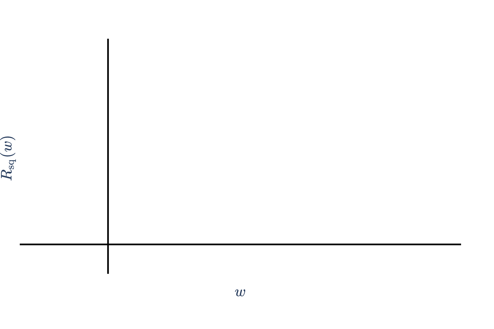
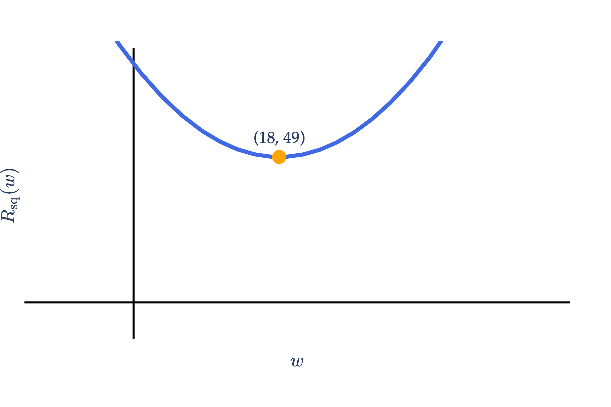
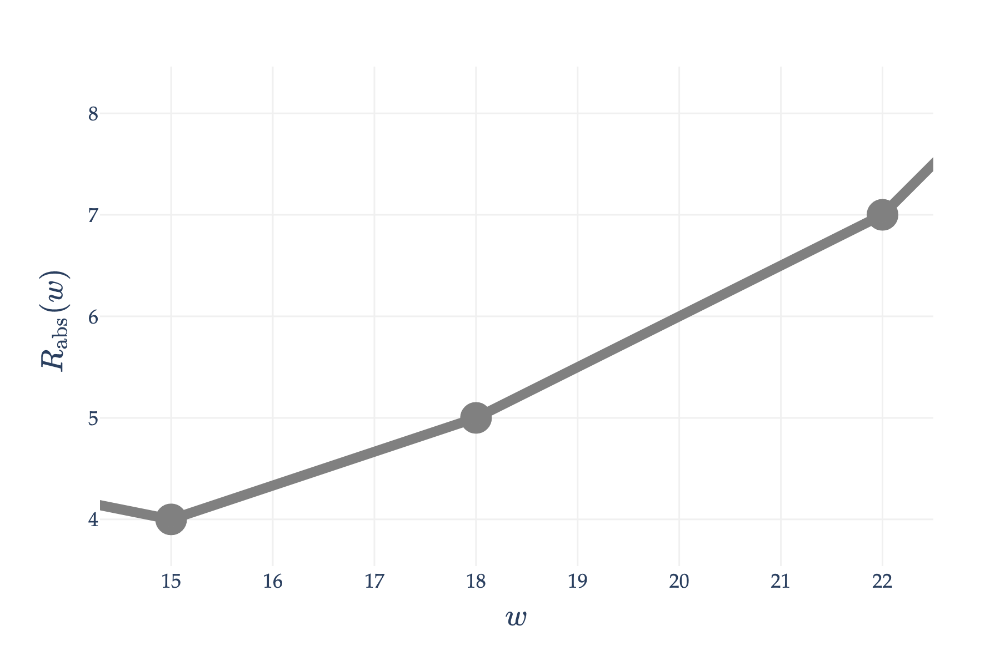



# Winter 2026 Midterm 1

**administered**

<a class="btn btn-info assignment-pdf-button" href="/resources/exams/wn26-mt1.pdf" target="_blank">View as PDF ✏️</a>
<a class="btn btn-info assignment-pdf-button" href="/resources/exams/wn26-mt1-solutions.pdf" target="_blank">Solutions PDF ✅</a>

{: .yellow }

**Instructions**

-   This exam consists of 7 problems, worth a total of 100 points, spread across 12 pages (6 sheets of paper).

-   You have 120 minutes to complete this exam, unless you have extended-time accommodations through SSD.

-   Write your uniqname in the top right corner of each page.

-   For free response problems, **you must show all of your work**, and \\(\boxed{\text{circle}}\\) your final answer. We will not grade work that appears elsewhere, and you may lose points if your work is not shown.

-   For multiple choice problems, completely fill in bubbles and square boxes; if we cannot tell which option(s) you selected, you may lose points.

-   You may refer to **one double-sided 8.5x11" handwritten notes sheet**. Other than that, you may not refer to any other resources or technology during the exam (no phones, watches, or calculators).

---

## Problems

- [Problem 1](#problem-1-16-pts)
- [Problem 2](#problem-2-14-pts)
- [Problem 3](#problem-3-12-pts)
- [Problem 4](#problem-4-12-pts)
- [Problem 5](#problem-5-12-pts)
- [Problem 6](#problem-6-14-pts)
- [Problem 7](#problem-7-20-pts)

---

## Problem 1 16 pts

Consider a dataset of \\(n\\) values, \\(y&#95;1, y&#95;2, \ldots, y&#95;n\\), with:

-   a mean of \\(\bar{y} = 18\\)

-   a median of 15

-   a standard deviation of \\(\sigma&#95;y = 7\\)

a)

4 pts In the space provided, sketch the graph of \\(R&#95;\text{sq}(w)\\), the mean squared error of a constant prediction \\(w\\) on the dataset. For full credit:

-   The shape of the graph must be correct.

-   You must clearly label the coordinates of the **minimum point** on the graph.

Solution

Recall that

$$
R_\text{sq}(w) = \frac{1}{n} \sum_{i=1}^n (y_i - w)^2
$$

is a parabola, minimized at \\(w = \bar y\\). When \\(w = \bar y\\),

$$
R_\text{sq}(w) = \frac{1}{n} \sum_{i=1}^n (y_i - \bar y)^2 = \sigma_y^2
$$

 is the variance of the dataset. Here, the mean is 18 and the variance is 49, so the minimum point is at \\((18, 49)\\).

b)

6 pts Which of the following quantities is **guaranteed** to be equal to 0? Select all that apply.

 \\(\displaystyle \frac{1}{n} \sum&#95;{i=1}^n (y&#95;i - 15)\\)

 \\(\displaystyle \frac{1}{n} \sum&#95;{i=1}^n (y&#95;i - 18)\\)

 \\(\displaystyle \frac{1}{n}\sum&#95;{i=1}^n (y&#95;i - 15)^2\\)

 \\(\displaystyle \frac{1}{n}\sum&#95;{i=1}^n (y&#95;i - 18)^2\\)

 \\(\displaystyle \frac{1}{n}\sum&#95;{i=1}^n (y&#95;i - 15)^2 - 7^2\\)

 \\(\displaystyle \frac{1}{n}\sum&#95;{i=1}^n (y&#95;i - 18)^2 - 7^2\\)

Solution

 \\(\displaystyle \frac{1}{n}\sum&#95;{i=1}^n (y&#95;i - 18)^2 - 7^2\\)

There are two key ideas at play here:

-   The mean is the unique point in the dataset such that the sum of deviations from the mean is 0. In other words,

$$
\sum_{i=1}^n (y_i - \bar y) = \sum_{i=1}^n y_i - n \bar y = n \bar y - n \bar y = 0
$$

-   The variance of a dataset is the average of the squared deviations from the mean. In other words,

$$
\sigma_y^2 = \frac{1}{n} \sum_{i=1}^n (y_i - \bar y)^2
$$

 Equivalently, this is the value of \\(R&#95;\text{sq}(w)\\) when \\(w = \bar y\\).

With this in mind, let's look at the options:

**(i)** (**False**) \\(\displaystyle \frac{1}{n} \sum&#95;{i=1}^n (y&#95;i - 15)\\): This is the average of the deviations from the median, which is not 0. This is only true for the mean.

**(ii)** (**True**) \\(\displaystyle \frac{1}{n} \sum&#95;{i=1}^n (y&#95;i - 18)\\): This is the average of the deviations from the mean, which is 0. This is only true for the mean.

**(iii)** (**False**) \\(\displaystyle \frac{1}{n}\sum&#95;{i=1}^n (y&#95;i - 15)^2\\): This is the function \\(R&#95;\text{sq}(w)\\) when \\(w = 15\\). As we see in the solution to part **a)**, this is not 0.

**(iv)** (**False**) \\(\displaystyle \frac{1}{n}\sum&#95;{i=1}^n (y&#95;i - 18)^2\\): This is the function \\(R&#95;\text{sq}(w)\\) when \\(w = 18\\), i.e. it is the variance of the dataset. As we see in the solution to part **a)**, this is also not zero --- here, it is \\(\sigma&#95;y^2 = 7^2 = 49\\). One point of confusion may be that \\(w = \bar{y}\\) is the point at which \\(R&#95;\text{sq}(w)\\) is minimized and \\(R&#95;\text{sq}(w)\\) has a **derivative** of 0, but \\(R&#95;\text{sq}(\bar y) \neq 0\\) in general.

**(v)** (**False**) \\(\displaystyle \frac{1}{n}\sum&#95;{i=1}^n (y&#95;i - 15)^2 - 7^2\\): This would be true if the 15 were replaced with the mean, 18, but it is not.

**(vi)** (**True**) \\(\displaystyle \frac{1}{n}\sum&#95;{i=1}^n (y&#95;i - 18)^2 - 7^2\\): This is the variance of the dataset minus the variance of the dataset, which indeed is 0.

c)

6 pts Recall that \\(R&#95;\text{abs}(w)\\) is the mean absolute error of a constant prediction \\(w\\) on the dataset. A snippet of the graph of \\(R&#95;\text{abs}(w)\\) is shown below.

For clarity, the circles at \\((15, 4)\\), \\((18, 5)\\), and \\((22, 7)\\) indicate the points at which the slope of \\(R&#95;\text{abs}(w)\\) changes.

Given that there are \\(n = 72\\) values in the dataset, how many values in the dataset are equal to **18**? Show your work and \\(\boxed{\text{circle}}\\) your final answer, which should be an integer with no variables.

Solution

The number of values in the dataset that are equal to 18 is 6.

Recall, the slope of \\(R&#95;\text{abs}(w)\\) at any \\(w\\) that is not a data point is:

$$
\frac{\text{d}}{\text{d}w} R_\text{abs}(w) = \frac{\# \text{ left of } w - \# \text{ right of } w}{n}
$$

There are two line segments of interest here: the one between \\(w=15\\) and \\(w=18\\), and the one between \\(w=18\\) and \\(w=22\\). We have two ways of computing the slope of each one: by using \\(\text{slope} = \frac{\text{change in } y}{\text{change in } x}\\) and by using the formula above. We'll use both formulas on each line segment.

-   **Between \\(w=15\\) and \\(w=18\\):**

-   Method 1: Using \\(\text{slope} = \frac{\text{change in } y}{\text{change in } x}\\), the graph rises from \\((15, 4)\\) to \\((18, 5)\\), which gives a slope of

$$
s_1 = \frac{5 - 4}{18 - 15} = \frac{1}{3}
$$

-   Method 2: Using the formula for the slope of \\(R&#95;\text{abs}(w)\\), let \\(l\\) be the number of values in the dataset less than or equal to 15. Then, the slope in this interval is

$$
s_1 = \frac{l - (72 - l)}{72} = \frac{2l - 72}{72}
$$

   At this point, we have enough information to solve for \\(l\\):

$$
\frac{2l - 72}{72} = \frac{1}{3} \implies l = 48
$$

-   **Between \\(w=18\\) and \\(w=22\\):**

-   Method 1:

$$
s_2 = \frac{7 - 5}{22 - 18} = \frac{2}{4} = \frac{1}{2}
$$

-   Method 2: Let \\(k\\) be the number of values in the dataset **equal to** 18. Ultimately, this is what we're trying to find. Then, the number of values in the dataset less than or equal to 18 is \\(l + k\\). In this interval, the slope is

$$
s_2 = \frac{(l + k) - (72 - (l + k))}{72} = \frac{2(l + k) - 72}{72}
$$

   So, we need to solve for \\(k\\) in

$$
\frac{2(l + k) - 72}{72}
$$

   But, we know that \\(l = 48\\), so

$$
\frac{2(48 + k) - 72}{72} = \frac{1}{2} \implies 96 + 2k - 72 = 36 \implies 2k = 12 \implies \boxed{k = 6}
$$

Therefore, there are 6 values in the dataset that are equal to 18.

---

## Problem 2 14 pts

Suppose we'd like to fit a simple linear regression model to a dataset of \\(n\\) points,

\\((x&#95;1, y&#95;1), (x&#95;2, y&#95;2), \ldots, (x&#95;n, y&#95;n)\\), by minimizing mean squared error.

Suppose \\(w&#95;0^{\ast}\\) and \\(w&#95;1^{\ast}\\) are the optimal intercept and slope parameters, respectively, and let

$$
M = \frac{1}{n} \sum_{i=1}^n (y_i - (w_0^* + w_1^* x_i))^2
$$

 Finally, let \\(\sigma&#95;x\\) and \\(\sigma&#95;y\\) be the standard deviations of the \\(x\\)-values and \\(y\\)-values in the dataset, respectively. Assume that \\(\sigma&#95;x &gt; 0\\) and \\(\sigma&#95;y &gt; 0\\).

a)

5 pts Which of the following is the relationship between \\(M\\) and \\(\sigma&#95;y^2\\)? Select an answer and provide a brief explanation in the box provided.

 \\(M \leq \sigma&#95;y^2\\) \\(M = \sigma&#95;y^2\\) \\(M \geq \sigma&#95;y^2\\) Impossible to tell

Solution

 \\(M \leq \sigma&#95;y^2\\) \\(M = \sigma&#95;y^2\\) \\(M \geq \sigma&#95;y^2\\) Impossible to tell

\\(M\\) is the mean squared error of the best simple linear regression model for the dataset; it minimizes the mean squared error among all models of the form

$$
h(x_i) = w_0 + w_1 x_i
$$

The constant model, \\(h(x&#95;i) = w\\), can be thought of as a more restrictive version of the simple linear regression model, in that it has an intercept \\(w\\) and slope of \\(0\\). So, the best simple linear regression model is at least as good as the best constant model, when both are measured by mean squared error. If the \\(x\\) and \\(y\\) values in the dataset have no linear association, meaning the correlation coefficient \\(r\\) is 0, then the best simple linear regression model is the same as the best constant model; otherwise, the best simple linear regression model is better, since it has all of the flexibility of the constant model, and more. The first section of [Chapter 2.5](https://notes.eecs245.org/simple-linear-regression/least-squares/) discusses this idea further.

b)

5 pts Suppose that \\(M = 0\\). What is the value of \\(r\\), the correlation coefficient between the \\(x\\)-values and \\(y\\)-values in the dataset? \\(\boxed{\text{Circle}}\\) your final answer and provide a brief explanation. If there are multiple possible values, state them all.

Solution

\\(r = 1\\) or \\(r = -1\\).

The only case in which \\(M = 0\\) is when the best simple linear regression model makes 0 errors, i.e. it passes through every point in the dataset. This happens when the \\(x\\) and \\(y\\) values in the dataset have a perfect linear association, meaning \\(r = 1\\) (positive linear association) or \\(r = -1\\) (negative linear association).

c)

2 pts True or False: It is possible for there to be multiple pairs of \\((\text{intercept}, \text{slope})\\) with a mean squared error of \\(M\\).

 True False

Solution

 True False

The values of \\(w&#95;0^{\ast}\\) and \\(w&#95;1^{\ast}\\) are unique. We've seen several formulas for them in the notes; they are the unique minimizers of

$$
R_\text{sq}(w_0, w_1) = \frac{1}{n} \sum_{i=1}^n (y_i - (w_0 + w_1 x_i))^2
$$

d)

2 pts True or False: It is possible for there to be multiple pairs of \\((\text{intercept}, \text{slope})\\) with a mean squared error of \\(M + 1\\).

 True False

Solution

 True False

The values of \\(w&#95;0\\) and \\(w&#95;1\\) that minimize \\(R&#95;\text{sq}(w&#95;0, w&#95;1)\\) are unique, but we're not discussing the minimizers here, so that fact is irrelevant.

Instead, it's asking whether it's possible for there to be multiple pairs of \\((w&#95;0, w&#95;1)\\) with a mean squared error of something bigger than \\(M\\). The \\(+1\\) is not important; we could have stated \\(+17\\) or \\(+3\pi^2\\) and the question would be the same.

Recall from [Chapter 2.3](https://notes.eecs245.org/simple-linear-regression/finding-optimal-parameters/) that the graph of \\(R&#95;\text{sq}(w&#95;0, w&#95;1)\\) looks like a bowl in \\(\mathbb{R}^3\\). While there's only one point at which the bowl is minimized, for any height (\\(z\\)-value) greater than \\(M\\), there are infinitely many pairs of \\((w&#95;0, w&#95;1)\\) that give that height. To see this, imagine slicing the bowl with the plane \\(z = M + 1\\). This slice is an ellipse (stretched circle), upon which infinitely many combinations of \\((w&#95;0, w&#95;1)\\) lie.

So, yes, it is possible for there to be multiple pairs of \\((w&#95;0, w&#95;1)\\) with a mean squared error of \\(M + 1\\) --- in fact, that's guaranteed.

---

## Problem 3 12 pts

Consider the following two planes, \\(P&#95;1\\) and \\(P&#95;2\\), in \\(\mathbb{R}^3\\).

-   \\(P&#95;1\\) is the plane spanned by the vectors \\(\begin{bmatrix} 3 \\\\ 2 \\\\ 0 \end{bmatrix}\\) and \\(\begin{bmatrix} 6 \\\\ -4 \\\\ -3 \end{bmatrix}\\).

-   \\(P&#95;2\\) is the plane defined by the equation \\(5x + 3y - z = 0\\).

a)

6 pts Find the equation of \\(P&#95;1\\) in standard form, i.e. \\(ax + by + cz + d = 0\\). Show your work and \\(\boxed{\text{circle}}\\) your final answer.

Solution

\\(2x - 3y + 8z = 0\\).

As discussed in [Chapter 4.4](https://notes.eecs245.org/linear-independence/lines-planes-hyperplanes/), the solution is to take the cross product of the two vectors used to span the plane; this will give us a vector \\(\begin{bmatrix} a \\\\ b \\\\ c \end{bmatrix}\\) that is orthogonal to both vectors, and therefore both will satisfy \\(ax + by + cz + d = 0\\). We know \\(d = 0\\) since the span of a set of vectors must contain the origin.

$$
\begin{bmatrix} 3 \\\\ 2 \\\\ 0 \end{bmatrix} \times \begin{bmatrix} 6 \\\\ -4 \\\\ -3 \end{bmatrix} = \begin{bmatrix} 2 \cdot (-3) - 0 \cdot (-4) \\\\ 0 \cdot 6 - 3 \cdot (-3) \\\\ 3 \cdot (-4) - 2 \cdot 6 \end{bmatrix} = \begin{bmatrix} -6 \\\\ 9 \\\\ -24 \end{bmatrix}
$$

So, the equation of \\(P&#95;1\\) is \\(-6x + 9y - 24z = 0\\), or simplified, \\(\boxed{2x - 3y + 8z = 0}\\). To verify, we should plug in both vectors to make sure they satisfy the equation:

$$
2(3) - 3(2) + 8(0) = 6 - 6 + 0 = 0, \qquad 2(6) - 3(-4) + 8(-3) = 12 + 12 - 24 = 0
$$

b)

6 pts Planes \\(P&#95;1\\) and \\(P&#95;2\\) intersect at a line. Find the equation of this line in parametric form. Show your work and \\(\boxed{\text{circle}}\\) your final answer. <em>Hint: This can be done without knowing the answer to the previous part.</em>

Solution

$$
L = t \begin{bmatrix} 1 \\\\ -2 \\\\ -1 \end{bmatrix}, \quad t \in \mathbb{R}
$$

 (where the direction vector could be scaled by any non-zero scalar)

There are a few possible techniques here.

**(i)** We can find the intersection of the two planes by solving the system of equations:

$$
\begin{align*}
5x + 3y - z   &= 0 \\\\
2x - 3y + 8z &= 0
\end{align*}
$$

Adding both equations gives

$$
7x + 7z = 0 \implies z = -x
$$

We know that the system will have infinitely many solutions, so we can let our "parameter" be \\(x\\). So far, we know two of the three components of the line: \\(x\\) is the free variable, and \\(z = -x\\). Finally, let's solve for \\(y\\) in terms of \\(x\\).

$$
5x + 3y + x = 0 \implies 6x + 3y = 0 \implies y = - 2x
$$

Therefore, the parametric equation of the line is

$$
L = \begin{bmatrix} x \\\\ -2x \\\\ -x \end{bmatrix} = x \begin{bmatrix} 1 \\\\ -2 \\\\ -1 \end{bmatrix}, \quad x \in \mathbb{R}
$$

**(ii)** Another solution is to recognize that any point on the first plane can be written as a linear combination of the two vectors that span the plane, i.e.

$$
s \begin{bmatrix} 3 \\\\ 2 \\\\ 0 \end{bmatrix} + t \begin{bmatrix} 6 \\\\ -4 \\\\ -3 \end{bmatrix} = \begin{bmatrix} 3s + 6t \\\\ 2s - 4t \\\\ -3t \end{bmatrix}
$$

Any vector on the first plane can be written in the form above. For a vector to be in both planes (i.e. in the intersection), it must be able to be written in the form above **and** satisfy the equation of the second plane, \\(5x + 3y - z = 0\\).

$$
\begin{align*}
5(3s + 6t) + 3(2s - 4t) - (-3t) &= 0 \\\\
15s + 30t + 6s - 12t + 3t &= 0 \\\\
21s + 21t &= 0 \\\\
t &= -s
\end{align*}
$$

So, as long as we pick \\(s\\) and \\(t\\) such that \\(t = -s\\), the resulting vector, \\(\begin{bmatrix} 3s + 6t \\\\ 2s - 4t \\\\ -3t \end{bmatrix}\\), will be in both planes. There are infinitely many pairs of such \\(s\\) and \\(t\\) -- \\(1\\) and \\(-1\\), \\(2\\) and \\(-2\\), etc. -- and these fill out the line of intersection. To find one of them, let \\(s = 1\\) and \\(t = -1\\):

$$
\begin{bmatrix} 3(1) + 6(-1) \\\\ 2(1) - 4(-1) \\\\ -3(-1) \end{bmatrix} = \begin{bmatrix} 3 - 6 \\\\ 2 + 4 \\\\ 3 \end{bmatrix} = \begin{bmatrix} -3 \\\\ 6 \\\\ 3 \end{bmatrix}
$$

Therefore, the parametric equation of the line is

$$
L = t \begin{bmatrix} -3 \\\\ 6 \\\\ 3 \end{bmatrix}, \quad t \in \mathbb{R}
$$

which is equivalent to

$$
L = t \begin{bmatrix} 1 \\\\ -2 \\\\ -1 \end{bmatrix}, \quad t \in \mathbb{R}
$$

This is the same line we found earlier, just with a scaled direction vector, which doesn't change the line.

**(iii)** A final solution is to (1) find a vector that is perpendicular to each plane (i.e. a normal vector), and (2) take the cross product of those two vectors. This will give us a vector that is in both planes, and therefore spans the intersecting line, which we know must also pass through the origin.

$$
\begin{align*}
\begin{bmatrix} 5 \\\\ 3 \\\\ -1 \end{bmatrix} \times \begin{bmatrix} 2 \\\\ -3 \\\\ 8 \end{bmatrix} = \begin{bmatrix} 3 \cdot 8 - (-1) \cdot (-3) \\\\ (-1) \cdot 2 - 5 \cdot 8 \\\\ 5 \cdot (-3) - 3 \cdot 2 \end{bmatrix} = \begin{bmatrix} 21 \\\\ -42 \\\\ -21 \end{bmatrix} = 21 \begin{bmatrix} 1 \\\\ -2 \\\\ -1 \end{bmatrix}
\end{align*}
$$

So, once again, we find that \\(\begin{bmatrix} 1 \\\\ -2 \\\\ -1 \end{bmatrix}\\) is a direction vector for the line of intersection.

---

## Problem 4 12 pts

Suppose \\(\vec u = \begin{bmatrix} 1 \\\\ 0 \\\\ 0 \end{bmatrix}\\) and \\(\vec u + \vec v + \vec w = \begin{bmatrix} 4 \\\\ 0 \\\\ 0 \end{bmatrix}\\). Assume that none of \\(\vec u\\), \\(\vec v\\), or \\(\vec w\\) are the zero vector, \\(\vec 0\\).

For each statement below, identify whether it is **impossible**, **possible**, or **guaranteed**, and provide a brief explanation in the box provided.

a)

4 pts
\\(\vec u\\) and \\(\vec v\\) are orthogonal.

 Impossible Possible Guaranteed

Solution

 Impossible Possible Guaranteed

This is possible.

There is nothing stopping \\(\vec u\\) and \\(\vec v\\) from being orthogonal. For example, let \\(\vec v = \begin{bmatrix} 0 \\\\ 1 \\\\ 0 \end{bmatrix}\\). Then, \\(\vec u \cdot \vec v = 0 \cdot 0 + 0 \cdot 1 + 0 \cdot 0 = 0\\), so \\(\vec u\\) and \\(\vec v\\) are orthogonal, and we can still find a \\(\vec w\\) such that \\(\vec u + \vec v + \vec w = \begin{bmatrix} 4 \\\\ 0 \\\\ 0 \end{bmatrix}\\). For example, let \\(\vec w = \begin{bmatrix} 4 \\\\ 0 \\\\ 0 \end{bmatrix} - \vec u - \vec v = \begin{bmatrix} 3 \\\\ -1 \\\\ 0 \end{bmatrix}\\).

However, it's not guaranteed: \\(\vec v = \begin{bmatrix} 2 \\\\ 0 \\\\ 0 \end{bmatrix}\\) and \\(\vec w = \begin{bmatrix} 1 \\\\ 0 \\\\ 0 \end{bmatrix}\\) satisfy \\(\vec u + \vec v + \vec w = \begin{bmatrix} 4 \\\\ 0 \\\\ 0 \end{bmatrix}\\), but \\(\vec u\\) and \\(\vec v\\) are not orthogonal.

So, it is possible for \\(\vec u\\) and \\(\vec v\\) to be orthogonal.

b)

4 pts The set \\(\lbrace\vec u, \vec v, \vec w\rbrace\\) is linearly dependent.

 Impossible Possible Guaranteed

Solution

 Impossible Possible Guaranteed

This is guaranteed.

$$
\vec u + \vec v + \vec w = \begin{bmatrix} 4 \\\\ 0 \\\\ 0 \end{bmatrix}
$$

Since \\(\vec u = \begin{bmatrix} 1 \\\\ 0 \\\\ 0 \end{bmatrix}\\), we can subtract \\(4 \vec u\\) from both sides to get

$$
\vec u + \vec v + \vec w - 4 \vec u = \vec w - 3 \vec u = \begin{bmatrix} 4 \\\\ 0 \\\\ 0 \end{bmatrix} - 4 \begin{bmatrix} 1 \\\\ 0 \\\\ 0 \end{bmatrix}
$$

Or, equivalently,

$$
- 3 \vec u + \vec v + \vec w = \vec 0
$$

This is a non-trivial linear combination of \\(\vec u\\), \\(\vec v\\), and \\(\vec w\\) that equals the zero vector, so the set \\(\lbrace\vec u, \vec v, \vec w\rbrace\\) is linearly dependent. Equivalently, we could say \\(\vec w = 3 \vec u - \vec v\\), which means \\(\vec w\\) is a linear combination of \\(\vec u\\) and \\(\vec v\\), which also means the set is linearly dependent.

c)

4 pts
\\(\vec u\\), \\(\vec v\\), and \\(\vec w\\) all have the same norm (length).

 Impossible Possible Guaranteed

Solution

 Impossible Possible Guaranteed

This is impossible.

Recall that the triangle inequality states that for any two vectors \\(\vec v\\) and \\(\vec w\\),

$$
\lVert \vec v + \vec w \rVert \leq \lVert \vec v \rVert + \lVert \vec w \rVert
$$

We know that \\(\lVert \vec u \rVert = 1\\), so in order for the statement to be possible, we'd need both \\(\lVert \vec v \rVert = 1\\) and \\(\lVert \vec w \rVert = 1\\). But, \\(\vec v + \vec w = \begin{bmatrix} 3 \\\\ 0 \\\\ 0 \end{bmatrix}\\), so \\(\lVert \vec v + \vec w \rVert = \sqrt{3^2 + 0^2 + 0^2} = \sqrt{9} = 3\\). In the triangle inequality, this would mean

$$
\lVert \vec v + \vec w \rVert \leq \lVert \vec v \rVert + \lVert \vec w \rVert \implies 3 \leq 2
$$

This is a contradiction, so it is impossible for both \\(\vec v\\) and \\(\vec w\\) to have a norm of 1, and therefore impossible for all three vectors to have the same norm.

---

## Problem 5 12 pts

Suppose \\(\vec u, \vec v \in \mathbb{R}^n\\). Let \\(\vec p\\) be the projection of \\(\vec u\\) onto \\(\vec v\\). Furthermore, we know that:

$$
\underbrace{\lVert \vec v \rVert = 2}_{\text{length of } \vec v \: (\text{not } \vec u)} \qquad \lVert \vec p \rVert = 3
$$

a)

6 pts Find \\(| \vec u \cdot \vec v |\\). Show your work and \\(\boxed{\text{circle}}\\) your final answer, which should be a number with no variables.

Solution

\\(|\vec u \cdot \vec v| = 6\\).

Let's start with the formula for \\(\vec p\\).

$$
\vec p = \frac{\vec u \cdot \vec v}{\vec v \cdot \vec v} \vec v = \frac{\vec u \cdot \vec v}{\lVert \vec v \rVert^2} \vec v
$$

We know that \\(\lVert \vec p \rVert = 3\\), so let's try and find the magnitude of \\(\vec p\\) in the formula above, which will allow us to learn more about \\(\vec u \cdot \vec v\\).

The key to remember that \\(\lVert k x \rVert = |k| \lVert x \rVert\\) for any scalar \\(k\\) and vector \\(x\\). The absolute value is necessary because the scalar \\(k\\) could be negative, but the length of a vector is always non-negative.

$$
\lVert \vec p \rVert = \left| \frac{\vec u \cdot \vec v}{\lVert \vec v \rVert^2} \right| \lVert \vec v \rVert = \left| \frac{\vec u \cdot \vec v}{2^2} \right| 2 = \left| \frac{\vec u \cdot \vec v}{4} \right| 2 = \frac{\left| \vec u \cdot \vec v \right|}{2}
$$

So, we know that \\(\frac{\left| \vec u \cdot \vec v \right|}{2} = 3\\), which means that \\(\boxed{\left| \vec u \cdot \vec v \right| = 6}\\).

b)

6 pts For each pair of vectors, determine whether they are orthogonal, linearly dependent, or neither. Make sure to select **one bubble per row**.

|  | pair of vectors | orthogonal | linearly dependent | neither |
|:--:|:---|:--:|:--:|:--:|
| \\(i\\) | \\(\vec u\\) and \\(\vec u - \vec p\\) |  |  |  |
| \\(ii\\) | \\(\vec u\\) and \\(\vec v - \vec p\\) |  |  |  |
| \\(iii\\) | \\(\vec v\\) and \\(\vec u - \vec p\\) |  |  |  |
| \\(iv\\) | \\(\vec v\\) and \\(\vec v - \vec p\\) |  |  |  |
| \\(v\\) | \\(\vec p\\) and \\(\vec u - \vec p\\) |  |  |  |
| \\(vi\\) | \\(\vec p\\) and \\(\vec v - \vec p\\) |  |  |  |

Solution

The key fact about orthogonality when it comes to projections is that the error vector --- here, \\(\vec e = \vec u - \vec p\\) --- is orthogonal to the vector we're projecting onto, \\(\vec v\\).

This means that \\(\vec v\\) and \\(\vec u - \vec p\\) are orthogonal (iii). But, \\(\vec p\\) is a scalar multiple of \\(\vec v\\), so \\(\vec p\\) and \\(\vec u - \vec p\\) are also orthogonal (v).

Remember that \\(\vec p\\) is a scalar multiple of \\(\vec v\\), so \\(\vec v - \vec p\\) is a scalar multiple of \\(\vec v\\) too. So, \\(\vec v\\) and \\(\vec v - \vec p\\) are linearly dependent (iv), as are \\(\vec p\\) and \\(\vec v - \vec p\\) (vi).

Now, we need to address (i) and (ii), which ask about \\(\vec u\\)'s relation to \\(\vec u - \vec p\\) and \\(\vec v - \vec p\\), respectively. \\(\vec u - \vec p\\) is the error vector of the projection, which in general is orthogonal to \\(\vec v\\) and neither orthogonal nor linearly dependent with \\(\vec u\\).

The only possible "edge case" here is when \\(\vec u\\) and \\(\vec v\\) are orthogonal, in which case \\(\vec p = \frac{\vec u \cdot \vec v}{\vec v \cdot \vec v} \vec v = \frac{0}{\vec v \cdot \vec v} \vec v = \vec 0\\), which would mean that \\(\vec u\\) and \\(\vec v - \vec p\\) are orthogonal and \\(\vec u\\) and \\(\vec u - \vec p\\) are the same vector and thus linearly dependent. However, we know that \\(\vec p \neq \vec 0\\) since \\(\lVert \vec p \rVert = 3 &gt; 0\\). So, this edge case doesn't apply to this problem, and therefore \\(\vec u\\) and \\(\vec u - \vec p\\) are neither orthogonal nor linearly dependent (i), and same with \\(\vec u\\) and \\(\vec v - \vec p\\) (ii).

---

## Problem 6 14 pts

Suppose \\(\vec x&#95;1, \vec x&#95;2, \vec x&#95;3, \vec x&#95;4, \vec x&#95;5, \vec x&#95;6\\) are 6 vectors in \\(\mathbb{R}^9\\) such that

$$
S = \text{span}\left(\{\vec x_1, \vec x_2, \vec x_3, \vec x_4, \vec x_5, \vec x_6\}\right)
$$

 is a **4-dimensional** subspace of \\(\mathbb{R}^9\\).

a)

2 pts True or False: The set \\(\lbrace\vec x&#95;1, \vec x&#95;2, \vec x&#95;3, \vec x&#95;4, \vec x&#95;5, \vec x&#95;6\rbrace\\) is linearly independent.

 True False

Solution

 True False

This is false.

If these vectors were linearly independent, they would span a 6-dimensional subspace of \\(\mathbb{R}^9\\); since they only span a 4-dimensional subspace, they must be linearly dependent, and two of them are "redundant".

b)

4 pts Consider the statement:

"There exists a vector \\(\vec b \in \mathbb{R}^9\\) such that the number of ways to write \\(\vec b\\) as a linear combination of \\(\vec x&#95;1, \ldots, \vec x&#95;6\\) is ."

In each part below, a possible way to fill in the blank is given. Determine whether the statement that results from filling in the blank is **True** or **False**.

1.  zero

 True False

2.  exactly one

 True False

3.  exactly two

 True False

4.  infinite

 True False

Solution

 True False

-   **(True) zero ways**: \\(S\\), the set of all linear combinations of \\(\vec x&#95;1, \ldots, \vec x&#95;6\\), is a 4-dimensional subspace of \\(\mathbb{R}^9\\). Since \\(S\\) isn't all of \\(\mathbb{R}^9\\), there are plenty of vectors \\(\vec b \in \mathbb{R}^9\\) that are not in \\(S\\), and therefore can't be written as a linear combination of \\(\vec x&#95;1, \ldots, \vec x&#95;6\\). So, it's true that there are some \\(\vec b\\)'s such that there are zero ways to write \\(\vec b\\) as a linear combination of \\(\vec x&#95;1, \ldots, \vec x&#95;6\\).

-   **(False) exactly one way**: Linear combinations are only unique if the spanning vectors are linearly independent. Since \\(\vec x&#95;1, \ldots, \vec x&#95;6\\) are linearly dependent, there is a non-trivial linear combination of them that equals the zero vector, which could be added to any other existing linear combination that sums to \\(\vec b\\) to "invent" a new, different-looking linear combination that sums to \\(\vec b\\). So, it's false that there is exactly one way to write \\(\vec b\\) as a linear combination of \\(\vec x&#95;1, \ldots, \vec x&#95;6\\) --- if there is one way, there are infinitely many.

-   **(False) exactly two ways**: Same logic as above. If this thinking is a bit confusing, see the solution to part **c)**.

-   **(True) infinite ways**: For any vector \\(\vec b \in S\\), there are infinitely many ways to write \\(\vec b\\) as a linear combination of \\(\vec x&#95;1, \ldots, \vec x&#95;6\\).

c)

4 pts Suppose \\(\vec b\\) is some vector in \\(S\\) such that both of the following equations are true:

$$

$$

\begin{aligned}
\vec b &= 4 \vec x_1 - 2 \vec x_2 + 6 \vec x_3

\vec b &= 3 \vec x_1 + 3 \vec x_3 - \vec x_5
\end{aligned}

$$

$$

State **one** other linear combination of \\(\vec x&#95;1, \ldots, \vec x&#95;6\\) that is equal to \\(\vec b\\). Fill in each box with a number with no variables.

\\(\vec b = \minibox{1.5cm}{7/2}  \vec x&#95;1 + \minibox{1.5cm}{-1}  \vec x&#95;2 + \minibox{1.5cm}{9/2}  \vec x&#95;3 + \minibox{1.5cm}{0}  \vec x&#95;4 + \minibox{1.5cm}{-1/2}  \vec x&#95;5 + \minibox{1.5cm}{0}  \vec x&#95;6\\)

Solution

Arguably, answering part **c)** may have helped clarify the answer to part **b)**.

Let's try adding the two representation of \\(\vec b\\) together.

$$

$$

\begin{aligned}
\vec b &= 4 \vec x_1 - 2 \vec x_2 + 6 \vec x_3

\vec b &= 3 \vec x_1 + 3 \vec x_3 - \vec x_5

\implies 2 \vec b &= 7 \vec x_1 - 2 \vec x_2 + 9 \vec x_3 - \vec x_5
\end{aligned}

$$

$$

Dividing both sides by 2 gives us

$$
\boxed{\vec b = \frac{7}{2} \vec x_1 - \vec x_2 + \frac{9}{2} \vec x_3 - \frac{1}{2} \vec x_5}
$$

This is not the only possible answer, but it's probably the easiest one. For example, you could repeat this process with one of the original two \\(\vec b\\)'s along with the new representation of \\(\vec b\\) to get another valid representation of \\(\vec b\\).

You also could have subtracted the two representations of \\(\vec b\\) to get a linear combination of \\(\vec x&#95;1, \ldots, \vec x&#95;6\\) that equals the zero vector, which could be added to any other existing linear combination that sums to \\(\vec b\\) to "invent" a new, different-looking linear combination that sums to \\(\vec b\\) (as we said in the solution to part **b)**). If you did this, you'd find that

$$
\vec 0 = \vec x_1 - 2 \vec x_2 + 3 \vec x_3 + \vec x_5
$$

This must mean that

$$
\vec b + \vec 0 = (4 \vec x_1 - 2 \vec x_2 + 6 \vec x_3) + (\vec x_1 - 2 \vec x_2 + 3 \vec x_3 + \vec x_5) = 5 \vec x_1 - 4 \vec x_2 + 9 \vec x_3 + \vec x_5
$$

is another way to represent \\(\vec b\\) as a linear combination of \\(\vec x&#95;1, \ldots, \vec x&#95;6\\),

and so is

$$
\vec b + 245 (\vec 0) = (4 \vec x_1 - 2 \vec x_2 + 6 \vec x_3) + 245(\vec x_1 - 2 \vec x_2 + 3 \vec x_3 + \vec x_5)
$$

(for instance).

d)

4 pts Let \\(T = \text{span}(\lbrace \vec x&#95;1, \vec x&#95;2, \vec x&#95;3 \rbrace)\\) and \\(U = \text{span}(\lbrace \vec x&#95;4, \vec x&#95;5, \vec x&#95;6 \rbrace)\\). Suppose \\(W\\) is the **intersection** of \\(T\\) and \\(U\\), i.e. \\(W = T \cap U\\). \\(W\\) is also a subspace of \\(\mathbb{R}^9\\).

What are the smallest and largest possible values of \\(\text{dim}(W)\\), the dimension of \\(W\\)? Give your answers as integers.

\\(=\\) \\(=\\)

Solution

\\(T\\) and \\(U\\) are each individually at most 3-dimensional, since they are each spanned by 3 vectors. So, the intersection \\(W\\) must be at most 3-dimensional. This means the possible dimensions to consider are 3, 2, 1, or 0. Let's reason about them, starting with 3.

To give examples, we'll use the standard basis vectors \\(\vec e&#95;1, \vec e&#95;2, \ldots, \vec e&#95;9\\) of \\(\mathbb{R}^9\\). In \\(\mathbb{R}^2\\), \\(\vec e&#95;1 = \begin{bmatrix} 1 \\\\ 0 \end{bmatrix}\\) and \\(\vec e&#95;2 = \begin{bmatrix} 0 \\\\ 1 \end{bmatrix}\\), so (for instance) in \\(\mathbb{R}^9\\),

$$
\vec e_5 = \begin{bmatrix} 0 \\\\ 0 \\\\ 0 \\\\ 0 \\\\ 1 \\\\ 0 \\\\ 0 \\\\ 0 \\\\ 0 \end{bmatrix}
$$

-   Could \\(\text{dim}(W) = 3\\)? **No**. If \\(\text{dim}(W) = 3\\), it would mean that \\(T\\) and \\(U\\) are both **the same** 3-dimensional subspace of \\(\mathbb{R}^9\\), and intersect everywhere. But if that were the case, then \\(S = \text{span}(\lbrace \vec x&#95;1, \vec x&#95;2, \vec x&#95;3, \vec x&#95;4, \vec x&#95;5, \vec x&#95;6 \rbrace)\\) would be a 3-dimensional subspace of \\(\mathbb{R}^9\\), which contradicts the problem statement that \\(S\\) is a 4-dimensional subspace of \\(\mathbb{R}^9\\). So, \\(\text{dim}(W) &lt; 3\\), and the maximum possible value is something less than 3.

-   Could \\(\text{dim}(W) = 2\\)? **Yes**, and all smaller values are also possible. \\(T\\) and \\(U\\) could overlap in a 2-dimensional subspace of \\(\mathbb{R}^9\\), while each containing a direction that the other doesn't.

   For example, \\(T\\) could be the span of \\(\lbrace\vec e&#95;1, \vec e&#95;2, \vec e&#95;3\rbrace\\) and \\(U\\) could be the span of \\(\lbrace\vec e&#95;2, \vec e&#95;3, \vec e&#95;4\rbrace\\). In this case, \\(W\\) would be the span of \\(\lbrace\vec e&#95;2, \vec e&#95;3\rbrace\\), which is a 2-dimensional subspace of \\(\mathbb{R}^9\\).

-   Could \\(\text{dim}(W) = 1\\)? **Yes**. For example, \\(T\\) could be the span of \\(\lbrace\vec e&#95;1, \vec e&#95;2\rbrace\\) and \\(U\\) could be the span of \\(\lbrace\vec e&#95;2, \vec e&#95;3, \vec e&#95;4 \rbrace\\). In this case, \\(W\\) would be the span of \\(\lbrace\vec e&#95;2\rbrace\\), which is 1-dimensional, while \\(S\\) would still be 4-dimensional. (In this example, we said that \\(T\\) is the span of \\(\vec e&#95;1\\) and \\(\vec e&#95;2\\) though we defined it in the problem statement to be the span of three vectors. No problem --- just pick the third vector to be a linear combination of \\(\vec e&#95;1\\) and \\(\vec e&#95;2\\). That is, \\(\vec x&#95;1 = \vec e&#95;1\\), \\(\vec x&#95;2 = \vec e&#95;2\\), and \\(\vec x&#95;3 = \vec e&#95;1 + \vec e&#95;2\\) would work as an example.)

-   Could \\(\text{dim}(W) = 0\\)? **Yes**. \\(T\\) and \\(U\\) could be two completely disjoint subspaces, except for \\(\vec 0\\), which is in every subspace.

   For example, let \\(\vec x&#95;1 = \vec e&#95;1\\), \\(\vec x&#95;2 = \vec e&#95;2\\), \\(\vec x&#95;3 = \vec e&#95;1 + \vec e&#95;2\\), which makes \\(T\\) a 2-dimensional subspace of \\(\mathbb{R}^9\\), and \\(\vec x&#95;4 = \vec e&#95;3\\), \\(\vec x&#95;5 = \vec e&#95;4\\), \\(\vec x&#95;6 = \vec e&#95;3 + \vec e&#95;4\\), which makes \\(U\\) a 2-dimensional subspace of \\(\mathbb{R}^9\\). In this case, \\(W\\) would be the set \\(\lbrace\vec 0\rbrace\\), while \\(S\\) would still be 4-dimensional.

So, the smallest possible value of \\(\text{dim}(W)\\) is \\(\boxed{0}\\), and the largest possible value is \\(\boxed{2}\\).

---

## Problem 7 20 pts

Suppose we'd like to find the optimal constant parameter, \\(w^{\ast}\\), for the constant model \\(h(x&#95;i) = w\\), given a dataset of \\(n\\) points \\((x&#95;1, y&#95;1), (x&#95;2, y&#95;2), \ldots, (x&#95;n, y&#95;n)\\). To do so, we use the **sub-squared** loss function, \\(L&#95;\text{ss}\\), defined below.

$$
L_\text{ss}(y_i, w) = (\sqrt{y_i} - \sqrt{w})^2
$$

This requires us to assume that all \\(y&#95;i \ge 0\\), as are all possible values of \\(w\\).

a)

6 pts Find \\(\frac{\text{d}}{\text{d}w} R&#95;\text{ss}(w)\\), the derivative of **average** sub-squared loss (i.e. the empirical risk) with respect to \\(w\\). Show your work and \\(\boxed{\text{circle}}\\) your final answer, which should be an expression in terms of the \\(y&#95;i\\)'s, \\(n\\), and/or any constants. <em>Hint: The derivative of \\(f(x) = \sqrt{x}\\) is \\(\frac{\text{d}}{\text{d}x} \sqrt{x} = \frac{1}{2\sqrt{x}}\\).</em>

Solution

The definition of average sub-squared loss is

$$
R_\text{ss}(w) = \frac{1}{n} \sum_{i=1}^n L_\text{ss}(y_i, w) = \frac{1}{n} \sum_{i=1}^n (\sqrt{y_i} - \sqrt{w})^2
$$

Then,

$$
\begin{align*}
\frac{\text{d}}{\text{d}w} R_\text{ss}(w)
&= \frac{\text{d}}{\text{d}w} \left( \frac{1}{n} \sum_{i=1}^n (\sqrt{y_i} - \sqrt{w})^2 \right) \\\\
&= \frac{1}{n} \sum_{i=1}^n \frac{\text{d}}{\text{d}w} \left[(\sqrt{y_i} - \sqrt{w})^2\right] \\\\
&= \frac{1}{n} \sum_{i=1}^n 2(\sqrt{y_i} - \sqrt{w}) \cdot \frac{\text{d}}{\text{d}w} (\sqrt{y_i} - \sqrt{w}) \\\\
&= \frac{1}{n} \sum_{i=1}^n 2(\sqrt{y_i} - \sqrt{w}) \cdot \left(0 -\frac{1}{2\sqrt{w}} \right) \\\\
&= \boxed{-\frac{1}{n} \sum_{i=1}^n \frac{\sqrt{y_i} - \sqrt{w}}{\sqrt{w}}}
\end{align*}
$$

b)

6 pts Show that the value of \\(w^{\ast}\\) that minimizes average sub-squared loss is

$$
\displaystyle w^* = \left( \frac{1}{n} \sum_{i=1}^n \sqrt{y_i} \right)^2
$$

Solution

We've found that

$$
\frac{\text{d}}{\text{d}w} R_\text{ss}(w) = -\frac{1}{n} \sum_{i=1}^n \frac{\sqrt{y_i} - \sqrt{w}}{\sqrt{w}}
$$

To find \\(w^{\ast}\\), we need to set this expression equal to 0 and solve for \\(w\\).

$$
\begin{align*}
-\frac{1}{n} \sum_{i=1}^n \frac{\sqrt{y_i} - \sqrt{w}}{\sqrt{w}} = 0 \\\\
\sum_{i=1}^n \frac{\sqrt{y_i} - \sqrt{w}}{\sqrt{w}} = 0 \\\\
\sum_{i=1}^n (\sqrt{y_i} - \sqrt{w}) = 0 \\\\
\sum_{i=1}^n \sqrt{y_i} - n \sqrt{w} = 0 \\\\
\sqrt{w} = \frac{1}{n} \sum_{i=1}^n \sqrt{y_i} \\\\
w = \left( \frac{1}{n} \sum_{i=1}^n \sqrt{y_i} \right)^2
\end{align*}
$$

So, the value of \\(w^{\ast}\\) that minimizes average sub-squared loss is

$$
\boxed{w^* = \left( \frac{1}{n} \sum_{i=1}^n \sqrt{y_i} \right)^2}
$$

c)

6 pts Using the Cauchy-Schwarz inequality, prove that

$$
\left( \frac{1}{n} \sum_{i=1}^n \sqrt{y_i} \right)^2 \leq \bar{y}
$$

where \\(\bar{y}\\) is the mean of the \\(y&#95;i\\)'s.

<em>Solutions that do not use the Cauchy-Schwarz inequality will not receive credit.</em>

Solution

The Cauchy-Schwarz inequality states that

$$
\left| \vec u \cdot \vec v \right| \leq \lVert \vec u \rVert \lVert \vec v \rVert
$$

for any two vectors \\(\vec u, \vec v \in \mathbb{R}^n\\). The problem boils down to constructing \\(\vec u\\) and \\(\vec v\\) such that the Cauchy-Schwarz inequality, for that \\(\vec u\\) and \\(\vec v\\), implies the inequality we're trying to prove.

For hints on how to proceed, let's expand the definition of \\(\bar y\\) in the inequality we're trying to prove.

$$
\left( \frac{1}{n} \sum_{i=1}^n \sqrt{y_i} \right)^2 \leq \frac{1}{n} \sum_{i=1}^n y_i
$$

On the left, we have a sum of \\(\sqrt{y&#95;i}\\)'s, and on the right, we have a sum of \\(y&#95;i\\)'s. We know that in the norm of a vector, the individual components are squared, which would allow us to turn \\(\sqrt{y&#95;i}\\) into \\(y&#95;i\\). So, one possible path forward is

$$
\vec u = \begin{bmatrix} \sqrt{y_1} \\\\ \sqrt{y_2} \\\\ \vdots \\\\ \sqrt{y_n} \end{bmatrix}, \qquad \vec v = \begin{bmatrix} 1 \\\\ 1 \\\\ \vdots \\\\ 1 \end{bmatrix}
$$

The dot product of \\(\vec u\\) and \\(\vec v\\) is \\(\sum&#95;{i=1}^n \sqrt{y&#95;i}\\), which seems promising. Let's plug \\(\vec u\\) and \\(\vec v\\) into the Cauchy-Schwarz inequality and see what we get.

$$
\begin{align*}
\left| \vec u \cdot \vec v \right| &\leq \lVert \vec u \rVert \lVert \vec v \rVert \\\\
\left| \sum_{i=1}^n \sqrt{y_i} \right| &\leq \left \lVert \begin{bmatrix} \sqrt{y_1} \\\\ \sqrt{y_2} \\\\ \vdots \\\\ \sqrt{y_n} \end{bmatrix} \right \rVert \left \lVert \begin{bmatrix} 1 \\\\ 1 \\\\ \vdots \\\\ 1 \end{bmatrix} \right \rVert \\\\
\sum_{i=1}^n \sqrt{y_i} &\leq \sqrt{\sum_{i=1}^n y_i} \sqrt{n} \\\\
\end{align*}
$$

Seems like we're getting somewhere. Let's square both sides.

$$
\begin{align*}
\left( \sum_{i=1}^n \sqrt{y_i} \right)^2 &\leq \left( \sqrt{\sum_{i=1}^n y_i} \sqrt{n} \right)^2 \\\\
\left( \sum_{i=1}^n \sqrt{y_i} \right)^2 & \leq n\sum_{i=1}^n y_i
\end{align*}
$$

Now, all that's left is to divide both sides by \\(n^2\\).

$$
\begin{align*}
\left( \sum_{i=1}^n \sqrt{y_i} \right)^2 & \leq n\sum_{i=1}^n y_i \\\\
\frac{\left( \sum_{i=1}^n \sqrt{y_i} \right)^2}{n^2} & \leq \frac{n\sum_{i=1}^n y_i}{n^2} \\\\
\left( \frac{1}{n} \sum_{i=1}^n \sqrt{y_i} \right)^2 & \leq \frac{1}{n} \sum_{i=1}^n y_i
\end{align*}
$$

This is exactly the inequality we're trying to prove, so we're done!

d)

2 pts What is the value of \\(w\\) that minimizes the following function:

$$
R(w) = \frac{1}{n}\sum_{i=1}^n (y_i^4 - w^4)^2
$$

<em>Hint: This can be done without using any calculus --- don't try and take the derivative.</em>

 \\(\displaystyle \left(\frac{1}{n} \sum&#95;{i=1}^n y&#95;i \right)^4\\) \\(\left(\displaystyle \frac{1}{n} \sum&#95;{i=1}^n y&#95;i^{1/4}\right)^4\\) \\(\displaystyle \left(\frac{1}{n} \sum&#95;{i=1}^n y&#95;i^4 \right)^{1/4}\\) \\(\displaystyle \left(\frac{1}{n} \sum&#95;{i=1}^n y&#95;i^{1/2} \right)^{1/4}\\) \\(\displaystyle \left(\frac{1}{n} \sum&#95;{i=1}^n y&#95;i^{4} \right)^{1/2}\\)

Solution

 \\(\displaystyle \left(\frac{1}{n} \sum&#95;{i=1}^n y&#95;i \right)^4\\) \\(\left(\displaystyle \frac{1}{n} \sum&#95;{i=1}^n y&#95;i^{1/4}\right)^4\\) \\(\displaystyle \left(\frac{1}{n} \sum&#95;{i=1}^n y&#95;i^4 \right)^{1/4}\\) \\(\displaystyle \left(\frac{1}{n} \sum&#95;{i=1}^n y&#95;i^{1/2} \right)^{1/4}\\) \\(\displaystyle \left(\frac{1}{n} \sum&#95;{i=1}^n y&#95;i^{4} \right)^{1/2}\\)

The idea here is to make a substitution that reduces the problem to one we've already seen --- the problem of minimizing mean squared error for the constant model.

Let \\(z&#95;i = y&#95;i^4\\), and let \\(t = w^4\\). Then,

$$
\frac{1}{n}\sum_{i=1}^n (z_i - t)^2 = \frac{1}{n}\sum_{i=1}^n (y_i^4 - w^4)^2
$$

What is \\(t^{\ast}\\), the minimizer of \\(\frac{1}{n}\sum&#95;{i=1}^n (z&#95;i - t)^2\\)? That's \\(\bar{z}\\), which is

$$
t^* = \bar{z} = \frac{1}{n} \sum_{i=1}^n z_i = \frac{1}{n} \sum_{i=1}^n y_i^4
$$

But, \\(t = w^4\\), so \\(w = t^{1/4}\\), meaning

$$
w^* = \boxed{\left( \frac{1}{n} \sum_{i=1}^n y_i^4 \right)^{1/4}}
$$

Notice how this relates to parts **a)** and **b)** --- those could have been solved the same way, if you wrote \\(\sqrt{x}\\) as \\(x^{1/2}\\).

Congrats on finishing Midterm 1!

Feel free to draw us a picture about EECS 245 in the box below (or use it for scratch work).


