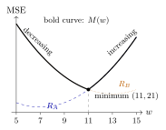

Consider two datasets, \\(A=\lbrace y&#95;1,y&#95;2,\ldots,y&#95;n\rbrace \\) and \\(B=\lbrace z&#95;1,z&#95;2,\ldots,z&#95;m\rbrace \\). Let \\(R&#95;A(w)\\) and \\(R&#95;B(w)\\) represent the mean squared errors of the constant prediction \\(w\\) on datasets \\(A\\) and \\(B\\), respectively:

$$
R_A(w)=\frac{1}{n}\sum_{i=1}^n(y_i-w)^2=(7-w)^2+5,\qquad
R_B(w)=(13-w)^2+17
$$

a)

3 pts Which dataset below could be \\(A\\)?

 7, 8, 10 4, 6, 8, 10 5, 6, 7, 8, 9 2, 3, 6, 7, 8

Solution

 7, 8, 10 4, 6, 8, 10 5, 6, 7, 8, 9 2, 3, 6, 7, 8

Recall that the mean squared error of a constant prediction can be written as

$$
R_A(w)=(w-\bar y)^2+\sigma_y^2
$$

 So, the dataset must have a mean of \\(7\\) and a variance of \\(5\\). The dataset \\(\boxed{4,6,8,10}\\) satisfies both requirements:

$$
\bar y=\frac{4+6+8+10}{4}=7,\qquad
\sigma_y^2=\frac{9+1+1+9}{4}=5
$$

 The dataset \\(5,6,7,8,9\\) also has a mean of \\(7\\), but its variance is \\(2\\), so it does not work.

b)

3 pts Let \\(S(w)\\) be the **sum** of the two mean squared error functions:

$$
S(w)=R_A(w)+R_B(w)
$$

 Find \\(w^{\ast}\\), the value of \\(w\\) that minimizes \\(S(w)\\). Give your answer as a number with no variables.

Solution

Add the two mean squared errors and take the derivative:

$$
\begin{align*}
S(w)&=(7-w)^2+5+(13-w)^2+17\\\\
\frac{\mathrm d}{\mathrm dw}S(w)&=2(w-7)+2(w-13)=4w-40
\end{align*}
$$

Setting this equal to zero gives \\(\boxed{w^{\ast}=10}\\). The derivative is negative below \\(10\\) and positive above \\(10\\), so this is the minimizer.

This is the same kind of optimization we used to minimize mean squared error: the optimal prediction balances the two squared deviations. The constants \\(+5\\) and \\(+17\\) disappear when we take the derivative, so they do not affect the minimizer.

c)

6 pts Let \\(M(w)\\) return the **larger** of the two mean squared error functions:

$$
M(w)=\max(R_A(w),R_B(w))
$$

 Find \\(w^{\ast}\\), the value of \\(w\\) that minimizes \\(M(w)\\). Give your answer as a number with no variables. <em>Hint: Draw a picture --- a clearly annotated picture, accompanied by some algebra, is sufficient justification.</em>

Solution

First, find where the two curves intersect:

$$
\begin{align*}
(w-7)^2+5&=(w-13)^2+17\\\\
w^2-14w+54&=w^2-26w+186\\\\
12w&=132\\\\
w&=11
\end{align*}
$$

Since \\(R&#95;A(w)-R&#95;B(w)=12(w-11)\\), when \\(w&gt;11\\), we have \\(R&#95;A(w)&gt;R&#95;B(w)\\), so \\(M(w)\\) returns \\(R&#95;A(w)\\). Otherwise, \\(M(w)\\) returns \\(R&#95;B(w)\\); at \\(w=11\\), the two are equal. Thus,

$$
M(w)=\begin{cases}
R_B(w),&w\leq11\\\\
R_A(w),&w\geq11
\end{cases}
$$

 \\(R&#95;B\\) is decreasing for \\(w&lt;11\\), since its vertex is at \\(13\\). \\(R&#95;A\\) is increasing for \\(w&gt;11\\), since its vertex is at \\(7\\). Therefore, \\(M\\) decreases up to \\(11\\) and increases after \\(11\\), giving \\(\boxed{w^{\ast}=11}\\) and \\(M(11)=21\\).

