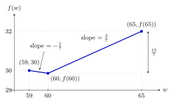

Consider a dataset of seven values \\(y&#95;1,y&#95;2,\ldots,y&#95;7\\), listed in **non-decreasing** order:

$$
y_1,\ y_2,\ 47,\ 60,\ 60,\ 81,\ y_7
$$

 Suppose that the mean of \\(y&#95;1,\ldots,y&#95;6\\) --- that is, **not including \\(\mathbf{y&#95;7}\\)** --- is \\(50\\). Furthermore, suppose

-   \\(\displaystyle f(w)=\frac17\sum&#95;{i=1}^7|y&#95;i-w|\\), and \\(\alpha^{\ast}\\) is the value of \\(w\\) that minimizes \\(f(w)\\).

-   \\(\displaystyle g(w)=\frac17\sum&#95;{i=1}^7(y&#95;i-w)^2\\), and \\(\beta^{\ast}\\) is the value of \\(w\\) that minimizes \\(g(w)\\).

a)

2 pts What is the value of \\(\alpha^{\ast}\\)? Give your answer as a number with no variables.

\\(\alpha^{\ast}=\&#95;\&#95;\&#95;\&#95;\&#95;\&#95;\\)

Solution

Mean absolute error is minimized by the median. Since there are seven ordered values, the median is the fourth value, so \\(\boxed{\alpha^{\ast}=60}\\). The fact that \\(60\\) is repeated does not change this result: the middle (fourth) value is still \\(60\\), so the median is still \\(60\\).

b)

5 pts What is the largest possible value of \\(y&#95;7\\) such that \\(\alpha^{\ast}\geq\beta^{\ast}\\)? Give your answer as a number with no variables.

Solution

Mean squared error is minimized by the mean. The first six values sum to \\(6\cdot50=300\\), so

$$
\beta^*=\frac{300+y_7}{7}
$$

 Using \\(\alpha^{\ast}=60\\), the required condition becomes

$$
60\geq\frac{300+y_7}{7}
\quad\Longleftrightarrow\quad
420\geq300+y_7
\quad\Longleftrightarrow\quad
y_7\leq120
$$

 The value \\(120\\) is consistent with the ordering, so the largest possible value is \\(\boxed{120}\\).

c)

7 pts Consider the same seven values, listed in **non-decreasing** order:

$$
y_1,\ y_2,\ 47,\ 60,\ 60,\ 81,\ y_7
$$

 Recall,

$$
f(w)=\frac17\sum_{i=1}^7|y_i-w|
$$

 For this part, do not assume that \\(\alpha^{\ast}\geq\beta^{\ast}\\).

Suppose that \\(f(59)=30\\). What is \\(f(65)\\)? Give your answer as a number with no variables. <em>Hint: Consider the slopes of \\(f(w)\\) between \\(w=59\\) and \\(w=65\\).</em>

Solution

For any value of \\(w\\) that is not equal to a \\(y&#95;i\\), the slope of mean absolute error, \\(f(w)\\), is

$$
\frac{\text{d}}{\text{d}w}f(w)
=\frac{\text{# of points left of }w-\text{# of points right of }w}{7}
$$

 For \\(59&lt;w&lt;60\\), there are three values to the left and four to the right, so the slope is \\(-1/7\\). For \\(60&lt;w&lt;65\\), there are five to the left and two to the right, so the slope is \\(3/7\\). Both copies of \\(60\\) count.

$$
\begin{align*}
f(60)&=30+(60-59)\left(-\frac17\right)=\frac{209}{7}\\\\
f(65)&=f(60)+(65-60)\left(\frac37\right)
=\frac{209}{7}+\frac{15}{7}=\boxed{32}
\end{align*}
$$

