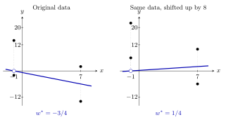

Consider a dataset of \\(n\\) points, \\((x&#95;1,y&#95;1),\ldots,(x&#95;n,y&#95;n)\\), where not all of the \\(x&#95;i\\) are the same. We'd like to fit a **modified** simple linear regression model whose slope and intercept are forced to be the same:

$$
h(x_i)=w+wx_i
$$

 The value of \\(w\\) that minimizes mean squared error for this model is

$$
w^*=\frac{\displaystyle\sum_{i=1}^n(1+x_i)y_i}{\displaystyle\sum_{i=1}^n(1+x_i)^2}
$$

a)

3 pts Suppose:

-   \\(h^{\ast}(x&#95;i)=w^{\ast}+w^{\ast}x&#95;i\\) is the fitted **modified** model, where \\(w^{\ast}\\) minimizes mean squared error.

-   \\(g^{\ast}(x&#95;i)=w&#95;0^{\ast}+w&#95;1^{\ast}x&#95;i\\) is the **regular** simple linear regression model fitted to the same dataset, where \\(w&#95;0^{\ast}\\) and \\(w&#95;1^{\ast}\\) are chosen to minimize mean squared error.

Fill in the \\(\boxed{???}\\) with the relationship that is **guaranteed**:

$$
\frac{1}{n}\sum_{i=1}^n(y_i-g^*(x_i))^2\quad\boxed{???}\quad\frac{1}{n}\sum_{i=1}^n(y_i-h^*(x_i))^2
$$

 \\(&gt;\\) \\(\geq\\) \\(=\\) \\(&lt;\\) \\(\leq\\)

Solution

 \\(&gt;\\) \\(\geq\\) \\(=\\) \\(&lt;\\) \\(\leq\\)

The relationship is \\(\boxed{\leq}\\).

Think of regular simple linear regression as being more flexible: it *can* have the same slope and intercept if that minimizes MSE, and it can have different slope and intercept if that minimizes MSE even further. Anything the modified model can do, the regular model can do, and more. So the regular model's minimum MSE cannot be larger.

b)

6 pts Let \\(r\\) be the correlation coefficient between the \\(x\\)- and \\(y\\)-values, and let \\(\sigma&#95;x\\) and \\(\sigma&#95;y\\) be their standard deviations, respectively. Suppose

$$
r=-\frac35,\qquad \sigma_x=4,\qquad \sigma_y=10
$$

 Give each answer as a number with no variables. If it is not possible to determine an answer from the information given, write **N/A** in the box.

<ol class="roman">
<li markdown="1">
(3 pts) What is \\(w^{\ast}\\), the optimal slope for the **modified** simple linear regression model?

   \\(w^{\ast}=\&#95;\&#95;\&#95;\&#95;\&#95;\&#95;\\)
</li>
<li markdown="1">
(3 pts) What is \\(w&#95;1^{\ast}\\), the optimal slope for the **regular** simple linear regression model?

   \\(w&#95;1^{\ast}=\&#95;\&#95;\&#95;\&#95;\&#95;\&#95;\\)

Solution

**(i)** \\(\boxed{\text{N/A}}\\). Moving the data changes which modified line fits best, even if its shape, correlation, and standard deviations stay the same. Every modified line \\(y=w+wx\\) passes through \\((-1,0)\\), so it cannot simply move along with the data.

For example, use \\(x\\)-values \\(-1,-1,7,7\\) and \\(y\\)-values \\(-2,14,-14,2\\) in the left panel. In the right panel, add \\(8\\) to every \\(y\\)-value. Both datasets have \\(r=-3/5\\), \\(\sigma&#95;x=4\\), and \\(\sigma&#95;y=10\\).

At \\(x=-1\\), the prediction is always \\(0\\), regardless of \\(w\\). At \\(x=7\\), the prediction is \\(8w\\), so the best choice makes \\(8w\\) equal to the mean of the two \\(y\\)-values there. This gives \\(w^{\ast}=-3/4\\) on the left and \\(w^{\ast}=1/4\\) on the right.

**(ii)** For regular simple linear regression,

$$
w_1^*=r\frac{\sigma_y}{\sigma_x}
=-\frac35\cdot\frac{10}{4}=\boxed{-\frac32}
$$

</li>
</ol>

c)

7 pts Show that \\(w^{\ast}\\), the value of \\(w\\) that minimizes mean squared error for the modified simple linear regression model \\(h(x&#95;i)=w+wx&#95;i\\), is

$$
w^*=\frac{\displaystyle\sum_{i=1}^n(1+x_i)y_i}{\displaystyle\sum_{i=1}^n(1+x_i)^2}
$$

Solution

The mean squared error of the modified model is

$$
R(w)=\frac1n\sum_{i=1}^n\bigl(y_i-w(1+x_i)\bigr)^2
$$

 Taking the derivative with respect to \\(w\\) gives

$$
R'(w)=-\frac2n\sum_{i=1}^n(1+x_i)\bigl(y_i-w(1+x_i)\bigr)
$$

 Set the derivative equal to zero and solve for \\(w\\):

$$
\begin{align*}
\sum_{i=1}^n(1+x_i)y_i-w\sum_{i=1}^n(1+x_i)^2&=0\\\\
w\sum_{i=1}^n(1+x_i)^2&=\sum_{i=1}^n(1+x_i)y_i\\\\
w^*&=\boxed{\frac{\displaystyle\sum_{i=1}^n(1+x_i)y_i}{\displaystyle\sum_{i=1}^n(1+x_i)^2}}
\end{align*}
$$

The objective is a quadratic in \\(w\\) with a positive coefficient on \\(w^2\\), so this critical point is its minimum. **A second derivative test is not necessary.**

