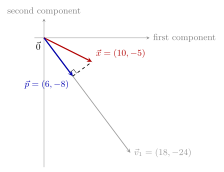
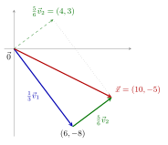

Suppose \\(\vec v&#95;1,\vec v&#95;2\in\mathbb R^2\\) satisfy

$$
\vec v_1=\begin{bmatrix}18\\\\-24\end{bmatrix},\qquad
\lVert\vec v_2\rVert=6,\qquad
\vec v_1\cdot\vec v_2=0
$$

 Let

$$
\vec x=\begin{bmatrix}10\\\\-5\end{bmatrix}
$$

a)

5 pts Find \\(\vec p\\), the projection of \\(\vec x\\) onto \\(\vec v&#95;1\\). Give your answer as a vector with two components and no variables.

Solution

Since \\(\vec v&#95;1=6\begin{bmatrix}3\\\\-4\end{bmatrix}\\), projecting onto \\(\vec v&#95;1\\) is equivalent to projecting onto \\(\begin{bmatrix}3\\\\-4\end{bmatrix}\\). So,

$$
\vec p=\frac{(10)(3)+(-5)(-4)}{3^2+(-4)^2}\begin{bmatrix}3\\\\-4\end{bmatrix}
=\frac{50}{25}\begin{bmatrix}3\\\\-4\end{bmatrix}
=\boxed{\begin{bmatrix}6\\\\-8\end{bmatrix}}
$$

 Equivalently, using \\(\vec v&#95;1\\) directly gives the coefficient \\(300/900=1/3\\).

b)

7 pts Suppose that the first component of \\(\vec v&#95;2\\) is positive. Write \\(\vec x\\) as a linear combination of \\(\vec v&#95;1\\) and \\(\vec v&#95;2\\) by filling in the two boxes below.

$$
\vec x=\_\_\_\_\_\_\vec v_1+\_\_\_\_\_\_\vec v_2
$$

Solution

A vector perpendicular to \\(\begin{bmatrix}3\\\\-4\end{bmatrix}\\) with positive first component has direction \\(\begin{bmatrix}4\\\\3\end{bmatrix}\\). This direction vector has length \\(5\\), so

$$
\vec v_2=\frac65\begin{bmatrix}4\\\\3\end{bmatrix}
$$

 From part **a)**, \\(\vec p=\frac13\vec v&#95;1\\). The remaining component is

$$
\vec x-\vec p=\begin{bmatrix}10\\\\-5\end{bmatrix}-\begin{bmatrix}6\\\\-8\end{bmatrix}
=\begin{bmatrix}4\\\\3\end{bmatrix}=\frac56\vec v_2
$$

 Therefore,

$$
\boxed{\vec x=\frac13\vec v_1+\frac56\vec v_2}
$$

