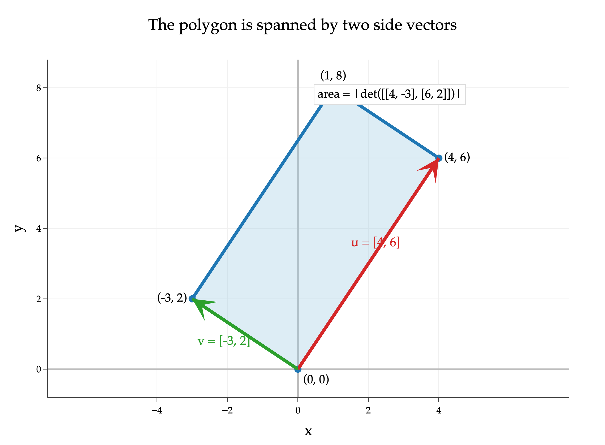



<nav class="exam-breadcrumb" aria-label="Breadcrumb">
<a href="/">← Back</a>
</nav>

# Chapter 6: Linear Transformations and Projections

*Topics: linear transformations, inverses, projecting onto column space, complete solution to the normal equations*

Problems below are collected from past exams; each links back to its full exam. Solutions are in the dropdowns.

## Problems

- [FA25 MT1 · Problem 5](#fa25-mt1--problem-5-back-to-normal-12-pts)
- [FA25 MT2 · Problem 5](#fa25-mt2--problem-5-orthodontist-12-pts)
- [WN26 MT1 · Problem 3](#wn26-mt1--problem-3-12-pts)
- [WN26 MT1 · Problem 5](#wn26-mt1--problem-5-12-pts)
- [WN26 MT2 · Problem 4](#wn26-mt2--problem-4-13-pts)
- [WN26 Final · Problem 6](#wn26-final--problem-6-12-pts-mt2-redemption)
- [WN26 Final · Problem 5](#wn26-final--problem-5-11-pts-mt2-redemption)
- [SP26 MT2 · Problem 4](#sp26-mt2--problem-4-14-pts)
- [SP26 Final · Problem 6](#sp26-final--problem-6-6-pts-mt2-redemption)
- [SP26 Final · Problem 7](#sp26-final--problem-7-12-pts-mt2-redemption)

---

## FA25 MT1 · Problem 5: Back to Normal 12 pts

From <a href="/exams/fa25-mt1/">FA25 MT1</a>

Consider the orthogonal vectors \\(\vec u&#95;1 = \begin{bmatrix} 13 \\\\ -3 \\\\ 2 \end{bmatrix}\\), \\(\vec u&#95;2 = \begin{bmatrix} 0 \\\\ 4 \\\\ 6 \end{bmatrix}\\), and \\(\vec u&#95;3 = \begin{bmatrix} 1 \\\\ 3 \\\\ -2 \end{bmatrix}\\).

a)

4 pts Find the equation of the plane spanned by \\(\vec u&#95;2\\) and \\(\vec u&#95;3\\) in standard form, i.e. \\(ax + by + cz + d = 0\\). \\(\boxed{\text{Circle}}\\) your final answer.

Solution

Plane: \\(13x - 3y + 2z = 0\\) (or any scalar multiple of this equation).

Most students took the cross product of \\(\vec u&#95;2\\) and \\(\vec u&#95;3\\) to find a vector that is orthogonal to the plane spanned by \\(\vec u&#95;2\\) and \\(\vec u&#95;3\\), and then used that vector to define the plane.

But, we were already told that all three vectors are orthogonal to each other, which means that the vector orthogonal to the plane spanned by \\(\vec u&#95;2\\) and \\(\vec u&#95;3\\) is \\(\vec u&#95;1\\). So, we can use \\(\vec u&#95;1\\) to define the plane.

$$
\vec u_1 \cdot (x, y, z) = 0 \implies 13x - 3y + 2z = 0
$$

So, the equation of the plane spanned by \\(\vec u&#95;2\\) and \\(\vec u&#95;3\\) is \\(13x - 3y + 2z = 0\\) (or any scalar multiple of this equation).

b)

8 pts There is one value of \\(k\\) such that the projection of \\(\vec x = \begin{bmatrix} 7 \\\\ 3 \\\\ 1 \end{bmatrix}\\) onto \\(\vec u&#95;k\\) is just \\(\vec u&#95;k\\) itself.

1.  What is the value of \\(k\\)?

 1 2 3

2.  Show your work in the box below. English explanations are not enough.

Solution

 1 2 3

We're told that for one of the three provided vectors --- \\(\vec u&#95;1\\), \\(\vec u&#95;2\\), or \\(\vec u&#95;3\\) --- the projection of \\(\vec x\\) onto that vector is just that vector itself.

Remember that the projection of \\(\vec x\\) onto \\(\vec u&#95;k\\) is given by

$$
\text{proj}_{\vec u_k} \vec x = \frac{\vec x \cdot \vec u_k}{\vec u_k \cdot \vec u_k} \vec u_k
$$

So, we need to find the vector \\(\vec u&#95;k\\) such that the scalar \\(\frac{\vec x \cdot \vec u&#95;k}{\vec u&#95;k \cdot \vec u&#95;k}\\) is equal to 1, or equivalently, \\(\vec x \cdot \vec u&#95;k = \vec u&#95;k \cdot \vec u&#95;k\\). We can check this equality for each of the three provided vectors.

**(i)** \\(x \cdot \vec u&#95;1 = \begin{bmatrix} 7 \\\\ 3 \\\\ 1 \end{bmatrix} \cdot \begin{bmatrix} 13 \\\\ -3 \\\\ 2 \end{bmatrix} = 7 \cdot 13 + 3 \cdot (-3) + 1 \cdot 2 = 84\\)

\\(\vec u&#95;1 \cdot \vec u&#95;1 = 13^2 + (-3)^2 + 2^2 = 180\\)

\\(84 \neq 180\\), so \\(\vec u&#95;1\\) is not the vector we're looking for.

**(ii)** \\(x \cdot \vec u&#95;2 = \begin{bmatrix} 7 \\\\ 3 \\\\ 1 \end{bmatrix} \cdot \begin{bmatrix} 0 \\\\ 4 \\\\ 6 \end{bmatrix} = 7 \cdot 0 + 3 \cdot 4 + 1 \cdot 6 = 18\\)

\\(\vec u&#95;2 \cdot \vec u&#95;2 = 0^2 + 4^2 + 6^2 = 52\\)

\\(18 \neq 52\\), so \\(\vec u&#95;2\\) is not the vector we're looking for.

**(iii)** \\(x \cdot \vec u&#95;3 = \begin{bmatrix} 7 \\\\ 3 \\\\ 1 \end{bmatrix} \cdot \begin{bmatrix} 1 \\\\ 3 \\\\ -2 \end{bmatrix} = 7 \cdot 1 + 3 \cdot 3 + 1 \cdot (-2) = 14\\)

\\(\vec u&#95;3 \cdot \vec u&#95;3 = 1^2 + 3^2 + (-2)^2 = 14\\)

\\(14 = 14\\), so \\(\vec u&#95;3\\) **is** the vector we're looking for.

---

## FA25 MT2 · Problem 5: Ortho\...dontist? 12 pts

From <a href="/exams/fa25-mt2/">FA25 MT2</a>

Let \\(A = \begin{bmatrix} 1 &amp; 0 \\\\ 1 &amp; 4 \\\\ 1 &amp; 4 \\\\ 1 &amp; 4 \end{bmatrix}\\).

a)

6 pts Find a matrix \\(Q\\) such that \\(\text{colsp}(Q) = \text{colsp}(A)\\) and \\(Q^TQ = I\\). Show your work and \\(\boxed{\text{circle}}\\) your final answer, which should be a matrix with two columns and no variables. <em>Hint: One of the columns may involve square roots.</em>

Solution

Since we want \\(Q^TQ = I\\), we're looking for a matrix \\(Q\\) with two columns that are orthogonal to each other and are both unit vectors.

The "standard" way to answer this part is to use the Gram-Schmidt process, first introduced in Homework 7, Problem 4. But, since \\(A\\) only has two columns, it's okay if you forgot about the specifics, and instead realized the core of Gram-Schmidt, which takes advantage of the fact that **the error when projecting \\(\vec u\\) onto \\(\vec v\\) is orthogonal to \\(\vec v\\)**.

Let

$$
\vec v = \begin{bmatrix} 1 \\\\ 1 \\\\ 1 \\\\ 1 \end{bmatrix}
\qquad
\vec u = \begin{bmatrix} 0 \\\\ 4 \\\\ 4 \\\\ 4 \end{bmatrix}
$$

Then the projection of \\(\vec u\\) onto \\(\vec v\\) is

$$
\vec p = \frac{\vec u \cdot \vec v}{\vec v \cdot \vec v}\vec v
= \frac{0\cdot 1 + 4\cdot 1 + 4\cdot 1 + 4\cdot 1}{1^2+1^2+1^2+1^2}
\begin{bmatrix} 1 \\\\ 1 \\\\ 1 \\\\ 1 \end{bmatrix}
= \frac{12}{4}
\begin{bmatrix} 1 \\\\ 1 \\\\ 1 \\\\ 1 \end{bmatrix}
= 3
\begin{bmatrix} 1 \\\\ 1 \\\\ 1 \\\\ 1 \end{bmatrix}
$$

So the error vector is

$$
\vec e = \vec u - \vec p
=
\begin{bmatrix} 0 \\\\ 4 \\\\ 4 \\\\ 4 \end{bmatrix}
-
\begin{bmatrix} 3 \\\\ 3 \\\\ 3 \\\\ 3 \end{bmatrix}
=
\begin{bmatrix} -3 \\\\ 1 \\\\ 1 \\\\ 1 \end{bmatrix}
$$

This vector \\(\vec e\\) is orthogonal to \\(\vec v\\), and together \\(\vec v\\) and \\(\vec e\\) have the same span as \\(\text{colsp}(A)\\). To make the columns orthonormal, we normalize both vectors:

$$
\|\vec v\| = \sqrt{1^2+1^2+1^2+1^2} = 2
\qquad
\|\vec e\| = \sqrt{(-3)^2+1^2+1^2+1^2} = \sqrt{12}
$$

Therefore, one valid matrix \\(Q\\) is

$$
\boxed{
Q=
\begin{bmatrix}
1/2 & -3/\sqrt{12} \\\\
1/2 & 1/\sqrt{12} \\\\
1/2 & 1/\sqrt{12} \\\\
1/2 & 1/\sqrt{12}
\end{bmatrix}
}
$$

Another common solution is to observe that the vectors

$$
\begin{bmatrix} 1 \\\\ 0 \\\\ 0 \\\\ 0 \end{bmatrix}
\qquad \text{and} \qquad
\begin{bmatrix} 0 \\\\ 1 \\\\ 1 \\\\ 1 \end{bmatrix}
$$

 are orthogonal to each other and span \\(\text{colsp}(A)\\). Normalizing these two vectors gives another valid answer:

$$
\boxed{
\begin{bmatrix}
1 & 0 \\\\
0 & 1/\sqrt{3} \\\\
0 & 1/\sqrt{3} \\\\
0 & 1/\sqrt{3}
\end{bmatrix}
}
$$

b)

2 pts True or False: The matrix \\(Q\\) you found above is an orthogonal matrix.

 True False

Solution

 True False

No matter how you find \\(Q\\) in part **a)**, the answer is false, because \\(Q\\) is not a square matrix, so it cannot be orthogonal!

For \\(Q\\) to be orthogonal, we'd need **both** \\(Q^TQ = I\\) **and** \\(QQ^T = I\\). Since \\(Q\\) is not square, these can't both be true at the same time (the dimensions don't match, since the former would be \\(2 \times 2\\) while the latter would be \\(4 \times 4\\)).

c)

4 pts Let \\(R = \begin{bmatrix} r&#95;1 &amp; \boxed{r&#95;2} \\\\ \boxed{r&#95;3} &amp; r&#95;4 \end{bmatrix}\\) be a \\(2 \times 2\\) matrix such that \\(A = QR\\), where \\(Q\\) is the matrix you found above.

Find \\(r&#95;2\\) and \\(r&#95;3\\). Give your answers as scalars without variables.

\\(r&#95;2 = \&#95;\&#95;\&#95;\&#95;\&#95;\&#95;, \qquad r&#95;3 = \&#95;\&#95;\&#95;\&#95;\&#95;\&#95;\\)

Solution

**We ended up giving full credit to everyone for this problem, since there's no unique answer, and it's difficult to answer this correctly if you found an invalid \\(Q\\).**

The main idea being assessed here, taken from Homework 7, Problem 4, is that if \\(Q\\) is a matrix such that \\(\text{colsp}(Q) = \text{colsp}(A)\\) and \\(Q^T Q = I\\), then

$$
A = QR \implies Q^TA = Q^TQR \implies R = Q^TA
$$

As we saw in that homework problem, **if you use Gram-Schmidt to find \\(Q\\)**, \\(R\\) is an **upper triangular** matrix, meaning that \\(r&#95;3 = 0\\). (We won't elaborate on this here: read the solutions to Homework 7, Problem 4.)

For two different \\(Q\\)'s, we'll find the corresponding \\(R\\)'s to give you some sample possible answers.

-   For

$$
Q =
        \begin{bmatrix}
        1/2 & -3/\sqrt{12} \\\\
        1/2 & 1/\sqrt{12} \\\\
        1/2 & 1/\sqrt{12} \\\\
        1/2 & 1/\sqrt{12}
        \end{bmatrix}
$$

 **which did result from Gram-Schmidt**,

$$
R = Q^TA
        =
        \begin{bmatrix}
        2 & 6 \\\\
        0 & 12/\sqrt{12}
        \end{bmatrix}
        =
        \begin{bmatrix}
        2 & 6 \\\\
        0 & \sqrt{12}
        \end{bmatrix}
$$

 This \\(R\\) **is** upper triangular.

-   For

$$
Q =
        \begin{bmatrix}
        1 & 0 \\\\
        0 & 1/\sqrt{3} \\\\
        0 & 1/\sqrt{3} \\\\
        0 & 1/\sqrt{3}
        \end{bmatrix}
$$

 **which did not result from Gram-Schmidt**,

$$
R = Q^TA
        =
        \begin{bmatrix}
        1 & 0 \\\\
        \sqrt{3} & 4\sqrt{3}
        \end{bmatrix}
$$

 This \\(R\\) **is not** upper triangular.

---

## WN26 MT1 · Problem 3 12 pts

From <a href="/exams/wn26-mt1/">WN26 MT1</a>

Consider the following two planes, \\(P&#95;1\\) and \\(P&#95;2\\), in \\(\mathbb{R}^3\\).

-   \\(P&#95;1\\) is the plane spanned by the vectors \\(\begin{bmatrix} 3 \\\\ 2 \\\\ 0 \end{bmatrix}\\) and \\(\begin{bmatrix} 6 \\\\ -4 \\\\ -3 \end{bmatrix}\\).

-   \\(P&#95;2\\) is the plane defined by the equation \\(5x + 3y - z = 0\\).

a)

6 pts Find the equation of \\(P&#95;1\\) in standard form, i.e. \\(ax + by + cz + d = 0\\). Show your work and \\(\boxed{\text{circle}}\\) your final answer.

Solution

\\(2x - 3y + 8z = 0\\).

As discussed in [Chapter 4.4](https://notes.eecs245.org/linear-independence/lines-planes-hyperplanes/), the solution is to take the cross product of the two vectors used to span the plane; this will give us a vector \\(\begin{bmatrix} a \\\\ b \\\\ c \end{bmatrix}\\) that is orthogonal to both vectors, and therefore both will satisfy \\(ax + by + cz + d = 0\\). We know \\(d = 0\\) since the span of a set of vectors must contain the origin.

$$
\begin{bmatrix} 3 \\\\ 2 \\\\ 0 \end{bmatrix} \times \begin{bmatrix} 6 \\\\ -4 \\\\ -3 \end{bmatrix} = \begin{bmatrix} 2 \cdot (-3) - 0 \cdot (-4) \\\\ 0 \cdot 6 - 3 \cdot (-3) \\\\ 3 \cdot (-4) - 2 \cdot 6 \end{bmatrix} = \begin{bmatrix} -6 \\\\ 9 \\\\ -24 \end{bmatrix}
$$

So, the equation of \\(P&#95;1\\) is \\(-6x + 9y - 24z = 0\\), or simplified, \\(\boxed{2x - 3y + 8z = 0}\\). To verify, we should plug in both vectors to make sure they satisfy the equation:

$$
2(3) - 3(2) + 8(0) = 6 - 6 + 0 = 0, \qquad 2(6) - 3(-4) + 8(-3) = 12 + 12 - 24 = 0
$$

b)

6 pts Planes \\(P&#95;1\\) and \\(P&#95;2\\) intersect at a line. Find the equation of this line in parametric form. Show your work and \\(\boxed{\text{circle}}\\) your final answer. <em>Hint: This can be done without knowing the answer to the previous part.</em>

Solution

$$
L = t \begin{bmatrix} 1 \\\\ -2 \\\\ -1 \end{bmatrix}, \quad t \in \mathbb{R}
$$

 (where the direction vector could be scaled by any non-zero scalar)

There are a few possible techniques here.

**(i)** We can find the intersection of the two planes by solving the system of equations:

$$
\begin{align*}
5x + 3y - z   &= 0 \\\\
2x - 3y + 8z &= 0
\end{align*}
$$

Adding both equations gives

$$
7x + 7z = 0 \implies z = -x
$$

We know that the system will have infinitely many solutions, so we can let our "parameter" be \\(x\\). So far, we know two of the three components of the line: \\(x\\) is the free variable, and \\(z = -x\\). Finally, let's solve for \\(y\\) in terms of \\(x\\).

$$
5x + 3y + x = 0 \implies 6x + 3y = 0 \implies y = - 2x
$$

Therefore, the parametric equation of the line is

$$
L = \begin{bmatrix} x \\\\ -2x \\\\ -x \end{bmatrix} = x \begin{bmatrix} 1 \\\\ -2 \\\\ -1 \end{bmatrix}, \quad x \in \mathbb{R}
$$

**(ii)** Another solution is to recognize that any point on the first plane can be written as a linear combination of the two vectors that span the plane, i.e.

$$
s \begin{bmatrix} 3 \\\\ 2 \\\\ 0 \end{bmatrix} + t \begin{bmatrix} 6 \\\\ -4 \\\\ -3 \end{bmatrix} = \begin{bmatrix} 3s + 6t \\\\ 2s - 4t \\\\ -3t \end{bmatrix}
$$

Any vector on the first plane can be written in the form above. For a vector to be in both planes (i.e. in the intersection), it must be able to be written in the form above **and** satisfy the equation of the second plane, \\(5x + 3y - z = 0\\).

$$
\begin{align*}
5(3s + 6t) + 3(2s - 4t) - (-3t) &= 0 \\\\
15s + 30t + 6s - 12t + 3t &= 0 \\\\
21s + 21t &= 0 \\\\
t &= -s
\end{align*}
$$

So, as long as we pick \\(s\\) and \\(t\\) such that \\(t = -s\\), the resulting vector, \\(\begin{bmatrix} 3s + 6t \\\\ 2s - 4t \\\\ -3t \end{bmatrix}\\), will be in both planes. There are infinitely many pairs of such \\(s\\) and \\(t\\) -- \\(1\\) and \\(-1\\), \\(2\\) and \\(-2\\), etc. -- and these fill out the line of intersection. To find one of them, let \\(s = 1\\) and \\(t = -1\\):

$$
\begin{bmatrix} 3(1) + 6(-1) \\\\ 2(1) - 4(-1) \\\\ -3(-1) \end{bmatrix} = \begin{bmatrix} 3 - 6 \\\\ 2 + 4 \\\\ 3 \end{bmatrix} = \begin{bmatrix} -3 \\\\ 6 \\\\ 3 \end{bmatrix}
$$

Therefore, the parametric equation of the line is

$$
L = t \begin{bmatrix} -3 \\\\ 6 \\\\ 3 \end{bmatrix}, \quad t \in \mathbb{R}
$$

which is equivalent to

$$
L = t \begin{bmatrix} 1 \\\\ -2 \\\\ -1 \end{bmatrix}, \quad t \in \mathbb{R}
$$

This is the same line we found earlier, just with a scaled direction vector, which doesn't change the line.

**(iii)** A final solution is to (1) find a vector that is perpendicular to each plane (i.e. a normal vector), and (2) take the cross product of those two vectors. This will give us a vector that is in both planes, and therefore spans the intersecting line, which we know must also pass through the origin.

$$
\begin{align*}
\begin{bmatrix} 5 \\\\ 3 \\\\ -1 \end{bmatrix} \times \begin{bmatrix} 2 \\\\ -3 \\\\ 8 \end{bmatrix} = \begin{bmatrix} 3 \cdot 8 - (-1) \cdot (-3) \\\\ (-1) \cdot 2 - 5 \cdot 8 \\\\ 5 \cdot (-3) - 3 \cdot 2 \end{bmatrix} = \begin{bmatrix} 21 \\\\ -42 \\\\ -21 \end{bmatrix} = 21 \begin{bmatrix} 1 \\\\ -2 \\\\ -1 \end{bmatrix}
\end{align*}
$$

So, once again, we find that \\(\begin{bmatrix} 1 \\\\ -2 \\\\ -1 \end{bmatrix}\\) is a direction vector for the line of intersection.

---

## WN26 MT1 · Problem 5 12 pts

From <a href="/exams/wn26-mt1/">WN26 MT1</a>

Suppose \\(\vec u, \vec v \in \mathbb{R}^n\\). Let \\(\vec p\\) be the projection of \\(\vec u\\) onto \\(\vec v\\). Furthermore, we know that:

$$
\underbrace{\lVert \vec v \rVert = 2}_{\text{length of } \vec v \: (\text{not } \vec u)} \qquad \lVert \vec p \rVert = 3
$$

a)

6 pts Find \\(| \vec u \cdot \vec v |\\). Show your work and \\(\boxed{\text{circle}}\\) your final answer, which should be a number with no variables.

Solution

\\(|\vec u \cdot \vec v| = 6\\).

Let's start with the formula for \\(\vec p\\).

$$
\vec p = \frac{\vec u \cdot \vec v}{\vec v \cdot \vec v} \vec v = \frac{\vec u \cdot \vec v}{\lVert \vec v \rVert^2} \vec v
$$

We know that \\(\lVert \vec p \rVert = 3\\), so let's try and find the magnitude of \\(\vec p\\) in the formula above, which will allow us to learn more about \\(\vec u \cdot \vec v\\).

The key to remember that \\(\lVert k x \rVert = |k| \lVert x \rVert\\) for any scalar \\(k\\) and vector \\(x\\). The absolute value is necessary because the scalar \\(k\\) could be negative, but the length of a vector is always non-negative.

$$
\lVert \vec p \rVert = \left| \frac{\vec u \cdot \vec v}{\lVert \vec v \rVert^2} \right| \lVert \vec v \rVert = \left| \frac{\vec u \cdot \vec v}{2^2} \right| 2 = \left| \frac{\vec u \cdot \vec v}{4} \right| 2 = \frac{\left| \vec u \cdot \vec v \right|}{2}
$$

So, we know that \\(\frac{\left| \vec u \cdot \vec v \right|}{2} = 3\\), which means that \\(\boxed{\left| \vec u \cdot \vec v \right| = 6}\\).

b)

6 pts For each pair of vectors, determine whether they are orthogonal, linearly dependent, or neither. Make sure to select **one bubble per row**.

|  | pair of vectors | orthogonal | linearly dependent | neither |
|:--:|:---|:--:|:--:|:--:|
| \\(i\\) | \\(\vec u\\) and \\(\vec u - \vec p\\) |  |  |  |
| \\(ii\\) | \\(\vec u\\) and \\(\vec v - \vec p\\) |  |  |  |
| \\(iii\\) | \\(\vec v\\) and \\(\vec u - \vec p\\) |  |  |  |
| \\(iv\\) | \\(\vec v\\) and \\(\vec v - \vec p\\) |  |  |  |
| \\(v\\) | \\(\vec p\\) and \\(\vec u - \vec p\\) |  |  |  |
| \\(vi\\) | \\(\vec p\\) and \\(\vec v - \vec p\\) |  |  |  |

Solution

The key fact about orthogonality when it comes to projections is that the error vector --- here, \\(\vec e = \vec u - \vec p\\) --- is orthogonal to the vector we're projecting onto, \\(\vec v\\).

This means that \\(\vec v\\) and \\(\vec u - \vec p\\) are orthogonal (iii). But, \\(\vec p\\) is a scalar multiple of \\(\vec v\\), so \\(\vec p\\) and \\(\vec u - \vec p\\) are also orthogonal (v).

Remember that \\(\vec p\\) is a scalar multiple of \\(\vec v\\), so \\(\vec v - \vec p\\) is a scalar multiple of \\(\vec v\\) too. So, \\(\vec v\\) and \\(\vec v - \vec p\\) are linearly dependent (iv), as are \\(\vec p\\) and \\(\vec v - \vec p\\) (vi).

Now, we need to address (i) and (ii), which ask about \\(\vec u\\)'s relation to \\(\vec u - \vec p\\) and \\(\vec v - \vec p\\), respectively. \\(\vec u - \vec p\\) is the error vector of the projection, which in general is orthogonal to \\(\vec v\\) and neither orthogonal nor linearly dependent with \\(\vec u\\).

The only possible "edge case" here is when \\(\vec u\\) and \\(\vec v\\) are orthogonal, in which case \\(\vec p = \frac{\vec u \cdot \vec v}{\vec v \cdot \vec v} \vec v = \frac{0}{\vec v \cdot \vec v} \vec v = \vec 0\\), which would mean that \\(\vec u\\) and \\(\vec v - \vec p\\) are orthogonal and \\(\vec u\\) and \\(\vec u - \vec p\\) are the same vector and thus linearly dependent. However, we know that \\(\vec p \neq \vec 0\\) since \\(\lVert \vec p \rVert = 3 &gt; 0\\). So, this edge case doesn't apply to this problem, and therefore \\(\vec u\\) and \\(\vec u - \vec p\\) are neither orthogonal nor linearly dependent (i), and same with \\(\vec u\\) and \\(\vec v - \vec p\\) (ii).

---

## WN26 MT2 · Problem 4 13 pts

From <a href="/exams/wn26-mt2/">WN26 MT2</a>

Suppose \\(X\\) is some \\(3 \times d\\) matrix, for some integer \\(d\\). Let

$$
\vec y = \begin{bmatrix} 9 \\\\ -5 \\\\ 3 \end{bmatrix}
$$

a)

5 pts Which of the following **could** be the projection of \\(\vec y\\) onto \\(\text{colsp}(X)\\)?

Select an answer, then briefly justify your answer in the space provided using properties of projections. Correct answers without justification may not receive full credit.

 \\(\begin{bmatrix} 5 \\\\ -7 \\\\ 4 \end{bmatrix}\\) \\(\begin{bmatrix} 7 \\\\ -7 \\\\ 4 \end{bmatrix}\\) \\(\begin{bmatrix} 6 \\\\ -7 \\\\ 4 \end{bmatrix}\\) \\(\begin{bmatrix} 6 \\\\ -7 \\\\ 3 \end{bmatrix}\\)

Solution

 \\(\begin{bmatrix} 6 \\\\ -7 \\\\ 3 \end{bmatrix}\\)

If \\(\vec p\\) is the projection of \\(\vec y\\) onto \\(\text{colsp}(X)\\), then the error

$$
\vec y - \vec p
$$

 must be orthogonal to all vectors in \\(\text{colsp}(X)\\), and hence orthogonal to \\(\vec p\\) itself.

For the third option, \\(\vec p = \begin{bmatrix} 6 \\\\ -7 \\\\ 4 \end{bmatrix}\\), we have

$$
\vec p = \begin{bmatrix} 6 \\\\ -7 \\\\ 4 \end{bmatrix} \implies
\vec y - \vec p = \begin{bmatrix} 9 \\\\ -5 \\\\ 3 \end{bmatrix} - \begin{bmatrix} 6 \\\\ -7 \\\\ 4 \end{bmatrix} = \begin{bmatrix} 3 \\\\ 2 \\\\ -1 \end{bmatrix}
$$

 The dot product of \\(\vec p\\) and \\(\vec y - \vec p\\) is

$$
\begin{align*}
\vec p \cdot (\vec y - \vec p) = \begin{bmatrix} 6 \\\\ -7 \\\\ 4 \end{bmatrix} \cdot \begin{bmatrix} 3 \\\\ 2 \\\\ -1 \end{bmatrix}
&= 18 - 14 - 4 = 0
\end{align*}
$$

So \\(\vec p = \begin{bmatrix} 6 \\\\ -7 \\\\ 4 \end{bmatrix}\\) could be the projection of \\(\vec y\\) onto \\(\text{colsp}(X)\\). If you repeat this calculation for the other three options, you'll find that \\(\vec p\\) and \\(\vec y - \vec p\\) are not orthogonal.

In each of the remaining parts, identify whether the statement is True or False and justify your answer in the space provided. Correct answers without justification may not receive full credit.

b)

4 pts If the projection of \\(\vec y\\) onto \\(\text{colsp}(X)\\) is \\(\vec y\\) itself, then \\(\text{rank}(X)\\) must be 3.

 True False

Solution

 True False

This is false. If the projection of \\(\vec y\\) onto \\(\text{colsp}(X)\\) is \\(\vec y\\) itself, that only tells us that \\(\vec y \in \text{colsp}(X)\\).

But \\(\text{colsp}(X)\\) could still be a 1-dimensional or 2-dimensional subspace of \\(\mathbb{R}^3\\) that happens to contain \\(\vec y\\). For example, if \\(\text{colsp}(X) = \text{span}\left(\left\lbrace \vec y \right\rbrace\right)\\), then the projection of \\(\vec y\\) is still \\(\vec y\\), but \\(\text{rank}(X)=1\\), not 3.

c)

4 pts If \\(\text{rank}(X) = 3\\), then the projection of \\(\vec y\\) onto \\(\text{colsp}(X)\\) must be \\(\vec y\\) itself.

 True False

Solution

 True False

This is true. If \\(\text{rank}(X)=3\\) and \\(X\\) is a \\(3 \times d\\) matrix, then \\(\text{colsp}(X)\\) is a 3-dimensional subspace of \\(\mathbb{R}^3\\). The only 3-dimensional subspace of \\(\mathbb{R}^3\\) is all of \\(\mathbb{R}^3\\).

But, this means every vector in \\(\mathbb{R}^3\\), including \\(\vec y\\), is in \\(\text{colsp}(X)\\). Therefore, the projection of \\(\vec y\\) onto \\(\text{colsp}(X)\\) is just \\(\vec y\\) itself.

---

## WN26 Final · Problem 6 12 pts MT2 Redemption

From <a href="/exams/wn26-final/">WN26 Final</a>

Suppose \\(X\\) is an \\(n \times 3\\) matrix, where \\(n &gt; 2\\), with columns \\(\vec x^{(1)}\\), \\(\vec x^{(2)}\\), and \\(\vec x^{(3)}\\). Furthermore, suppose that \\(X = QR\\), where

$$
Q =
\begin{bmatrix}
\vert & \vert \\\\
\vec q^{(1)} & \vec q^{(2)} \\\\
\vert & \vert
\end{bmatrix}
$$

 is an \\(n \times 2\\) matrix with orthonormal columns, and

$$
R =
\begin{bmatrix}
2 & 0 & 2\\\\
0 & 1 & -1
\end{bmatrix}
$$

Lastly, suppose \\(\vec y \in \mathbb{R}^n\\) and \\(Q^T \vec y = \begin{bmatrix} -2 \\\\ 10 \end{bmatrix}\\).

a)

6 pts Let \\(\vec p\\) be the projection of \\(\vec y\\) onto \\(\text{colsp}(X)\\). Write \\(\vec p\\) as a linear combination of the columns of \\(X\\). Fill in each box with a number with no variables. If there are multiple correct answers, you only need to provide one.

\\(\vec p = \&#95;\&#95;\&#95;\&#95;\&#95;\&#95;  \vec x^{(1)} + \&#95;\&#95;\&#95;\&#95;\&#95;\&#95;  \vec x^{(2)} + \&#95;\&#95;\&#95;\&#95;\&#95;\&#95;  \vec x^{(3)}\\)

Solution

The columns of \\(Q\\) are a basis for \\(\text{colsp}(X)\\) (since \\(X = QR\\) writes every column of \\(X\\) as a linear combination of the columns of \\(Q\\)). So, the general strategy is to first write \\(\vec p\\) as a linear combination of the columns of \\(Q\\), and then use the information in \\(R\\) to write that as a linear combination of the columns of \\(X\\).

If \\(X\\) is a full rank matrix, then the projection of \\(\vec y\\) onto \\(\text{colsp}(X)\\) is

$$
X (X^TX)^{-1}X^T \vec y
$$

\\(X\\) isn't full rank here, but \\(Q\\) is, and that is the matrix whose columns we're writing \\(\vec p\\) as a linear combination of to begin with. So, we have

$$
\vec p = Q (Q^TQ)^{-1}Q^T \vec y
$$

But, since \\(Q\\)'s columns are orthonormal, \\(Q^TQ = I\\), so

$$
\vec p = Q (Q^TQ)^{-1} Q^T \vec y = Q I Q^T \vec y = Q Q^T \vec y = Q \begin{bmatrix} -2 \\\\ 10 \end{bmatrix} = -2 \vec q^{(1)}+10 \vec q^{(2)}
$$

Good, so now we have \\(\vec p\\) as a linear combination of the columns of \\(Q\\). How do the columns of \\(X\\) relate to the columns of \\(Q\\)? \\(R = \begin{bmatrix} 2 &amp; 0 &amp; 2\\\\0 &amp; 1 &amp; -1 \end{bmatrix}\\) tells us that

$$
\vec x^{(1)} = 2\vec q^{(1)},
\qquad
\vec x^{(2)} = \vec q^{(2)},
\qquad
\vec x^{(3)} = 2\vec q^{(1)}-\vec q^{(2)}
$$

 So, one possible answer comes from

$$
\vec p = \boxed{-\vec x^{(1)}+10\vec x^{(2)}+0\vec x^{(3)}}
$$

b)

6 pts Let \\(\vec w^{\ast}\\) be a minimizer of

$$
R_\text{sq}(w) = \frac{1}{n}\lVert \vec y - X \vec w \rVert^2
$$

 Fill in the blanks to describe the set of all possible values of \\(\vec w^{\ast}\\). Each blank should contain a vector with no variables.

\\(\text{set of all possible } \vec w^{\ast} = \left\lbrace \&#95;\&#95;\&#95;\&#95;\&#95;\&#95; + t  \&#95;\&#95;\&#95;\&#95;\&#95;\&#95; : t \in \mathbb{R} \right\rbrace\\).

Solution

From the previous part, we know one possible minimizer is

$$
\vec w^* = \begin{bmatrix}-1\\\\10\\\\0\end{bmatrix}
$$

As discussed in [Chapter 6.4](https://notes.eecs245.org/linear-transformations-and-projections/complete-solution/#finding-all-solutions), the full sete of minimizers results from taking one particular solution and adding any vector in \\(\text{nullsp}(X)\\). So, all we need to do is find a basis for \\(\text{nullsp}(X)\\).

Note that \\(X\\) has two linearly independent columns (\\(\vec x^{(1)}\\) and \\(\vec x^{(2)}\\)), with a third column defined by

$$
\vec x^{(3)} = 2 \vec q^{(1)}-\vec q^{(2)} = \vec x^{(1)} - \vec x^{(2)}
$$

**Before continuing to read these solutions, make sure you understand why the statement above is true!**

Rearranging the above equation gives

$$
\vec x^{(1)} - \vec x^{(2)} - \vec x^{(3)} = \vec 0
$$

The coefficients on the three vectors in the linear combination above are \\(1\\), \\(-1\\), and \\(-1\\). So, \\(\begin{bmatrix} 1 \\\\ -1 \\\\ -1 \end{bmatrix}\\) is in \\(\text{nullsp}(X)\\). Not only that, but it's a basis for \\(\text{nullsp}(X)\\), since \\(\text{rank}(X) = 2\\) and thus \\(\text{dim}(\text{nullsp}(X)) = 3-2 = 1\\) (meaning any one vector in \\(\text{nullsp}(X)\\) is a basis for it). Another commonly chosen basis for \\(\text{nullsp}(X)\\) was \\(\begin{bmatrix} -1 \\\\ 1 \\\\ 1 \end{bmatrix}\\).

So, the full set of minimizers is

$$
\boxed{\left\{ \begin{bmatrix}-1\\\\10\\\\0\end{bmatrix} + t \begin{bmatrix}1\\\\-1\\\\-1\end{bmatrix} : t \in \mathbb{R} \right\}}
$$

---

## WN26 Final · Problem 5 11 pts MT2 Redemption

From <a href="/exams/wn26-final/">WN26 Final</a>

Suppose \\(A\\) is a \\(6 \times 5\\) matrix such that

$$
\text{nullsp}(A)
=
\text{span}\left(
\left\{
\begin{bmatrix}1\\\\0\\\\1\\\\0\\\\0\end{bmatrix},
\begin{bmatrix}0\\\\1\\\\1\\\\0\\\\0\end{bmatrix},
\begin{bmatrix}0\\\\0\\\\0\\\\1\\\\1\end{bmatrix}
\right\}
\right)
$$

a)

4 pts Find \\(\text{rank}(A)\\) and \\(\dim(\text{nullsp}(A^T))\\). Give your answers as integers with no variables.

\\(\text{rank}(A) = \&#95;\&#95;\&#95;\&#95;\&#95;\&#95;  \dim(\text{nullsp}(A^T)) = \&#95;\&#95;\&#95;\&#95;\&#95;\&#95;\\)

Solution

Recall, the rank-nullity theorem states that for any matrix \\(A\\),

$$
\text{rank}(A) + \dim(\text{nullsp}(A)) = \text{number of columns of } A
$$

The null space has dimension \\(3\\), since the given basis has \\(3\\) vectors. Because \\(A\\) has \\(5\\) columns, rank-nullity gives

$$
\text{rank}(A) + 3 = 5
\implies \text{rank}(A) = \boxed{2}
$$

 Also, \\(A^T\\) has \\(6\\) columns and \\(\text{rank}(A^T)=\text{rank}(A)=2\\), so rank-nullity gives

$$
\dim(\text{nullsp}(A^T)) = 6-2 = \boxed{4}
$$

b)

3 pts Which of the following **could NOT** be the first row of \\(A\\)?

 \\(\begin{bmatrix} 2 &amp; 2 &amp; -2 &amp; 3 &amp; -3 \end{bmatrix}\\) \\(\begin{bmatrix} 1 &amp; 1 &amp; -1 &amp; 4 &amp; -4 \end{bmatrix}\\) \\(\begin{bmatrix} 2 &amp; 0 &amp; -2 &amp; 5 &amp; -5 \end{bmatrix}\\) \\(\begin{bmatrix} 3 &amp; 3 &amp; -3 &amp; -2 &amp; 2 \end{bmatrix}\\)

Solution

 \\(\begin{bmatrix} 2 &amp; 2 &amp; -2 &amp; 3 &amp; -3 \end{bmatrix}\\) \\(\begin{bmatrix} 1 &amp; 1 &amp; -1 &amp; 4 &amp; -4 \end{bmatrix}\\) \\(\begin{bmatrix} 2 &amp; 0 &amp; -2 &amp; 5 &amp; -5 \end{bmatrix}\\) \\(\begin{bmatrix} 3 &amp; 3 &amp; -3 &amp; -2 &amp; 2 \end{bmatrix}\\)

A key fact is that the row space and null space of a matrix are orthogonal complements, as discussed in [Chapter 5.4](https://notes.eecs245.org/matrices/null-space-rank-nullity/#example-orthogonal-complements) (and the linked video). What this means is that every row of \\(A\\) is orthogonal to every vector in \\(\text{nullsp}(A)\\).

So a row

$$
\begin{bmatrix} a & b & c & d & e \end{bmatrix}
$$

 must satisfy

$$
a+c = 0,
\qquad
b+c = 0,
\qquad
d+e = 0
$$

Equivalently, every row of \\(A\\) must have the form

$$
\begin{bmatrix} a & a & -a & d & -d \end{bmatrix}
$$

The first, second, and fourth options all have this form. The third option,

$$
\begin{bmatrix} 2 & 0 & -2 & 5 & -5 \end{bmatrix}
$$

 does not. For instance, it is not orthogonal to

$$
\begin{bmatrix}0\\\\1\\\\1\\\\0\\\\0\end{bmatrix}
\in \text{nullsp}(A)
$$

 since

$$
\begin{bmatrix} 2 & 0 & -2 & 5 & -5 \end{bmatrix}
\begin{bmatrix}0\\\\1\\\\1\\\\0\\\\0\end{bmatrix}
= -2 \neq 0
$$

So the correct answer is the **third** option, \\(\boxed{\begin{bmatrix} 2 &amp; 0 &amp; -2 &amp; 5 &amp; -5 \end{bmatrix}}\\).

c)

4 pts Let \\(\vec a^{(1)}, \vec a^{(2)}, \vec a^{(3)}, \vec a^{(4)}, \vec a^{(5)} \in \mathbb{R}^6\\) be the columns of \\(A\\).

Below, select **one possible set** of columns of \\(A\\) that form a basis for \\(\text{colsp}(A)\\). You should select the fewest possible number of columns needed to span \\(\text{colsp}(A)\\).

$$
\begin{array}{c|c}
\text{Column} & \text{Include in your basis?} \\\\ \hline
\vec a^{(1)} & \square  \quad  \\\\
\vec a^{(2)} & \square  \quad  \\\\
\vec a^{(3)} & \square  \quad  \\\\
\vec a^{(4)} & \square  \quad  \\\\
\vec a^{(5)} & \square  \quad
\end{array}
$$

Solution

The vector

$$
\begin{bmatrix}1\\\\0\\\\1\\\\0\\\\0\end{bmatrix}
\in \text{nullsp}(A)
$$

 tells us

$$
\vec a^{(1)}+\vec a^{(3)}=\vec 0 \implies \vec a^{(3)} = -\vec a^{(1)}
$$

 and the vector

$$
\begin{bmatrix}0\\\\1\\\\1\\\\0\\\\0\end{bmatrix}
\in \text{nullsp}(A)
$$

 tells us

$$
\vec a^{(2)}+\vec a^{(3)}=\vec 0 \implies \vec a^{(3)} = -\vec a^{(2)}
$$

 So \\(\vec a^{(1)}\\), \\(\vec a^{(2)}\\), and \\(\vec a^{(3)}\\) all lie on the same line and are scalar multiples of each other. Similarly,

$$
\begin{bmatrix}0\\\\0\\\\0\\\\1\\\\1\end{bmatrix}
\in \text{nullsp}(A)
$$

 tells us

$$
\vec a^{(4)}+\vec a^{(5)}=\vec 0 \implies \vec a^{(5)} = -\vec a^{(4)}
$$

 Since \\(\text{rank}(A)=2\\), the column space is 2-dimensional. A basis for the column space comes from picking one of \\(\lbrace \vec a^{(1)}, \vec a^{(2)}, \vec a^{(3)} \rbrace\\) and one of \\(\lbrace \vec a^{(4)}, \vec a^{(5)} \rbrace\\). There are therefore 6 possible options; one of them is

$$
\boxed{\{\vec a^{(1)}, \vec a^{(4)}\}}
$$

---

## SP26 MT2 · Problem 4 14 pts

From <a href="/exams/sp26-mt2/">SP26 MT2</a>

Suppose \\(X\\) is a matrix such that

$$
X^TX =
\begin{bmatrix}
4 & 0\\\\
0 & 4
\end{bmatrix}
\qquad
XX^T =
\begin{bmatrix}
1 & \sqrt{3} & 0 & 0 \\\\
\sqrt{3} & 3 & 0 & 0 \\\\
0 & 0 & 0 & 0 \\\\
0 & 0 & 0 & 4
\end{bmatrix}
$$

a)

3 pts Fill in each blank with an integer with no variables.

X has \_\_\_\_\_\_ rows, \_\_\_\_\_\_ columns, and \\(\text{rank}(X) =\\) \_\_\_\_\_\_.

Solution

Recall that if \\(X\\) is an \\(n \times d\\) matrix, then \\(X^T X\\) is an \\(d \times d\\) matrix containing the dot products of all pairs of \\(X\\)'s columns, and \\(XX^T\\) is an \\(n \times n\\) matrix containing the dot products of all pairs of \\(X\\)'s rows.

Here, since \\(X^T X\\) is \\(2 \times 2\\), \\(X\\) must have 2 columns and since \\(XX^T\\) is \\(4 \times 4\\), \\(X\\) must have 4 rows. So \\(X\\) is \\(4 \times 2\\).

Also, recall that \\(\text{rank}(X) = \text{rank}(X^T X) = \text{rank}(XX^T)\\), as proven [here](https://notes.eecs245.org/matrices/null-space-rank-nullity/#example-rank-of-x-tx). Since \\(\text{rank}(X^T X) = 2\\) (as it is a diagonal matrix with 2 non-zero entries), we have that \\(\text{rank}(X)=2\\).

b)

4 pts For each statement below, determine whether it is true or false.

1.  The columns of \\(X\\) are all orthogonal to each other.

 True False

2.  The columns of \\(X\\) are orthonormal.

 True False

Solution

 True False

**(i)** This is true. The entries of \\(X^TX\\) are the dot products of the columns of \\(X\\) with each other. Since the off-diagonal entries are 0, the columns of \\(X\\) are orthogonal to each other.

**(ii)** This is false. The diagonal entries of \\(X^TX\\) are the squared lengths of the columns of \\(X\\). Since both diagonal entries are 4, both columns have length 2, not 1.

c)

7 pts Suppose \\(P\\) is the matrix that projects onto the column space of \\(X\\). In other words, for any \\(\vec y\\) of the appropriate shape, \\(P \vec y\\) is the projection of \\(\vec y\\) onto \\(\text{colsp}(X)\\). **Find \\(P\\)**. Show your work, and \\(\boxed{\text{circle}}\\) your final answer, which should be a matrix with no variables.

Solution

Since \\(X\\) has linearly independent columns, the projection matrix onto \\(\text{colsp}(X)\\) is

$$
P = X(X^T X)^{-1}X^T
$$

 Here,

$$
X^TX = 4I
\qquad \Longrightarrow \qquad
(X^TX)^{-1} = \frac{1}{4}I
$$

 So,

$$
P = X\left(\frac{1}{4}I\right)X^T
=
\frac{1}{4}XX^T
$$

 Using the given value of \\(XX^T\\),

$$
P =
\begin{bmatrix}
1/4 & \sqrt{3}/4 & 0 & 0 \\\\
\sqrt{3}/4 & 3/4 & 0 & 0 \\\\
0 & 0 & 0 & 0 \\\\
0 & 0 & 0 & 1
\end{bmatrix}
$$

Note that we're only able to answer this problem because \\(X^TX\\) is a multiple of the identity matrix, so its inverse is just a multiple of the identity matrix. If \\(X^TX\\) was not a multiple of the identity matrix, even if it was diagonal, we wouldn't be able to find \\(P\\) using just the information in this problem.

---

## SP26 Final · Problem 6 6 pts MT2 Redemption

From <a href="/exams/sp26-final/">SP26 Final</a>

Find the area enclosed by the polygon with vertices \\((0, 0)\\), \\((4, 6)\\), \\((1, 8)\\), and \\((-3, 2)\\). Show your work, and write your answer in the box provided.

$$
\text{area} = \_\_\_\_\_\_
$$

Solution

Let

$$
\vec{u}=\begin{bmatrix}4\\\\6\end{bmatrix}
\qquad\text{and}\qquad
\vec{v}=\begin{bmatrix}-3\\\\2\end{bmatrix}
$$

 Then

$$
\vec{u}+\vec{v}
=
\begin{bmatrix}1\\\\8\end{bmatrix}
$$

 so the four vertices are the coordinates of \\(\vec{0}\\), \\(\vec{u}\\), \\(\vec{u}+\vec{v}\\), and \\(\vec{v}\\). This means the polygon is a parallelogram. The area of the parallelogram is the absolute value of the determinant of the matrix whose columns are the two side vectors, as in [Chapter 6.1](https://notes.eecs245.org/linear-transformations-and-projections/linear-transformations/#the-determinant). We picked \\(\vec{u}\\) and \\(\vec{v}\\) because they are the side vectors from the origin, but using any two of the three nonzero vertices as the columns would give the same answer after taking the absolute value: adding one column to another does not change the determinant.

So,

$$
\text{area}
=
\left|
\det\left(
\begin{bmatrix}
4 & -3\\\\
6 & 2
\end{bmatrix}
\right)
\right|
=
\left|4(2)-(-3)(6)\right|
=26
$$

---

## SP26 Final · Problem 7 12 pts MT2 Redemption

From <a href="/exams/sp26-final/">SP26 Final</a>

Suppose \\(X\\) is an \\(n \times d\\) matrix with linearly independent columns, \\(d&lt;n\\), and \\(\vec y \in \mathbb{R}^n\\).

Furthermore, suppose \\(P\\) is the matrix that projects vectors in \\(\mathbb{R}^n\\) onto \\(\text{colsp}(X)\\), and \\(\vec p = P \vec y\\) is the projection of \\(\vec y\\) onto \\(\text{colsp}(X)\\).

Finally, let \\(Q\\) be an \\(n \times n\\) orthogonal matrix.

a)

4 pts
1.  (2 pts) What is \\(\text{det}(P)\\)?

 \\(-1\\) \\(0\\) \\(1\\) \\(-1\\) or \\(1\\) None of these

2.  (2 pts) What is \\(\text{det}(Q)\\)?

 \\(-1\\) \\(0\\) \\(1\\) \\(-1\\) or \\(1\\) None of these

Solution

 \\(-1\\) \\(0\\) \\(1\\) \\(-1\\) or \\(1\\) None of these

**(i)** Since \\(P\\) projects onto \\(\text{colsp}(X)\\) and \\(d&lt;n\\), multiple vectors in \\(\mathbb{R}^n\\) will have the same projection onto \\(\text{colsp}(X)\\). So \\(P\\) is not invertible, and therefore \\(\det(P)=0\\).

**(ii)** Since \\(Q\\) is orthogonal, \\(Q^TQ=I\\). Taking determinants gives

$$
\det(Q^TQ)=\det(I)
$$

 so, since \\(\det(I)=1\\), \\(\text{det}(Q^T) = \det(Q)\\), and in general \\(\text{det}(AB) = \det(A)\det(B)\\) for square \\(A\\) and \\(B\\), we have

$$
\det(Q)^2=1
$$

 and therefore \\(\det(Q)\\) is either \\(-1\\) or \\(1\\).

b)

2 pts Which of the following vectors is orthogonal to \\(\text{colsp}(X)\\)?

 \\(\vec y\\) \\(P \vec y\\) \\(Q \vec y\\) \\((I - P) \vec y\\) \\((I - Q) \vec y\\) None of these

Solution

 \\(\vec y\\) \\(P \vec y\\) \\(Q \vec y\\) \\((I - P) \vec y\\) \\((I - Q) \vec y\\) None of these

The vector \\(P\vec{y}\\) is the projection of \\(\vec{y}\\) onto \\(\text{colsp}(X)\\), so the error vector

$$
\vec y - \vec p = \vec{y}-P\vec{y}=(I-P)\vec{y}
$$

 is orthogonal to \\(\text{colsp}(X)\\). This is the same projection geometry used in [Chapter 6.3](https://notes.eecs245.org/linear-transformations-and-projections/projecting-onto-column-space/); the novel thing here was the representation of the error vector as a linear combination of the columns of \\(I-P\\).

c)

6 pts Prove that the projection of \\(Q \vec y\\) onto \\(\text{colsp}(QX)\\) is \\(Q \vec p\\). <em>Hint: Start by showing that the matrix that projects vectors in \\(\mathbb{R}^n\\) onto \\(\text{colsp}(QX)\\) is \\(Q P Q^T\\).</em>

Solution

Since \\(X\\) has linearly independent columns, the matrix that projects onto \\(\text{colsp}(X)\\) is

$$
P=X(X^TX)^{-1}X^T
$$

 Now, the matrix that projects onto \\(\text{colsp}(QX)\\) is

$$
\begin{align*}
QX((QX)^T(QX))^{-1}(QX)^T
&=
QX(X^TQ^TQX)^{-1}X^TQ^T \\\\
&=
QX(X^TX)^{-1}X^TQ^T \\\\
&=
QPQ^T
\end{align*}
$$

using the fact that \\(Q^TQ=I\\). Therefore, the projection of \\(Q\vec{y}\\) onto \\(\text{colsp}(QX)\\) is

$$
(QPQ^T)(Q\vec{y})
=
QP(Q^TQ)\vec{y}
=
QP\vec{y}
=
Q\vec{p}
$$

Why does this happen? Think of \\(Q\\) as a rotation matrix. This is saying that if we:

**(i)** Rotate \\(\vec y\\) and rotate \\(\text{colsp}(X)\\), and project the rotated \\(\vec y\\) onto the rotated \\(\text{colsp}(X)\\), OR

**(ii)** Project the original \\(\vec y\\) onto the original \\(\text{colsp}(X)\\), and then rotate the projected vector,

we end up with the same vector in either case.

---


